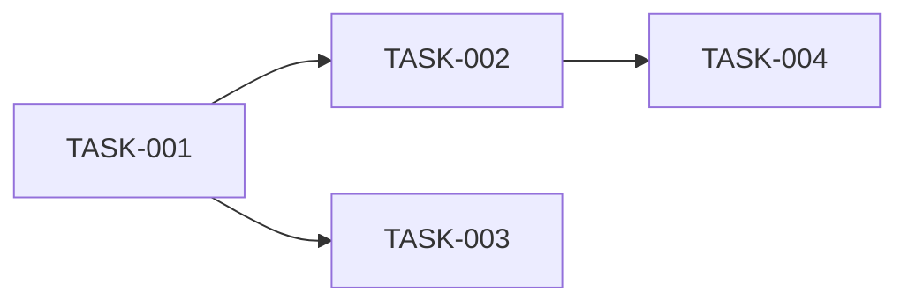

# Task Breakdown

## Mandatory Skill Activation

### Step 1 - EVALUATE

- `superpowers:writing-plans` - YES - Creating bite-sized implementation tasks
- `solid-design-principles` - YES - Ensure tasks promote good design
- `superpowers:brainstorming` - CONDITIONAL - If task breakdown needs exploration

### Step 2 - ACTIVATE

Use `Skill(superpowers:writing-plans)` tool NOW.
Use `Skill(solid-design-principles)` tool NOW.
Use `Skill(superpowers:brainstorming)` tool if task breakdown is complex.

### Step 3 - PARALLEL AGENT DISPATCH

Dispatch in parallel (single message with multiple Task tool calls):
```
Task 1: Explore agent - "Analyze stories for task dependencies and scope"
Task 2: feature-dev:code-explorer - "Explore codebase for existing implementations to reference"
```

### Step 4 - PROCEED

Only after activating skills and dispatching agents, continue below.

---

## Your Role: Assistant (NOT Lead)

**The user is the lead Developer.** Create task breakdown, validate estimates with them.

---

## Find Stories

Load from `docs/agile/stories/*-<feature>-stories.md`

---

## Task Generation (Writing-Plans Format)

For each story, generate tasks following the `superpowers:writing-plans` bite-sized format:

### Task Format
```markdown
### Task: <FEATURE>-<STORY#>-<TASK#>: [Verb] [What]

**Story:** STORY-XXX
**Type:** Feature | Bug | Chore | Spike
**Estimate:** Xh

**Files:**
- Create: `exact/path/to/NewFile.ts`
- Modify: `exact/path/to/existing.ts` - [what change]
- Test: `exact/path/to/test.ts`

**Step 1: Write the failing test**
```typescript
// Complete test code here
```

**Step 2: Run test to verify it fails**
Run: `pnpm test path/to/test.ts --run`
Expected: FAIL with "[reason]"

**Step 3: Write minimal implementation**
```typescript
// Complete implementation code here
```

**Step 4: Run test to verify it passes**
Run: `pnpm test path/to/test.ts --run`
Expected: PASS

**Step 5: Commit**
```bash
git add [files]
git commit -m "feat(scope): description"
```

**Dependencies:**
- Requires: TASK-XXX (must be done first)
- Blocks: TASK-YYY (do this before that)
```

---

## Validate Each Task

```
📋 TASK PROPOSAL

### AUTH-001-01: Create user registration endpoint

[Full task details]

🎯 DEVELOPER DECISION:
1. Is the estimate reasonable? (includes test + code + review)
2. Are the file paths correct?
3. Should this be split further? (max 4h per task)
```

---

## Dependency Graph



🎯 DEVELOPER REVIEW:
Is the dependency graph correct?

---

## Output

Save task breakdown to: `docs/agile/tasks/YYYY-MM-DD-<feature>-tasks.md`
Save board to: `docs/agile/boards/<feature>-board.md`

---

## Execution Options

```
✅ TASKS CREATED

**Option A: Subagent-Driven (this session)**
- Fresh subagent per task
- Code review between tasks
- Fast iteration

**Option B: Parallel Session (separate)**
- Open new session with executing-plans skill
- Batch execution with checkpoints

🎯 DEVELOPER DECISION:
Which execution approach?
```

---

## Context Persistence (MANDATORY)

Before proceeding to implementation, save context for continuity:

### 1. Decision Log
Append to `docs/agile/context/<feature>-decisions.md`:
```markdown
## Tasks Phase Decisions - [DATE]

| Decision | Options Considered | Chosen | Rationale |
|----------|-------------------|--------|-----------|
| Task granularity | [options] | [choice] | [user's reasoning] |
| Execution approach | [options] | [choice] | [user's reasoning] |

**Tasks Created:**
| ID | Title | Story | Estimate |
|----|-------|-------|----------|
| FEAT-001-01 | [title] | STORY-001 | 2h |
```

### 2. Session Summary
Save to `docs/agile/context/<feature>-tasks-summary.md`:
```markdown
# Tasks Phase Summary: <feature>

**Date:** [DATE]
**Phase:** Tasks

## Task Breakdown
| Story | Tasks | Total Estimate |
|-------|-------|----------------|
| STORY-001 | 3 | 6h |
| STORY-002 | 2 | 4h |

## Dependency Graph Summary
[Key dependencies noted]

## Execution Plan
[Chosen approach: subagent-driven / parallel session]

## Implementation Order
1. FEAT-001-01 (no dependencies)
2. FEAT-001-02 (depends on 01)

## Files Touched
- Created: `docs/agile/tasks/[filename]`
- Created: `docs/agile/boards/<feature>-board.md`
- Updated: `docs/agile/context/<feature>-decisions.md`

## Handoff Context
```json
{
  "feature": "<feature>",
  "phase": "tasks",
  "tasks": ["FEAT-001-01", "FEAT-001-02"],
  "first_task": "FEAT-001-01",
  "execution_approach": "subagent-driven",
  "next_phase": "impl"
}
```
```

---

## Next Phase

"✅ Tasks created. Run `/agile:impl <task-id>` to start implementing with TDD."