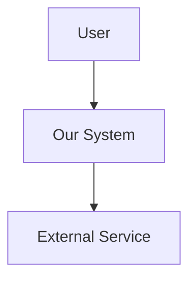

# Architecture Design

## Find the PRD

1. If feature name provided, look for: `docs/agile/prds/*-$ARGUMENTS.feature-prd.md`
2. Otherwise, find the most recently modified PRD in `docs/agile/prds/`
3. If no PRD found, inform user to run `/prd` first

## Analyze Existing Architecture

Before designing, understand the current system:
1. Read existing architecture docs if any
2. Examine src/ directory structure
3. Identify existing patterns (MVC, hexagonal, etc.)
4. Note technology stack (from package.json, pom.xml, etc.)
5. Check for existing API patterns

## Generate Architecture Document

### 1. Executive Summary
One paragraph overview of the architectural approach

### 2. System Context
Create a Mermaid diagram showing:
- External actors
- The system boundary
- External systems/services

### 3. Component Architecture
Design the internal structure:
- Component responsibilities
- Dependencies between components
- Technology choices for each

Create component diagram in Mermaid.

### 4. Data Architecture
- Data model (ER diagram in Mermaid)
- Data flow sequences
- Storage decisions

### 5. API Design
For new/modified endpoints:
- Method, path, description
- Request/response examples
- Error responses

### 6. Technology Decisions (ADRs)
For each significant decision:
- **Context**: Why this decision is needed
- **Decision**: What we decided
- **Alternatives**: What else was considered
- **Consequences**: Trade-offs accepted

### 7. Security Considerations
- Authentication approach
- Authorization model
- Data protection needs

### 8. Performance & Scalability
- Expected load
- Caching strategy
- Scaling approach

### 9. Observability
- Logging strategy
- Key metrics
- Alerting needs

### 10. Migration Plan
If modifying existing system:
- Database migrations needed
- Feature flags for rollout
- Backwards compatibility

## Output

Save to: `docs/agile/architecture/YYYY-MM-DD-<feature>-arch.md`

Include links to PRD and plan documents.

## Next Phase

"✅ Architecture complete. Run `/stories` to create user stories."
