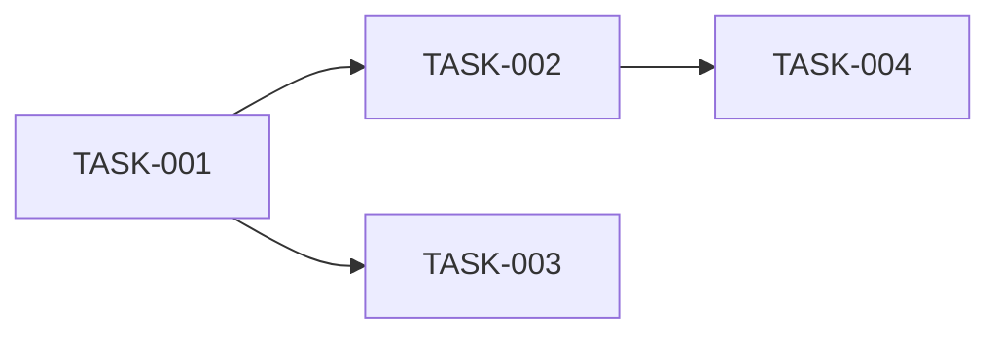

# Task Breakdown

## Find Stories

Load from `docs/agile/stories/*-<feature>-stories.md`

## Task Generation

For each story, generate granular tasks:

### Task Format
```
TASK-NNN: [Specific action verb] [what]

Story: STORY-XXX
Type: Feature | Bug | Chore | Spike
Estimate: Xh
Assignee: -

Description:
[Specific, actionable description]

Files to create:
- path/to/NewFile.ts

Files to modify:
- path/to/existing.ts - [what change]

Subtasks:
- [ ] Subtask 1
- [ ] Subtask 2
- [ ] Subtask 3

Dependencies:
- Requires: TASK-XXX
- Blocks: TASK-YYY

Acceptance:
- [ ] Unit tests passing
- [ ] Lint passing
- [ ] Manual verification
```

### Task ID Convention
`<FEATURE>-<STORY#>-<TASK#>`
Example: `AUTH-001-01`, `AUTH-001-02`

### Task Types
- **Feature**: New functionality
- **Bug**: Fix for broken behavior
- **Chore**: Maintenance, refactoring, config
- **Spike**: Research/investigation (time-boxed)

### Estimation Guidelines
- Include time for tests
- Include time for code review
- Add buffer for unknowns
- Break tasks >4h into smaller tasks

## Create Task Board

Generate a Kanban board:

```markdown
## Backlog
- [ ] TASK-001: [Description] (Xh) @-

## In Progress
[empty initially]

## Review
[empty initially]

## Done
[empty initially]
```

## Dependency Graph

Create a Mermaid diagram showing task dependencies:


## Summary Tables

### By Story
| Story | Tasks | Total Hours | Critical Path |
|-------|-------|-------------|---------------|

### By Type
| Type | Count | Hours |
|------|-------|-------|

## Output

Save task breakdown to: `docs/agile/tasks/YYYY-MM-DD-<feature>-tasks.md`
Save board to: `docs/agile/boards/<feature>-board.md`

## Next Phase

"✅ Tasks created. Run `/impl <task-id>` to start implementing with TDD."

## Task Commands

During implementation, use:
- `/board` - View task board
- `/impl <task-id>` - Implement a task
- `/status` - Check workflow progress
