```mermaid
flowchart TD
    subgraph Entry["Entry Points"]
        E1["🔍 Found new tool/trial"]
        E2["📧 Email: trial ending soon"]
        E3["📱 Dashboard: 'Protect a trial' prompt"]
    end

    subgraph DeferredModel["Deferred Commitment Model"]
        D1["Cards block charges<br/>WITHOUT funding"]
        D2["KYC only when<br/>using card details"]
        D3["Funding only when<br/>paying for subscriptions"]
    end

    subgraph PreKYC["Pre-KYC Path"]
        K1{"KYC Complete?"}
        K2["Create Demo Card<br/>Name + optional rules"]
        K3["Card shows '⏳ Awaiting Activation'"]
        K4["CTA: 'Activate your protection'<br/>(~2-3 min inline KYC)"]
        K5["Complete KYC Flow"]
    end

    subgraph CardCreation["Card Creation (3 Taps)"]
        C1["Tap: 'Create Card'"]
        C2["Context: 'What are you protecting?'"]
        C3["System suggests defaults<br/>(rules optional, not required)"]
        C4["User accepts OR adjusts"]
        C5["Tap: 'Create'"]
        C6["🎉 Card appears with animation"]
    end

    subgraph CardUsage["Card Usage"]
        U1["Copy card number<br/>(one-tap clipboard)"]
        U2["Paste in trial checkout"]
        U3["Trial activated ✅"]
        U4["Card status: 'Armed and watching'"]
    end

    subgraph StrategicSilence["Strategic Silence (3-30 days)"]
        S1["No spam notifications"]
        S2["Anticipation builds"]
        S3["User continues life"]
    end

    subgraph BlockMoment["Block Moment ⚡"]
        B1["Merchant attempts charge"]
        B2["Klard evaluates rules"]
        B3["DECLINED<br/>(no funding needed to block)"]
        B4["Push notification:<br/>'🛡️ Blocked: $X from Merchant'"]
        B5["→ Block Celebration Flow"]
    end

    E1 --> C1
    E2 --> C1
    E3 --> C1

    C1 --> K1
    K1 -->|No| K2
    K2 --> K3
    K3 --> K4
    K4 --> K5
    K5 --> C2

    K1 -->|Yes| C2
    C2 --> C3
    C3 --> C4
    C4 --> C5
    C5 --> C6
    C6 --> U1
    U1 --> U2
    U2 --> U3
    U3 --> U4
    U4 --> S1
    S1 --> S2
    S2 --> S3
    S3 --> B1
    B1 --> B2
    B2 --> B3
    B3 --> B4
    B4 --> B5

    style C6 fill:#059669,color:#fff
    style B3 fill:#059669,color:#fff
    style B4 fill:#059669,color:#fff
    style D1 fill:#0D7C7A,color:#fff
    style D2 fill:#0D7C7A,color:#fff
    style D3 fill:#0D7C7A,color:#fff
```

```mermaid
flowchart TD
    subgraph Onboarding["Onboarding Choice"]
        O1["'How do you want to start?'"]
        O2["A: Add subscriptions first"]
        O3["B: Protect a trial first"]
    end

    subgraph ManualAdd["Manual Addition"]
        M1["Category suggestions<br/>Entertainment, Software, News..."]
        M2["Checkbox grid of common services<br/>Netflix ☑️ Spotify ☑️ Adobe ☐"]
        M3["Tap all that apply"]
        M4["Add price + renewal date"]
        M5["'12 subscriptions in under a minute'"]
    end

    subgraph EmailConnect["Email Scanning (Optional)"]
        E1["'Want Klard to find more?'"]
        E2["Connect email (read-only)"]
        E3["AI scans for receipts"]
        E4["Surfaces hidden subscriptions"]
        E5["'Found 14 more subscriptions!'"]
    end

    subgraph Dashboard["Discovery Dashboard"]
        D1["Total spend revealed:<br/>'$298/month'"]
        D2["😲 SHOCK MOMENT<br/>'I'm spending HOW much?!'"]
        D3["Health indicators light up"]
        D4["🔴 Unused (no login 90+ days)"]
        D5["🟡 Price Increased"]
        D6["🟢 Healthy"]
    end

    subgraph Action["Immediate Action"]
        A1["Filter: 'Show Unused'"]
        A2["See: Masterclass, Calm, Blue Apron..."]
        A3["Each shows cancellation link"]
        A4["Tap → Cancel externally"]
        A5["Return → Mark as cancelled"]
        A6["Savings counter updates:<br/>'$1,500/year saved!'"]
    end

    subgraph Upgrade["Upgrade Moment"]
        U1["User wants to try new tool"]
        U2["Goes to create BurnerCard"]
        U3["'BurnerCards are Saver+ ($19.99/mo)'"]
        U4["Remembers: just saved $125/mo"]
        U5["Upgrade pays for itself 6x"]
        U6["→ Saver+ conversion"]
    end

    O1 --> O2
    O1 --> O3
    O2 --> M1
    M1 --> M2
    M2 --> M3
    M3 --> M4
    M4 --> M5
    M5 --> E1
    E1 -->|Yes| E2
    E2 --> E3
    E3 --> E4
    E4 --> E5
    E5 --> D1
    E1 -->|No| D1
    D1 --> D2
    D2 --> D3
    D3 --> D4
    D3 --> D5
    D3 --> D6
    D4 --> A1
    A1 --> A2
    A2 --> A3
    A3 --> A4
    A4 --> A5
    A5 --> A6
    A6 --> U1
    U1 --> U2
    U2 --> U3
    U3 --> U4
    U4 --> U5
    U5 --> U6

    style D2 fill:#D97706,color:#fff
    style A6 fill:#059669,color:#fff
    style U6 fill:#0D7C7A,color:#fff
```

```mermaid
flowchart TD
    subgraph Trigger["Block Event"]
        T1["Merchant attempts charge"]
        T2["Remote auth evaluates:<br/>- Spending limit?<br/>- Card locked?<br/>- One-time used?<br/>- Merchant match?"]
        T3["DECLINE issued"]
    end

    subgraph Notification["Push Notification"]
        N1["📱 Push arrives instantly"]
        N2["'🛡️ Blocked: $X from Merchant'"]
        N3["User taps notification"]
    end

    subgraph Celebration["Celebration Screen"]
        C1{"First block ever?"}
        C2["🎊 FULL CELEBRATION<br/>Confetti + haptic + sound"]
        C3["Subtle celebration<br/>Glow pulse + small haptic"]
        C4["Screenshot-ready screen:<br/>Dark bg, bold $X, merchant name"]
        C5["No buttons in screenshot zone"]
        C6["Klard branding visible"]
    end

    subgraph Milestone["Milestone Check"]
        M1{"$100+ saved?<br/>10+ blocks?"}
        M2["🎊 MILESTONE CELEBRATION<br/>'You've saved $100!'"]
        M3["Continue to share"]
    end

    subgraph Share["Share Moment"]
        S1["Share button appears<br/>(below screenshot zone)"]
        S2["Native share sheet"]
        S3["User posts to Discord/Slack/Twitter"]
        S4["Social proof created<br/>→ Viral loop"]
    end

    subgraph Dashboard["Return to Dashboard"]
        D1["Savings counter updated"]
        D2["Card shows 'Block history'"]
        D3["Weekly digest includes block"]
    end

    T1 --> T2
    T2 --> T3
    T3 --> N1
    N1 --> N2
    N2 --> N3
    N3 --> C1
    C1 -->|Yes| C2
    C1 -->|No| C3
    C2 --> C4
    C3 --> M1
    M1 -->|Yes| M2
    M1 -->|No| C4
    M2 --> C4
    C4 --> C5
    C5 --> C6
    C6 --> S1
    S1 --> S2
    S2 --> S3
    S3 --> S4
    S4 --> D1
    D1 --> D2
    D2 --> D3

    style T3 fill:#059669,color:#fff
    style C2 fill:#059669,color:#fff
    style M2 fill:#059669,color:#fff
    style S4 fill:#0D7C7A,color:#fff
```

```mermaid
flowchart TD
    subgraph Clarification["When Funding Is Needed"]
        CL1["🛡️ Blocking charges?<br/>NO funding needed"]
        CL2["💳 Paying for subscriptions?<br/>Funding required"]
    end

    subgraph Trigger["Funding Trigger"]
        T1["User wants to PAY for<br/>a subscription via BurnerCard"]
        T2["Card balance: $0.00"]
        T3["'Add funds to use this<br/>card for payment'"]
    end

    subgraph FundingFlow["Stripe Checkout"]
        F1["Tap 'Add Funds'"]
        F2["Amount selector:<br/>$25 / $50 / $100 / $250 / Custom"]
        F3["Stripe payment sheet"]
        F4["Apple Pay / Google Pay / Card"]
        F5["Processing..."]
        F6["'Funds added instantly!'"]
    end

    subgraph Confirmation["Balance Update"]
        C1["Dashboard shows new balance"]
        C2["Card status: 'Funded & Active'"]
        C3["'Ready to pay for subscriptions'"]
    end

    subgraph Usage["Card Ready for Payment"]
        U1["Copy card number"]
        U2["Pay for subscription"]
        U3["Charge succeeds up to balance"]
    end

    CL1 -.-> T1
    CL2 --> T1
    T1 --> T2
    T2 --> T3
    T3 --> F1
    F1 --> F2
    F2 --> F3
    F3 --> F4
    F4 --> F5
    F5 --> F6
    F6 --> C1
    C1 --> C2
    C2 --> C3
    C3 --> U1
    U1 --> U2
    U2 --> U3

    style CL1 fill:#059669,color:#fff
    style CL2 fill:#D97706,color:#fff
    style F6 fill:#059669,color:#fff
    style C2 fill:#0D7C7A,color:#fff
```

# UX Design Specification klard-apps

**Author:** Drcraig
**Date:** 2025-12-26

---

## Executive Summary

### Project Vision

Klard is a subscription intelligence and payment protection platform that lets users "subscribe fearlessly." By combining subscription tracking with smart virtual cards (BurnerCards), Klard blocks unwanted renewals, protects trial sign-ups, and gives users complete control — without ever asking for bank credentials.

The 30-day free trial of Saver+ means users experience full value before paying. This product-led growth model makes **trial conversion the critical UX challenge** — every friction point steals from the "aha moment" window.

### Target Users

**Primary Focus (MVP):**
- **Felix** (Freelancer, 26) — Trial junkie, signs up for everything, "subscription shame"
- **Sam** (Student, 21) — Tight budget, has been burned by forgotten trials
- **Fiona** (Marketing Manager, 28) — Subscription fatigue, wants to simplify

**Secondary Focus:**
- **Harper** (VP Product, 32) — High spender, values peace of mind
- **Pete** (Security Engineer, 27) — Privacy advocate, rejected all bank-connected trackers

**Common Thread:** All users want to try services without fear of unwanted charges. The emotional journey is: 😰 Anxious → 🤔 Curious → 😲 Surprised → 😌 Protected → 📣 Advocate

### Key Design Challenges

| Challenge | Reframed Understanding |
|-----------|------------------------|
| **Day-1 Value Delivery** | Dashboard must show subscription insights instantly — "I'm spending HOW much?!" |
| **Friction Elimination** | Every screen is churn risk. Default to fewer steps. |
| **Pre-KYC Engagement** | Let users build BurnerCards before KYC — emotional investment before commitment |
| **'Level Up' Framing** | KYC = activation moment, not barrier. "Let's activate your protection." |
| **Anticipatory Satisfaction** | Users should feel protected BEFORE any block occurs. "Armed and ready 🛡️" |
| **Ongoing Value Visibility** | Weekly digests + ROI reminders prevent Month 2-3 churn |

### Design Principles

1. **Speed Wins** — Every screen removed is churn prevented.
2. **Value Before Commitment** — Show insights before asking for anything.
3. **Anticipation = Value** — Feeling protected IS the product.
4. **Smart Nudges, Not Nags** — Context-aware prompts beat generic reminders.
5. **Celebrate Everything** — Small wins build momentum.
6. **Visibility Sustains** — ROI reminders keep users paying.

### Design Opportunities

| Opportunity | Competitive Advantage |
|-------------|----------------------|
| **Pre-KYC Card Building** | No competitor lets users design protection before committing |
| **Anticipatory UX** | 'Armed and ready' status creates value before blocking |
| **Smart Renewal Prompts** | 'Spotify renews in 3 days' contextualizes urgency |
| **ROI Visibility** | 'Blocked $47.98 this month vs $19.99 subscription' justifies payment |
| **Trial Churn Signals** | Track leading indicators to intervene with at-risk users |

### Trial Conversion Timeline (30-Day Trial)

| Day Range | Goal | UX Must-Haves |
|-----------|------|---------------|
| **Day 0-1** | 'Wow' moment | Instant dashboard value, subscription count shock |
| **Day 1-3** | First BurnerCard created | Guided flow, pre-KYC card building |
| **Day 3-7** | Card deployed on a real trial | Prompt: 'Found a trial to protect?' |
| **Day 7-14** | Anticipation building | 'Your card is armed — X days until renewal' |
| **Day 14-21** | First blocks likely to occur | Block celebration + sharing prompt |
| **Day 21-30** | Block OR value reinforcement | 'Blocked $X' or 'Protected $X so far' |

### Conversion Signals (Churn Prediction)

| Signal | Good Indicator | Churn Risk |
|--------|----------------|------------|
| Day 1 subscriptions added | ≥5 | 0-2 |
| Email connected | Yes | No |
| BurnerCard created | By Day 3 | After Day 7 or never |
| Card deployed (used in checkout) | By Day 7 | Never |
| Return visits | 3+ in first week | 1 and done |

---

## Core User Experience

### Defining Experience

The core action that defines Klard's value is **creating a BurnerCard for trial protection**. The PRD establishes this through three North Star metrics:

- **Time to First BurnerCard** — Target: ≤3 days
- **Active Protectors Rate** — Target: ≥50% with active cards
- **First Block in 30 Days** — Target: ≥65% (the "aha moment")

The emotional payoff is not the card creation itself, but the **anticipation of protection** followed by the **celebration of a block**. Users feel value before any charge is declined.

**Core Value Loop:**
1. Create Card → Feel protected ("Armed and ready")
2. Deploy on Trial → Investment in protection
3. See Block → Validation + screenshot moment
4. Share → Advocacy + viral growth
5. Repeat → Habit formation

### Platform Strategy

Both Web (PWA) and Mobile (Expo) deliver a complete experience with full feature parity:

| Platform | Optimized For | Key Strengths |
|----------|---------------|---------------|
| Web (Desktop) | Extended sessions | Analytics dashboards, bulk subscription management, complex card rule configuration |
| Mobile | On-the-go control | Push notifications, biometric auth, one-tap card copy, instant lock/unlock |

**Mobile-Critical Interaction:** At checkout, users need card numbers instantly. One-tap clipboard copy (user-initiated) is essential.

**Offline Behavior (Security-First):**

| Feature | Offline | Rationale |
|---------|---------|-----------|
| View subscriptions | ✅ Cached | Value without security risk |
| View cards | ❌ Online only | Cards = protection = real-time verification required |
| Create/lock cards | ❌ Online only | Requires API |

**Offline Card Message:** *"🔒 Card details require a secure connection to ensure your protection is current."*

### Pre-KYC Card Building (Demo Card Concept)

Card issuers (Airwallex) require KYC before issuing real payment instruments. To preserve emotional investment while respecting issuer constraints:

**Demo Card Strategy:**

| State | What Exists | What User Sees |
|-------|-------------|----------------|
| **Pre-KYC** | Klard-side configuration only | Card name, type, limits, rules, linked subscription, fully masked PAN (`**** **** **** ****`) |
| **Post-KYC** | Real Airwallex card created | Full card details (masked PAN with last 4, CVV button, expiry) |

**Pre-KYC Card Display:**
- Card name (user-defined)
- Card type (One-Time, Recurring, Category-Locked)
- Spending limit configured
- Linked subscription (if any)
- Fully masked PAN: `**** **** **** ****`
- Status: "⏳ Awaiting Activation"
- CTA: "[Activate Now →]" triggers KYC flow

**KYC as Activation Moment:**
The framing shifts from "verify your identity" (barrier) to "activate your protection" (unlock). User has already designed their card — KYC simply makes it real.

### Effortless Interactions

| Interaction | Effortlessness Target |
|-------------|----------------------|
| Onboarding | Suggestion checkboxes enable "12 subscriptions in under a minute" |
| Card Creation | <30 seconds from intent to configured card (3 taps: Type → Limit → Create) |
| Card Copy (Mobile) | User-initiated one-tap to clipboard for external checkout |
| Block Celebration | Confetti + haptic + screenshot-ready share image |
| Renewal Decision | One-tap: Keep / Pause / Burn directly from notification |

**Automatic Intelligence:**
- One-Time cards auto-lock after first charge
- Merchant mismatch auto-declines (card for Netflix blocks charge from RandomMerchant)
- Email scanning surfaces forgotten subscriptions
- Weekly digests show ROI automatically

### Critical Success Moments

The 30-day trial window defines conversion. Critical UX moments:

| Day | Success Moment | Churn Prevention |
|-----|----------------|------------------|
| 0-1 | "Subscription shock" — "I'm spending HOW much?!" | Instant dashboard value |
| 1-3 | First BurnerCard configured (demo card) | Pre-KYC card building creates investment |
| 1-3 | KYC completed → Card activated | Framed as "activation", not barrier |
| 3-7 | Card deployed on real trial | Context-aware prompt |
| 7-14 | Anticipation phase | "Your card is armed — X days until renewal" |
| 14-21 | First blocks likely to occur | Block celebration + sharing prompt |
| 21-30 | Block OR value reinforcement | "Blocked $X" or "Protected $X so far" |

**Make-or-Break:** First BurnerCard configured by Day 3, KYC completed shortly after. Users who configure cards by Day 3 convert at 2-3x the rate of those who don't.

### Experience Principles

1. **Speed Wins** — Every screen removed is churn prevented
2. **Value Before Commitment** — Show insights before KYC; demo card building creates emotional investment
3. **Anticipation = Value** — Feeling protected IS the product
4. **Smart Nudges, Not Nags** — Context-aware prompts beat generic reminders
5. **Celebrate Everything** — Confetti, badges, screenshot-ready moments
6. **Visibility Sustains** — ROI reminders keep Month 2-3 retention high
7. **Security-First Offline** — Cards require real-time connection; subscriptions are cached

---

## Desired Emotional Response

### Primary Emotional Goals

Klard's core emotional promise is captured in the tagline: **"Subscribe fearlessly."**

Two pillars define the emotional architecture:

- **Fearlessness** — The outcome. Users try any service without anxiety about forgotten charges. Every trial signup feels risk-free. This is what users *feel*.
- **Control** — The mechanism. Users decide what happens to their money. Self-service tools, not concierge hand-holding. This is what users *do*.

Financial peace of mind emerges when both work together. The defining transformation is **curiosity → confidence**. When a BurnerCard blocks an unwanted charge, curiosity becomes conviction. That's when users become advocates.

### Emotional Journey Mapping

The user's emotional arc:

```
😰 Anxious → 🤔 Curious → 😲 Surprised → 😌 Protected → 📣 Advocate
```

**Before Klard:** Users carry subscription anxiety — guilt about spending, fear of forgotten charges, overwhelm from "subscription creep."

**Discovery Shock (One Moment Only):** The dashboard reveals the truth. "I'm spending HOW much?!" This shock is productive — it validates the user's suspicion. But it must be brief. One screen moment of revelation, then *immediate* action. A "Fix This Now" button, not a guilt tour. Users shouldn't marinate in past mistakes.

**First Card:** Creating a BurnerCard (even a demo card pre-KYC) shifts from passive awareness to active protection. The user feels "armed and ready 🛡️."

**Protection States (Two Paths):**

Users experience protection differently based on whether charges hit their cards:

*Path A — Block Experienced:*
The first blocked charge is the conversion moment. Sam stared at his notification: $295 blocked. That was his entire discretionary budget for the month. He screenshotted it immediately.

*Path B — Quiet Confidence:*
Many users won't experience a block during the trial. Their emotional state should be **quietly confident** — the system is working even if nothing happens. Like insurance: you feel protected without needing a claim. Weekly status: "Your 3 cards are active and watching. No unwanted charges detected."

**Ongoing Advocacy:** Harper's dashboard showed $412 blocked over 6 months. She checks Klard during Sunday coffee — a 5-minute habit that replaced hours of anxiety.

### Micro-Emotions

The critical micro-emotion that determines success: **Trust vs. Skepticism**.

Pete, the security engineer, represents the hardest converts and best advocates. He validated Klard's architecture before committing. If we nail trust, everything else follows. Security-minded users who convert become vocal champions.

Supporting micro-emotions:

- **Anticipation vs. Anxiety** — "Your card is armed — 4 days until renewal" creates excitement, not nerves
- **Accomplishment vs. Frustration** — Quick wins in under 60 seconds. Pre-checked suggestions, minimal fields
- **Delight vs. Mere Satisfaction** — Confetti, haptics, screenshot-ready celebrations transform success into peaks

### Design Implications

**For Fearlessness:**
- Demo cards before KYC let users invest emotionally before committing
- $0-limit cards prove the concept risk-free
- "One-time" card type means trials can't become recurring charges

**For Control:**
- User-initiated clipboard copy (not automatic)
- Manual lock/unlock with instant feedback
- Clear card states: "Active", "Locked", "Awaiting Activation"

**For Trust (The Critical Path):**
- Security badges visible at decision points
- Transparent pricing — no hidden fees discovered later
- Technical users can review how it works (Pete's journey)

**For Protection Without Incident:**
- Weekly status: "Your cards are watching. All clear."
- Reinforce value even when nothing is blocked
- "Protected $X in potential unwanted charges" messaging

**Guilt → Relief Timing:**
- Shock discovery lasts ONE screen moment
- Immediately pivot to action buttons
- Never dwell on past mistakes — always forward-focused

**Framing Shifts:**
- "Verify your identity" → "Activate your protection"
- "You're spending too much" → "Here's what you could save"
- "Payment blocked" → "Your BurnerCard did its job"

### Emotional Design Principles

1. **Control → Fearlessness:** Control is the mechanism, fearlessness is the outcome.
2. **Brief Shock, Immediate Action:** Discovery moment is one screen, then action buttons.
3. **Guilt → Relief, Not Guilt → More Guilt:** Forward savings, not past mistakes.
4. **Trust First:** Security-minded users are hardest converts, best advocates. Nail trust.
5. **Protection Without Incident:** Users should feel protected even if nothing is blocked.
6. **Anticipation = Value:** Feeling protected IS the product, before any blocking occurs.

---

## UX Pattern Analysis & Inspiration

### Inspiring Products Analysis

**1. Duolingo — Gamification & Celebration**

Duolingo transforms language learning from a chore into a game. The core insight: **small wins, celebrated loudly, create habit loops**.

What they do well:
- Confetti and sound effects on lesson completion — every win feels like an event
- Streak system creates daily commitment
- Achievement badges are shareable — users post milestones to social media
- Failure is softened ("You're learning!") rather than punitive

**Klard Application:** Block celebrations with confetti + haptics, but with **tiered intensity** to prevent fatigue. First block = full confetti + sound. Routine blocks = subtle pulse + number increment. Milestones ($100, $500) = full celebration again. This keeps celebrations meaningful rather than becoming noise.

Badges are Phase 2 — the celebration moment matters more than the collection system for MVP.

**2. Monzo/Revolut — Instant Feedback & Control**

These neobanks redefined what "real-time" means in finance. The core insight: **instant feedback removes anxiety**.

What they do well:
- Push notifications arrive before the receipt prints
- Card freeze/unfreeze is one tap, instant, reversible
- Spending categorization happens automatically
- Clean transaction feed with merchant logos

**Klard Application:** Push notifications are MVP-critical. Blocks happen when users aren't in the app — without push, they discover blocks hours later, killing the dopamine moment. WebSocket for web is already planned; push for mobile needs prioritization.

Card lock/unlock should be one-tap with immediate visual confirmation. No confirmation dialogs — the action itself is reversible.

**3. Apple Wallet — Card Visualization & Security**

Apple Wallet set the standard for digital card UX. The core insight: **physical metaphors reduce cognitive load**.

What they do well:
- Cards look like cards — skeuomorphism aids recognition
- Double-click to pay creates muscle memory
- Biometric protection feels secure without friction
- Smooth animations reinforce actions

**Klard Application:** BurnerCards should look like cards, not form fields. Block notification screens designed for screenshots: dark background, one bold number dominating, merchant name visible, Klard branding clear. The screen should BE shareable — no buttons cluttering the screenshot area.

**4. YNAB — Forward-Looking Framing**

YNAB reframes budgeting from restriction to empowerment. The core insight: **framing determines emotional response**.

What they do well:
- "Give every dollar a job" — active language, not passive tracking
- Shows money you HAVE, not money you spent
- "Roll with the punches" — mistakes are recoverable
- Reports focus on progress toward goals

**Klard Application:** Active protection language even when nothing happens. Not "No charges blocked this week" (sounds useless) but "3 cards watching, 0 unwanted charges detected" (sounds protective). Weekly protection report framed as wellness check, not financial statement.

**5. Cross-Domain Inspiration**

Beyond direct competitors, unexpected domain combinations revealed fresh patterns:

From **Insurance:** Quiet confidence. "All clear" status creates value through absence. No news = protection working. Users should feel protected without constant pings.

From **Gaming:** Progressive achievement unlocks create long-term engagement. But for MVP, the celebration moment matters more than the collection system.

From **Healthcare apps:** Onboarding that asks "What's your goal?" before "Enter your data." Personalization creates investment.

From **Travel apps:** Anticipation-building before the experience. Pre-trial checklists create ritual: "Card ready ✓, Limit set ✓, Expiry scheduled ✓"

### Transferable UX Patterns

**Celebration Patterns:**
- Tiered celebration intensity prevents fatigue (full → subtle → full at milestones)
- Sound design optional — always respect mute settings
- Screenshot-ready screens: dark backgrounds, bold typography, no UI clutter in share zone
- The block notification IS the shareable moment, not a screen with a share button

**Feedback Patterns:**
- Instant push notifications for all card activity (MVP-critical for mobile)
- Visual state changes (color, animation) for lock/unlock
- Active protection language: "3 cards watching" not "nothing happened"
- Strategic silence between card creation and block — don't over-communicate, let anticipation build

**Control Patterns:**
- Context-first card type suggestions eliminate analysis paralysis: "Signing up for trial?" → system suggests One-Time + Time-Bounded
- Progressive disclosure: show 2 card types initially, reveal advanced options on request
- One-tap reversible actions — no confirmation dialogs for lock/unlock
- Biometric protection for revealing full card details only

**Anticipation Patterns:**
- Pre-trial checklists create ritual and emotional investment
- "Your card is armed — 4 days until renewal" builds excitement
- The path to virality: easy card creation → strategic silence → dramatic block → share-ready screen

### Anti-Patterns to Avoid

**From Competitors:**
- **RocketMoney's bank-access-first onboarding** — Klard must show value before asking for commitment. Never gate the "wow moment" behind friction.
- **Privacy.com's isolation** — Cards without context feel disconnected. Every Klard card should show what it protects and why it exists.

**From UX Red Team Analysis:**
- **Confetti fatigue** — Same celebration for every block becomes noise. Use tiered intensity based on achievement rarity.
- **Card type analysis paralysis** — Six card types presented as a menu = overwhelming. Use context-first suggestions with progressive disclosure.
- **"Nothing happened" messaging** — "No blocks this week" makes Klard seem useless. Reframe as active protection: "watching" not "waiting."
- **Over-communication** — Don't spam users between card creation and block. Silence is strategic. It makes the block moment louder.
- **Buttons in screenshot areas** — Clutters the shareable moment. Block screens should be clean, bold, single-focus.

**General Anti-Patterns:**
- Guilt-based dashboards ("You spent $X on coffee!" shame)
- Marketing notifications during trial window
- Delayed feedback on any card action
- Complex onboarding before value delivery

### Design Inspiration Strategy

**Adopt Directly (MVP):**
- Duolingo's celebration moments → Confetti + haptic on blocks, tiered by rarity
- Monzo's instant push → Real-time notifications within seconds (MVP-critical)
- Apple Wallet's screenshot-ready design → Dark, bold, one number dominates
- YNAB's forward framing → Active protection language, savings focus

**Adapt for Klard:**
- Duolingo's streaks → "Days protected" framing without requiring daily engagement
- Insurance's quiet confidence → Weekly "all clear" email as wellness check
- Travel's anticipation → Pre-trial checklists that build investment (Phase 2)

**Avoid Entirely:**
- Any pattern requiring commitment before value
- Same celebration intensity for every event
- Card type menus without contextual suggestions
- "Nothing happened" language anywhere
- Over-communication between key moments

**MVP vs Phase 2 Clarity:**

MVP priorities: confetti celebrations, push notifications, context-first card suggestions, active protection language, screenshot-ready block screens.

Phase 2: badge/achievement system, pre-trial checklists, declined-charge analytics, protection report with industry comparisons.

**The Viral Design Insight:**

The path to shareability is: Easy card creation → Strategic silence → Dramatic block notification → Screenshot-ready screen

Don't over-engineer the middle. The silence between creation and block is intentional — it lets anticipation build. When the block notification arrives, the surprise is amplified by the quiet that preceded it.

---

## Design System Foundation

### Design System Choice

**Foundation:** Klard Design System + Tailwind CSS 4 (web) + SVA (mobile)

Klard inherits a mature, comprehensive design system built around five thematic pillars: Visibility, Protection, Automation, Savings, and Control.

**Reference Documents:**
- `docs/design/Klard Design System.md` — Core design principles, components, patterns
- `docs/design/Klard Design System - Light Theme Colors & Effects.md` — Light theme tokens
- `docs/design/Klard Design System - Dark Theme Colors & Effects.md` — Dark theme tokens

This UX specification extends and applies that system to the patterns identified in our inspiration analysis.

### Theme Strategy

The system supports two themes based on user preference or system setting:

- **Light Theme** — Bright, trustworthy, modern. Default for most users.
- **Dark Theme** — Premium, glassy, glowy. Preferred by dashboard power users.

**Theme follows user preference.** Celebration screens, block notifications, and shareable reports render in the user's chosen theme. Both themes are designed to be screenshot-worthy with appropriate glow effects and contrast.

**Theme Detection Priority:**
1. User explicit choice (stored preference)
2. System preference (`prefers-color-scheme`)
3. Default to light if no preference detected

### Token Synchronization Architecture

Design tokens are centralized in `commons/` as the single source of truth, derived from the design system documents:

```
commons/src/
├── design-tokens/
│   ├── colors.ts      # All color tokens (light + dark)
│   ├── spacing.ts     # 4/8 grid values
│   ├── animation.ts   # Durations, easings
│   ├── typography.ts  # Font scales, weights
│   └── index.ts       # Re-exports all
```

**Web (Tailwind 4):** Tokens generate CSS variables. Theme switching via `[data-theme="dark"]`.

**Mobile (SVA):** Tokens imported directly for SVA theme configuration.

### Block Celebration System

Celebrations render in the user's current theme. Both themes support celebration effects with theme-appropriate glow intensities (see theme documents for specific values).

**Critical Rule: Blocks Are Celebrations, Not Errors**
Never use Error color for blocked charges. Blocks are WINS. Use Success Green with appropriate glow.

**Tiered Intensity:**
- **First block ever:** Full celebration — confetti, haptic, sound, enhanced glow
- **Routine blocks:** Subtle — glow pulse, minimal haptic
- **Milestones** ($100 saved, 10 blocks): Full celebration

**Confetti Colors (both themes):** Success Green, Primary Teal, Warning Amber

### Card States

See theme documents for specific color values. States:
- **Active:** Primary border with teal glow
- **Locked:** Warning border with amber glow, lock icon
- **Awaiting Activation:** Dashed muted border, "⏳ Awaiting Activation", CTA to KYC
- **Expired:** Error border, 50% opacity

### Sensitive Data Protection

Full card number reveal requires re-authentication:
- **Mobile:** Biometric via Expo LocalAuthentication
- **Web:** Passkey via WebAuthn API

### Component Library

- `BlockCelebration` — shareable celebration screen
- `CardStateIndicator` — Active/Locked/Awaiting badge
- `ProtectionStatus` — "3 cards watching" display
- `SavingsCounter` — running total with animation
- `BurnerCardVisual` — card-like visualization

### Implementation Stack

**Web:** Tailwind CSS 4 + shadcn/ui + `canvas-confetti` + WebAuthn
**Mobile:** SVA + Expo Haptics + Expo LocalAuthentication + native share

### Phase 2 Enhancements

- Reduced motion support
- Badge/achievement system

---

## Defining Experience Deep Dive

### User Mental Model

**How users currently solve this problem:**

Users approach subscription management through fragmented, reactive methods:

- **Credit card statements:** Monthly review after charges hit. Reactive, not preventive. By the time they see the charge, money is already gone.
- **Email searches:** "Cancellation" keyword hunts when they remember a trial is ending. Unreliable, forgotten.
- **Calendar reminders:** Manual setup for trials. Friction-heavy, rarely maintained.
- **Bank-connected trackers (Rocket Money, Truebill):** Require sensitive bank access. Many users (like Pete) reject this approach entirely.
- **Spreadsheets:** Power users manually track. High friction, low adoption.

**The mental model gap:**

Users expect *payment control* but only have *payment visibility*. Current solutions show what happened; Klard prevents what users don't want to happen.

**User expectations for Klard:**

- "I should be able to try anything without thinking about cancellation"
- "Protection should be set-and-forget, not another thing to manage"
- "I want to see immediately if I'm saving money"
- "This should work like my credit card's fraud protection — automatic, but I'm in control"

**Where confusion occurs:**

- **Card types:** Six types can overwhelm. Context-first suggestions eliminate this.
- **Pre-KYC vs Post-KYC:** Users may not understand why they can't use demo cards immediately. Clear "Awaiting Activation" state with explanation needed.
- **Block vs. Decline:** Users need to understand that blocks are wins, not errors.

### Novel vs Established Patterns

**Established Patterns We Adopt:**

- **Card visualization** (Apple Wallet): Cards that look like cards
- **Instant freeze/unfreeze** (Monzo/Revolut): One-tap control, immediate feedback
- **Spending limits** (Bank apps): Familiar mental model for budgeting
- **Push notifications** (All modern fintech): Real-time awareness

**Novel Patterns Unique to Klard:**

- **Pre-KYC Card Building:** No competitor lets users design protection before identity verification
- **Subscription-Linked Cards:** Cards tied to specific subscriptions, not just limits
- **Anticipatory Protection:** "Armed and ready" status creates value before any block
- **Block as Celebration:** Treating declined charges as wins, not failures
- **Demo Card Concept:** Klard-side configurations that become real cards after KYC

**Teaching Strategy:**

Novel patterns are taught through context-first flows, inline explanations, immediate feedback, and celebration reinforcement.

### Experience Mechanics

**Core Interaction: Create BurnerCard for Trial Protection**

**1. Initiation**
- Primary: "Create Card" button in navigation/dashboard
- Contextual: Prompt after adding subscription
- Smart: Prompt after email scan detects trial

**2. Interaction (Target: <30 seconds, 3 taps)**

*Step 1 — Intent:* System asks "What are you protecting?" → triggers context-first suggestion

*Step 2 — Configuration:* System pre-selects card type, limit, time boundary based on intent. User adjusts or accepts.

*Step 3 — Creation:* One tap creates card with immediate visual confirmation

**3. Feedback**
- Instant visual: Card appears with animation
- Status clarity: "Active and watching" or "Awaiting Activation"
- Anticipation: "Your card is armed"
- Linked subscription visible

**4. Completion**
- Card visible in "My Cards"
- Linked subscription shows "Protected" badge
- Optional: Copy card number for checkout
- Next action suggested

### Success Criteria

**"This just works" when:**
- Card creation <30 seconds
- No thinking about card types needed
- Card appears instantly
- Protection feels immediate

**Users feel accomplished when:**
- First block notification arrives
- Dashboard shows cumulative savings
- Sharing a block screenshot

**What happens automatically:**
- One-Time cards auto-lock after first charge
- Merchant mismatch auto-declines
- Weekly digests show protection status

---

## Visual Design Foundation

### Color System Summary

Klard's color system is defined in the Design System documents. Key principles:

**Brand Colors:**
- Primary Teal (#0D7C7A light / #15B5B0 dark) — trust, action, CTAs
- Navy (#0F172A) — structure, professionalism
- Success Green (#059669 light / #10B981 dark) — savings, block celebrations

**Semantic Usage:**
- Success = Block celebrations (never Error color for blocks)
- Warning = Price alerts, renewal reminders
- Error = Actual failures only

**Reference:** `docs/design/Klard Design System - Light Theme Colors & Effects.md` and `docs/design/Klard Design System - Dark Theme Colors & Effects.md`

### Typography System Summary

**Typeface:** Inter or SF Pro — geometric, clean, modern

**Scale (1.25 modular ratio):**
- Display: 48px — Block celebration amounts
- H1: 32px — Page titles
- H2: 24px — Section headers
- H3: 20px — Card titles
- Body: 16px — Content
- Label: 14px — Metadata, captions

**Weights:** Semi-Bold (Display, H1), Medium (Labels), Regular (Body)

**Line Height:** 150% for body text, tighter for headings

**Reference:** `docs/design/Klard Design System.md` Section 7

### Spacing & Layout Foundation

**Spacing Scale:** 4/8 grid (4, 8, 12, 16, 24, 32, 40, 48)

**Application:**
- Card padding: 20-24px
- Section margins: 32px
- Button padding: 12px horizontal, 8px vertical
- Celebration screens: 48px+ (generous for screenshot clarity)

**Grid System:**
- Web: 12-column responsive grid
- Mobile: Single column with occasional 2-column for cards

**Reference:** `docs/design/Klard Design System.md` Section 8

### Accessibility Considerations

**Color Contrast:**
- All text meets WCAG AA (4.5:1 minimum)
- Dark Navy on white: 14.74:1 ✅ AAA
- Primary Teal on white: 4.68:1 ✅ AA

**Motion:**
- Respect `prefers-reduced-motion` (Phase 2)
- Keep essential transitions, disable celebrations

**Touch Targets:** Minimum 44px for all interactive elements

**Screen Readers:**
- Aria-labels for icon-only buttons
- Focus states with teal ring
- Descriptive alt text for savings visualizations

**Reference:** `docs/design/Klard Design System.md` Section 12

---

## Design Direction Decision

### Design Directions Explored

Eight visual directions were evaluated through an interactive HTML showcase (`_bmad-output/ux-design-directions.html`):

1. **Clean & Minimal** — Spacious, subtle, trustworthy
2. **Bold & Vibrant** — Energetic, confident, powerful
3. **Glassmorphic Premium** — Luxurious, atmospheric, modern
4. **Data-Dense** — Efficient, comprehensive, professional
5. **Mobile-First Cards** — Touch-first, portable, intuitive
6. **Playful & Friendly** — Approachable, warm, delightful
7. **Dark-First Premium** — Sophisticated, focused, premium
8. **Hybrid Dashboard** — Balanced, adaptable, complete

### Chosen Direction

**Hybrid Glassmorphic with Bold Navigation** — A synthesis combining:

| Source | Element | Contribution |
|--------|---------|--------------|
| Direction 8 (Hybrid) | Layout structure | Main + sidebar zones, activity feed, mixed density |
| Direction 3 (Glass) | Visual effects | Backdrop blur, glow orbs, translucent cards, depth |
| Direction 2 (Bold) | Navigation style | Gradient sidebar, prominent CTAs, high-energy feel |

### Design Rationale

This combination achieves Klard's brand goals:

- **Premium Feel**: Glass effects and glows create luxury atmosphere (with warm accents to prevent cold/sterile feeling)
- **Clarity**: Hybrid's zoned layout keeps information organized
- **Energy**: Bold navigation makes protection feel powerful
- **Trust**: The polished, modern aesthetic builds confidence
- **Differentiation**: Unique combination stands out from competitor designs

**Implementation Considerations:**
- Apply blur to fixed elements only (header, nav) — blur on scrolling content causes jank
- Budget 20% extra time for cross-platform polish
- Build web design system first, then adapt for mobile (Android glow/blur varies by device)
- Validate with user testing that "premium" doesn't alienate price-sensitive personas (Felix, Sam)

### Implementation Approach

**Layout Structure:**
```
┌─────────────────────────────────────────────────────────────────┐
│ Header: Glassmorphic bar with blur + subtle glow                │
├─────────────┬───────────────────────────────────────────────────┤
│             │                                                   │
│ Navigation  │  Main Content Area                                │
│ (Bold-style │  ┌─────────────────────────────────────┐          │
│  gradient   │  │ Hero Card (Glass-style with glow)  │          │
│  sidebar    │  └─────────────────────────────────────┘          │
│  with       │  ┌────────┐ ┌────────┐ ┌────────┐                 │
│  icons)     │  │ Stat 1 │ │ Stat 2 │ │ Stat 3 │ (Glass cards)  │
│             │  └────────┘ └────────┘ └────────┘                 │
│             │  ┌───────────────────────────────────────────┐    │
│             │  │ Renewals List (Hybrid-style)              │    │
│             │  └───────────────────────────────────────────┘    │
├─────────────┴───────────────────────────────────────────────────┤
│ Activity Sidebar (from Hybrid) — can float or dock              │
└─────────────────────────────────────────────────────────────────┘
```

**Iconography:**
- Use proper icon library (Lucide for web, SF Symbols/Material Icons for mobile)
- NOT emoji icons — professional, consistent stroke-based icons
- Icon style: Outline/stroke for navigation, filled for active states
- Size: 20-24px for navigation, 16-20px for inline

**Effect Tokens:**
- Backdrop blur: 24px for cards, 12px for navigation
- Glow intensity: Teal (#15B5B0) at 25% opacity, Purple (#8B5CF6) at 15%
- Card borders: 1px rgba(white, 0.08) with teal glow on hover
- Gradient navigation: linear-gradient(135deg, #15B5B0, #34D399)

**Platform Parity:**
- Web: CSS backdrop-filter + box-shadow glows + Lucide icons
- Mobile: React Native blur views + shadow layers + platform-native icons

---

## User Journey Flows

### Flow 1: Trial Protection Journey

*"I want to try something without worrying about forgetting to cancel"*

**Entry Points:**
- Found new tool/trial to try
- Email notification about trial ending soon
- Dashboard prompt: "Protect a trial"

**Deferred Commitment Model:**
Following the Wise-style approach, KYC and funding are deferred until actually needed:

| Commitment | When Required | Not Required |
|------------|---------------|--------------|
| KYC Verification | When user needs to USE card details in checkout | During card creation |
| Wallet Funding | When user wants to PAY for a subscription | For blocking unwanted charges |

**Pre-KYC Path:**
Users without completed KYC can still configure cards:
1. Create Demo Card (name, type, optional rules)
2. Card shows "⏳ Awaiting Activation"
3. CTA: "Activate your protection" triggers inline KYC (~2-3 minutes)
4. After KYC, card details revealed and immediately usable

**Card Creation Flow (3 Taps, <30 seconds):**

| Step | Action | System Behavior |
|------|--------|-----------------|
| 1. Intent | Tap "Create Card" | System asks: "What are you protecting?" |
| 2. Configure | Accept or adjust suggestion | System pre-selects: One-Time + $X limit + 30 days |
| 3. Create | Tap "Create" | Card appears with animation, status: "Armed and watching" |

**Card Usage:**
1. Copy card number (one-tap clipboard)
2. Paste in trial checkout
3. Trial activated ✅
4. Card status: "Armed and watching"

**Strategic Silence (3-30 days):**
- No spam notifications
- Anticipation builds naturally
- User continues life

**Block Moment:**
1. Merchant attempts charge
2. Klard evaluates rules (limit? locked? one-time used? merchant match?)
3. DECLINED
4. Push notification: "🛡️ Blocked: $X from Merchant"
5. → Block Celebration Flow

**Key Design Decisions:**
- 3-tap creation with context-first suggestions
- Strategic silence between creation and block (consider 30-day trial window to increase block probability)
- Deferred KYC: Wise-style inline verification only when card needs to be used
- Deferred Funding: Cards block charges without wallet balance; funding only needed to pay for subscriptions
- Flexible Cards: Rules (merchant lock, limits, categories) are optional enhancements, not requirements

**Flow Diagram:**



---

### Flow 2: Subscription Discovery Journey

*"I want to see what I'm actually paying for"*

**Onboarding Choice:**
System asks: "How do you want to start?"
- A: Add subscriptions first (visibility path)
- B: Protect a trial first (protection path)

**Subscription Import Methods:**

| Method | Best For | Privacy Level |
|--------|----------|---------------|
| Checkbox Grid | Quick common services | ✅ No data shared |
| CSV Upload | Spreadsheet users, bulk import | ✅ No data shared |
| Invoice/Receipt Upload | Photo of bill, PDF upload | ✅ AI extracts locally, no storage |
| Email Scanning | Discovering unknown subscriptions | ⚠️ Read-only OAuth, explicit consent |

**Quick Add (checkbox path):**
1. Category suggestions: Entertainment, Software, News...
2. Checkbox grid of common services (Netflix ☑️ Spotify ☑️ Adobe ☐)
3. Tap all that apply
4. Add price + renewal date
5. "12 subscriptions in under a minute"

**CSV Upload:**
1. Download template or use existing spreadsheet
2. Upload CSV with subscription name, price, renewal date
3. AI validates and imports

**Invoice/Receipt Upload:**
1. Take photo or upload PDF/image of subscription receipt
2. AI extracts: service name, amount, billing cycle
3. User confirms details before adding

**Email Scanning (Recommended but Optional):**
1. "Want Klard to find subscriptions you've forgotten?"
2. **Privacy messaging:** "We scan for subscription receipts only. No email content is stored. Connection can be revoked anytime."
3. **OAuth scope transparency:** Display exactly which permissions are requested
4. Connect email (read-only OAuth)
5. AI scans for receipts
6. "Found 14 more subscriptions!"

**Discovery Dashboard:**
1. Total spend revealed: "$298/month"
2. 😲 Brief shock moment — immediately followed by action-first framing
3. **Lead with immediate win:** "Cancel [unused subscription] and save $15/month in 30 seconds →"
4. Health indicators light up:
   - 🔴 Unused (no login 90+ days) — with one-tap cancellation link
   - 🟡 Price Increased — shows previous vs current price
   - 🟢 Healthy — no action needed

**Framing Principles:**
- Progress language: "You're taking control" not "Look what you've been wasting"
- Comparative context: "Your spending is typical for your profile" (reduces shame)
- Forward focus: Savings you WILL achieve, not guilt about past spending

**Immediate Action:**
1. Prominent: First unused subscription with "Cancel Now →" button
2. Filter: "Show Unused" for all problematic subscriptions
3. Each shows direct cancellation link
4. Tap → Cancel externally
5. Return → Mark as cancelled
6. Savings counter animates: "$1,500/year saved!"

**Upgrade Moment:**
1. User wants to try new tool
2. Goes to create BurnerCard
3. "BurnerCards are Saver+ ($19.99/mo)"
4. Remembers: just saved $125/mo
5. Upgrade pays for itself 6x
6. → Saver+ conversion

**Key Design Decisions:**
- Choice-first onboarding (visibility OR protection)
- Checkbox efficiency: "12 subscriptions in under a minute"
- Brief shock → immediate action → savings visibility
- Natural upgrade moment after demonstrating value

**Flow Diagram:**



---

### Flow 3: Block Celebration Journey

*"My card just blocked an unwanted charge!"*

**Block Event:**
1. Merchant attempts charge
2. Remote auth evaluates:
   - Spending limit exceeded?
   - Card locked?
   - One-time already used?
   - Merchant mismatch?
3. DECLINE issued

**Push Notification:**
1. Push arrives instantly (within seconds)
2. "🛡️ Blocked: $X from Merchant"
3. User taps notification

**Celebration Screen:**

| Condition | Celebration Level |
|-----------|-------------------|
| First block ever | 🎊 FULL: Confetti + haptic + sound |
| Routine blocks | Subtle: Glow pulse + small haptic |
| Milestones ($100+, 10+ blocks) | 🎊 FULL: Milestone celebration |

**Screenshot-Ready Design:**
- Dark background (or user's theme)
- Bold $X amount dominates
- Merchant name visible (with anonymization option — see below)
- No buttons in screenshot zone
- Klard branding clear

**Celebration Preferences (Settings → Notifications):**
Power users experiencing 20+ blocks/month can customize:

| Setting | Behavior |
|---------|----------|
| Full (default first 10) | Confetti + haptic + sound |
| Subtle | Glow pulse + minimal haptic |
| Off | Notification only, no animation |

**Screenshot Customization:**
- Option to anonymize merchant name: "Blocked $47.98 from [Hidden]"
- Useful for "subscription shame" scenarios (Masterclass, Calm, etc.)
- Toggle: "Hide merchant name in shareable screenshot"

**Share Moment:**
1. Share button appears (below screenshot zone)
2. Option: "Anonymize merchant?" toggle
3. Native share sheet
4. User posts to Discord/Slack/Twitter
5. Social proof created → Viral loop

**Dashboard Update:**
1. Savings counter updated
2. Card shows "Block history"
3. Weekly digest includes block

**Key Design Decisions:**
- Tiered celebration intensity prevents fatigue
- Screenshot-ready: clean screens designed for sharing
- Instant push: notification arrives before user forgets
- Viral loop: Share → Social proof → New users

**Flow Diagram:**



---

### Flow 4: Wallet Funding Journey

*"I want to pay for a subscription through my BurnerCard"*

**Important Clarification (Explained During Onboarding):**
BurnerCards serve two purposes that have different funding requirements:

| Purpose | Funding Required? | How It Works |
|---------|-------------------|--------------|
| **Block unwanted charges** | ❌ No | Card exists, merchant attempts charge, Klard declines based on rules |
| **Pay for subscriptions** | ✅ Yes | User adds funds, card has balance, charges succeed up to balance |

**Funding Trigger:**
1. User wants to actually PAY for a subscription through their BurnerCard
2. Card shows balance: $0.00
3. "Add funds to use this card for payment"

**Stripe Checkout:**
1. Tap "Add Funds"
2. Amount selector: $25 / $50 / $100 / Custom
3. Stripe payment sheet
4. Apple Pay / Google Pay / Card
5. Processing...
6. "Funds added instantly!"

**Balance Update:**
1. Dashboard shows new balance
2. Card status: "Active"
3. "Your protection is ready"

**Card Ready:**
1. Copy card number
2. Use for trial signup
3. Card is armed

**Key Design Decisions:**
- **Deferred Funding:** Cards block charges without funds; funding only needed when user wants to pay for subscriptions
- **Upfront Explanation:** Prepaid card model explained during onboarding, not at point of friction
- Instant funding (no waiting for bank transfers)
- Simple pre-set amounts ($25/$50/$100) plus prominent Custom option for power users ($250/$500)
- Platform payments (Apple Pay/Google Pay) for frictionless checkout

**Flow Diagram:**



---

### Journey Patterns

**Navigation Patterns:**
- Context-first entry: System suggests actions based on what user is trying to do
- Progressive disclosure: Show 2 options initially, reveal advanced on request
- Breadcrumb-free: Flows are shallow enough to not need complex navigation

**Decision Patterns:**
- Smart defaults: System pre-selects best option, user overrides if needed
- Binary choices: Keep/Cancel, Lock/Unlock, Accept/Adjust
- One-tap reversible: No confirmation dialogs for reversible actions

**Feedback Patterns:**
- Instant visual: Every action has immediate visual response
- Strategic silence: Don't over-communicate between key moments
- Active protection language: "Watching" not "waiting"

**Celebration Patterns:**
- Tiered intensity: First/milestone = full, routine = subtle
- Screenshot-ready: Clean screens designed for sharing
- Viral loop: Share → Social proof → New users

---

### Flow Optimization Principles

| Principle | Implementation |
|-----------|----------------|
| Minimize steps to value | Card creation in 3 taps, funding only when paying |
| Defer friction | KYC and funding triggered when needed, not upfront |
| Reduce cognitive load | Context-first suggestions; rules optional, not required |
| Flexible by default | Cards work without merchant locks, limits, or categories |
| Clear progress indicators | Card states: Awaiting → Active → Armed → Blocked |
| Moments of delight | Tiered celebrations; customizable for power users |
| Graceful error handling | Decline troubleshooting, cancellation issue reporting |
| Extended trial window | Consider 30-day trial to increase block probability (~65% vs ~40%) |
| Privacy-first imports | Email scanning optional; CSV and invoice upload alternatives available |

---

## Component Strategy

### Design System Components

**Foundation:** Klard Design System + Tailwind CSS 4 (web) + SVA (mobile)

The existing component libraries provide solid foundations but require systematic updates to align with the **Hybrid Glassmorphic + Bold Navigation** design direction.

#### Current Library Status

| Platform | Total Components | Ready | Need Redesign | Need Creation |
|----------|------------------|-------|---------------|---------------|
| **klard-web** | 77 | 25 | 12 | 15 |
| **klard-mobile** | 46 | 18 | 12 | 15 |

#### Existing Components Requiring Redesign

| Component | Web | Mobile | Key Changes |
|-----------|-----|--------|-------------|
| **Button** | 60% | 60% | Add `klard` glow, `burn` variant (Success Green), hover scale |
| **Card/KlardCard** | 20% | 40% | Backdrop blur (24px), glow on hover, white/0.08 borders |
| **StatCard** | 70% | Missing | Add glassmorphism, icon glow |
| **SubscriptionCard** | 50% | 50% | Add health indicators, protected badge, glow |
| **AlertCard** | 60% | 70% | Block = Success Green (victory), glassmorphism |
| **Input/InputField** | 65% | 75% | Glassmorphic background, theme-aware focus ring |
| **EmptyState** | 30% | 30% | Implement 3-tier hierarchy (first-time/cleared/error) |
| **Toast** | 40% | 40% | Celebration variant, center-screen, tiered intensity |
| **AppSidebar** | 30% | N/A | Bold gradient (#15B5B0 → #34D399), active glow |
| **TabBar** | N/A | 50% | Glassmorphic background, 5 tabs max |
| **Badge** | 70% | 80% | Glow effects on status colors, health variant |
| **BurnerCardVisual** | 65% | 70% | "Awaiting" state, compound pattern, state glows |

### Custom Components

#### Critical MVP Components

| Component | Purpose | Architecture |
|-----------|---------|--------------|
| **BlockCelebration** | Screenshot-ready block success with confetti, haptics, shareable image | Compound |
| **ProtectionStatus** | "3 cards watching" dashboard widget with pulse animation | Single |
| **SavingsCounter** | Animated running savings total with incrementing animation | Single |
| **HealthIndicator** | Subscription health badge (Forgotten?/Price went up/All good) | Single |
| **CardTypeSelector** | Context-first card type selection with progressive disclosure | Compound |
| **SubscriptionCheckboxGrid** | Quick-add onboarding grid for "12 subscriptions in under a minute" | Single |

#### High Priority Components

| Component | Purpose | Architecture |
|-----------|---------|--------------|
| **UndoWindow** | 5-second undo toast for reversible actions | Single |
| **CelebrationToast** | Center-screen celebration variant with confetti | Single |
| **CopyToClipboardButton** | One-tap card copy with haptic + toast | Single |
| **CardLockToggle** | One-tap lock/unlock with visual feedback | Single |
| **BurnCardButton** | Success-styled "Burn It" action | Single |
| **KYCActivationPrompt** | "Activate your protection" pre-KYC trigger | Single |

#### Medium Priority Components

| Component | Purpose |
|-----------|---------|
| **AmountSelector** | Funding presets ($25/$50/$100/Custom) |
| **FundingConfirmation** | "Funds added instantly!" success state |
| **MerchantAnonymizationToggle** | Screenshot privacy toggle |

### BlockCelebration Specification

**Purpose:** Screenshot-ready celebration screen driving viral sharing.

**Compound Structure:**
```tsx
<BlockCelebration level="first">
  <BlockCelebration.Amount value={47.98} />
  <BlockCelebration.Merchant name="TrialService" anonymize={false} />
  <BlockCelebration.ShareZone />
  <BlockCelebration.ShareButton onShare={...} />
</BlockCelebration>
```

**Celebration Levels:**
- **first:** Full confetti + haptic + sound (first block ever)
- **routine:** Subtle glow pulse + minimal haptic
- **milestone:** Full celebration ($100+, 10 blocks)

**Haptic Choreography:**
- T+0ms: Visual confetti starts
- T+50ms: Light haptic
- T+150ms: Sound effect (if enabled)
- T+200ms: Success haptic

**Screenshot Zone Rules:**
- Dark background (or user's theme)
- Bold $X amount dominates (48px Display)
- Merchant name visible (with anonymization option)
- NO buttons in screenshot area
- Klard branding clear

### HealthIndicator Specification

**Purpose:** Subscription health badge with user-centric copy.

| Status | Color | Icon | Label |
|--------|-------|------|-------|
| forgotten | Error Red | AlertCircle | "Forgotten?" |
| price-increased | Warning Amber | TrendingUp | "Price went up" |
| healthy | Success Green | CheckCircle | "All good" |

**Glow Effects:** Each status has theme-appropriate glow matching its color.

### Component Implementation Strategy

#### Architecture Patterns

**Web:** Compound pattern for complex components (BlockCelebration, CardTypeSelector), props-based for simpler ones. Continue using CVA for variants.

**Mobile:** Introduce compound pattern for complex components. Continue using custom SVA for variants.

#### Glassmorphism Implementation

**Web:** Activate existing CSS variables in `globals.css`:
- `--klard-glass-blur: 24px`
- `--klard-glass-border: rgba(255, 255, 255, 0.08)`
- `--klard-glow-primary: 0 0 24px rgba(21, 181, 176, 0.25)`

**Mobile:** Create `<GlassCard>` wrapper using `expo-blur`. Fallback for low-end Android.

#### Token Centralization

Design tokens centralized in `commons/src/design-tokens/`:
- `colors.ts` — All color tokens (light + dark)
- `effects.ts` — Glows, shadows, glassmorphism values
- `spacing.ts` — 4/8 grid (4, 8, 12, 16, 24, 32, 40, 48)
- `radius.ts` — radius-sm (8px), md (12px), lg (16px), xl (24px)
- `animation.ts` — Durations, easings

**Platform consumption:**
- Web: Build step generates CSS variables → Tailwind consumes
- Mobile: Direct import → SVA references colors.ts

#### Shared Logic Hooks

```
commons/src/hooks/
├── useCelebration.ts     # Celebration intensity logic
├── useHealthStatus.ts    # Subscription health calculation
└── useProtectionStatus.ts # Card watching state
```

#### Update Strategy

**In-place updates** to existing component files (no v2 versioning).

#### Testing Approach

**TDD:** Write tests first, then implement. Quality gates:
- All jest tests pass
- `jest-axe` accessibility tests pass
- Visual regression approved
- Performance budget met (≤50KB lazy-loaded for celebrations)

### Performance Considerations

| Component | Risk | Mitigation |
|-----------|------|------------|
| Glassmorphism on Android | Backdrop blur varies by device | Conditional `backdrop-filter` based on capability |
| BlockCelebration | Confetti library bundle size | Lazy-load `canvas-confetti` (web), Reanimated (mobile) |
| SavingsCounter | Choppy number animations | Use `react-spring` or Reanimated `withSpring` |
| Chart Components | Heavy dependencies | Lazy-load, code-split by route |

### Implementation Roadmap

**Build Order:** Parallel tracks using sub-agents.

**Phase 1 — Token Foundation (Week 1):**
- Create `commons/src/design-tokens/` with all tokens
- Update web CSS variables
- Update mobile colors.ts to consume from commons
- Update Button (both platforms) with klard + burn variants
- Update KlardCard/Card with glassmorphism

**Phase 2 — Cards & Status (Week 2):**
- Create HealthIndicator, ProtectionStatus, SavingsCounter
- Update SubscriptionCard with health + protected badge
- Update StatCard (web) / Create StatCard (mobile)
- Update AlertCard ensuring block = Success Green
- Update AppSidebar (web) with bold gradient
- Update TabBar (mobile) with glassmorphism

**Phase 3 — Celebration & Forms (Week 3):**
- Create BlockCelebration compound component
- Update Toast with celebration variant + center-screen
- Update EmptyState with 3-tier hierarchy
- Update BurnerCardVisual with "awaiting" state
- Create CardTypeSelector + SubscriptionCheckboxGrid

**Phase 4 — Polish & Integration (Week 4):**
- Update Badge with glow effects
- Update Tabs with glassmorphism
- Create AmountSelector, FundingConfirmation
- Visual regression setup (Chromatic/Percy)
- Accessibility audit (jest-axe all components)
- Documentation and Storybook stories

**Full Implementation Plan:** `docs/plans/2025-12-27-design-system-sprint.md`

---

## UX Consistency Patterns

*Updated with team input from Party Mode review (Architect, Developer, Test Architect perspectives)*

### 1. Button Hierarchy

**Component**: `Button` (web: `src/components/ui/button.tsx`, mobile: `src/components/ui/Button.tsx`)

| Variant | Usage | Status | Notes |
|---------|-------|--------|-------|
| `default` (Primary) | Main CTAs: Create Card, Upgrade, Activate | ✅ Exists | Add `klard` glow on hover |
| `secondary` | Supporting actions: Cancel, Skip | ✅ Exists | — |
| `outline` | Tertiary actions: View Details | ✅ Exists | — |
| `ghost` | Inline/text actions: Learn More, Help | ✅ Exists | — |
| `destructive` | Delete, Remove (irreversible) | ✅ Exists | Add 2-step confirm pattern |
| `burn` | Celebration states: Card Burned!, Blocked! | **Create** | Success green fill (#059669) |
| `link` | Inline text links | ✅ Exists | — |

**States (WCAG 2.1 AA Compliant):**
- **Default:** Teal fill with subtle glow
- **Hover:** Enhanced glow + scale 1.02
- **Active:** Scale 0.98
- **Focus:** 2px teal ring with 2px offset (visible on all backgrounds)
- **Disabled:** 40% opacity, `aria-disabled="true"`, maintain in tab order with tooltip
- **Loading:** Spinner icon replaces text, interaction blocked
- **Touch target:** 44x44px minimum (WCAG requirement)

**Two-Step Destructive Pattern** *(Team-validated)*:
```
[Delete] → click → [Are you sure? Yes / No] → 5s auto-reset OR confirm → action
```
- Button transforms inline (no modal for simple destructive)
- **5-second auto-reset** to default state if abandoned
- Prevents accidental confirmations from interrupted interactions
- Use `Dialog` modal for complex destructive actions (Delete Account)

**Button Behavior Rules:**

| Rule | Implementation |
|------|----------------|
| One primary per context | Never show two teal glow buttons side by side |
| Loading state | Spinner replaces text, button disabled |
| Touch targets | 44px minimum height on all platforms |
| Haptic feedback (mobile) | Light impact on press, success on complete |

---

### 2. Feedback Patterns

**Components**:
- `Toast` / `Toaster` (web: sonner, mobile: custom) — notifications
- `Alert` (web: `src/components/ui/alert.tsx`) — inline feedback
- `BlockCelebration` — celebration modals *(NOT a Toast variant)*

| Feedback Type | Component | Duration | Position |
|---------------|-----------|----------|----------|
| Success | `Toast` | 4s auto-dismiss | Top-right (web), top-center (mobile) |
| Error | `Toast` | Persist until dismissed | Top-right (web), top-center (mobile) |
| Warning | `Toast` | Persist until acknowledged | Top-right (web), top-center (mobile) |
| Info | `Toast` | 5s auto-dismiss | Top-right (web), top-center (mobile) |
| **Celebration** | `BlockCelebration` | 3s auto-dismiss | **Center-screen** (both platforms) |
| Inline Error | `Alert` | Persist | Inline below form field |

**BlockCelebration Component** *(Architectural clarification from team)*:

> ⚠️ **Not a Toast variant** — `BlockCelebration` is a Modal-based component, not a Toast.
> Toasts are for notifications. Celebrations are full-screen moments.

```tsx
<BlockCelebration
  amount={savings}
  subscriptionName="Netflix"
  onDismiss={handleDismiss}
  autoClose={3000}
/>
```
- Modal-based with backdrop blur (24px glassmorphism)
- Confetti animation (respects `prefers-reduced-motion`)
- Screenshot-ready layout with dark theme
- 3s auto-dismiss, tap anywhere to dismiss immediately

**Tiered Celebration Intensity:**

| Trigger | Intensity | Visual |
|---------|-----------|--------|
| First block ever | Full | Center-screen modal + confetti + haptic + sound |
| Routine block | Subtle | Top toast + glow pulse + light haptic |
| Milestone ($100+) | Full | Center-screen modal + enhanced confetti |

**Undo Pattern** *(Server contract clarified by team)*:
```tsx
toast.success("Card burned! You're protected.", {
  action: { label: "Undo", onClick: undoAction },
  duration: 5000
})
```
- **Server Contract:** Action is **queued, not executed** until 5s window expires
- If undo clicked within window: Action cancelled server-side
- Edge case: Undo at 4.9s with network latency → server honors client timestamp
- API returns `{ queued: true, executeAt: timestamp }` for undo-eligible actions

**Applicable Undo Actions:**

| Action | Has Undo Window | Rationale |
|--------|-----------------|-----------|
| Lock card | ✅ Yes (5s) | Instantly reversible |
| Unlock card | ✅ Yes (5s) | Instantly reversible |
| Burn card | ✅ Yes (5s) | Soft-delete allows recovery |
| Delete card | ❌ No (modal) | Requires confirmation first |
| Cancel subscription | ❌ No (modal) | External action, not reversible |

---

### 3. Form Patterns

**Components**: `Input`, `Label`, `CheckboxField`, `SelectField`, `RadioGroup`, `Form` (react-hook-form)

**Validation Timing** *(Enhanced with team feedback)*:

| Trigger | Behavior |
|---------|----------|
| On blur | Validate when user leaves field |
| On submit | Re-validate all fields, focus first error |
| **On change (after error)** | Clear error as user types fix *(Team addition)* |
| Never | Validate while actively typing (before first blur) |

**Error State Pattern:**
```tsx
<Input
  aria-invalid={!!error}
  aria-describedby={error ? `${id}-error` : undefined}
/>
{error && (
  <p id={`${id}-error`} role="alert" className="text-destructive">
    {error}
  </p>
)}
```

**Form Field Specifications:**
- **Visual:** Glassmorphic input with subtle border, 12px radius
- **Focus state:** 2px teal ring, enhanced border visibility
- **Error state:** Red border + red error icon + inline message below
- **Label:** Above input, medium weight, required indicator (*)
- **Help text:** Below input, 14px, muted color, linked via `aria-describedby`

**Form Layout:**
- Single column always (except short related fields like City/State)
- 24px gap between field groups, 16px between fields
- Actions: Primary right, secondary left (desktop); full-width stacked (mobile)

**Password Strength Indicator:**
- 4-segment bar: Weak (red) → Fair (amber) → Good (light green) → Strong (success green)
- Requirements checklist: Items check off as met
- Real-time validation as user types

---

### 4. Navigation Patterns

**Components**:
- `AppSidebar` (web: `src/components/ui/app-sidebar.tsx`)
- `Tabs` (web: `src/components/ui/tabs.tsx`)
- `SegmentedControl` (mobile: `src/components/ui/SegmentedControl.tsx`)
- Bottom Tab Bar (mobile: Expo Router)

| Navigation Type | Platform | Component | Configuration |
|-----------------|----------|-----------|---------------|
| Primary (sidebar) | Web | `AppSidebar` | Bold gradient header (#15B5B0 → #10B981) |
| Primary (tabs) | Mobile | Expo Router | Teal active state, haptic on switch |
| Secondary (tabs) | Web | `Tabs` | Underline indicator |
| Segmented filter | Mobile | `SegmentedControl` | Pill-style, teal active fill |
| Breadcrumbs | Web | `Breadcrumb` | Chevron separators |

**Active State Patterns:**
- Web sidebar: Bold weight + 4px teal left border + subtle glow background
- Mobile tabs: Filled icon + teal color + label visible
- Tabs component: Teal underline indicator (2px)
- SegmentedControl: Teal fill on active segment

**Drill-Down Navigation:**
- Pattern: Main → List → Detail
- Back: System back button (mobile), breadcrumb or back arrow (web)
- State preservation: Return to exact scroll position and filters

**Keyboard Shortcuts (Web):**
- `Cmd/Ctrl + N`: New card
- `Cmd/Ctrl + K`: Global search
- `Cmd/Ctrl + /`: Show all shortcuts

---

### 5. Modal & Overlay Patterns

**Components**:
- `Dialog` / `Modal` (web: `src/components/ui/dialog.tsx`, mobile: `src/components/ui/Modal.tsx`)
- `BottomSheet` (mobile: `src/components/ui/BottomSheet.tsx`)
- `Sheet` (web: `src/components/ui/sheet.tsx`)
- `Popover` (web: `src/components/ui/popover.tsx`)
- `Tooltip` (web: `src/components/ui/tooltip.tsx`)

| Overlay Type | Web Component | Mobile Component | Glassmorphism |
|--------------|---------------|------------------|---------------|
| Confirmation | `Dialog` | `Modal` | Backdrop blur 24px |
| Actions | `Sheet` | `BottomSheet` | Backdrop blur 24px |
| Celebrations | `BlockCelebration` | `BlockCelebration` | Backdrop blur 24px |
| Info popup | `Popover` | `Modal` (small) | Optional |
| Hint | `Tooltip` | N/A | None |

**Modal Sizes:**

| Size | Width (Web) | Usage |
|------|-------------|-------|
| Small | 400px | Confirmations, simple forms |
| Medium | 560px | Card details, settings |
| Large | 720px | Complex forms, analytics |

**Modal Behavior:**
- **Backdrop:** 50% black overlay with backdrop blur, click-to-close for non-destructive
- **Close methods:** X button top-right, Escape key, backdrop click
- **Focus trap:** Tab cycles within modal only
- **Scroll:** Modal body scrolls, header/footer fixed

**Focus Management After Modal Close:**

| Outcome | Focus Destination |
|---------|-------------------|
| Success | Affected element (updated card) |
| Cancel/Close | Original trigger element |
| Error | First error field |

**Bottom Sheet (Mobile):**
- Snap points: 30% (small), 50% (medium), 85% (expanded)
- Gesture: Swipe down to dismiss
- Handle: Visual drag indicator at top
- Backdrop: Tap outside to close

**Accessibility Requirements:**
- `role="dialog"` with `aria-modal="true"`
- `aria-labelledby` pointing to title
- Focus moves to first focusable element on open
- Focus returns to trigger element on close
- Screen reader announces dialog title

---

### 6. Empty States & Loading

**Components**:
- `EmptyState` (web: `src/components/ui/empty-state.tsx`, mobile: `src/components/ui/EmptyState.tsx`)
- `Skeleton` (web: `src/components/ui/skeleton.tsx`)
- `Spinner` (mobile: `src/components/ui/Spinner.tsx`)

**Three-Tier Empty State Hierarchy:**

| Type | Variant | When Used | Tone |
|------|---------|-----------|------|
| First-time | `variant="welcome"` | User has never had content | Educational, welcoming |
| Cleared | `variant="cleared"` | User had content, now empty | Celebratory, positive |
| Error | `variant="error"` | Failed to load content | Recovery-focused, helpful |

**EmptyState Pattern** *(With testID for QA)*:
```tsx
// First-time (welcome)
<EmptyState
  variant="welcome"
  testID="empty-state-welcome"
  icon={<PlusCircle />}
  title="Add your first subscription"
  description="Start tracking your recurring payments"
  action={<Button>Add Subscription</Button>}
/>

// Cleared (all done)
<EmptyState
  variant="cleared"
  testID="empty-state-cleared"
  icon={<CheckCircle />}
  title="All caught up!"
  description="No pending actions"
/>

// Error
<EmptyState
  variant="error"
  testID="empty-state-error"
  icon={<AlertTriangle />}
  title="We couldn't load your cards"
  description="Something went wrong on our end"
  action={<Button onClick={retry}>Try Again</Button>}
/>
```

**Loading States:**
- **Content loading:** `Skeleton` matching final layout structure
- **Action loading:** `Button` with `loading={true}` prop
- **Full page:** Grid of Skeletons, show immediately (no spinner first)
- **Partial loading:** Show available content, skeleton for pending sections

**Skeleton Animation:**
- Subtle shimmer left-to-right
- Respects `prefers-reduced-motion`
- Match exact layout dimensions to prevent layout shift

---

### 7. Search & Filtering Patterns

**Components**:
- `SearchInput` (web: `src/components/ui/search-input.tsx`)
- `Input` with search icon (mobile)
- `Select` / `DropdownMenu` for filters
- `Badge` for active filter chips

| Pattern | Components | Behavior |
|---------|------------|----------|
| Search | `SearchInput` | Debounced 300ms, clear button when value present |
| Filter dropdown | `Select` | Single selection |
| Multi-filter | `DropdownMenu` + `Checkbox` | Multiple selection |
| Active filters | `Badge` (dismissible) | Click X to remove filter |
| Sort | `Select` | Persist user preference |
| Clear all | `Button` ghost | Appears when any filter active |

**Search + Filter Pattern:**
```tsx
<div className="flex gap-4">
  <SearchInput
    placeholder="Search subscriptions..."
    value={search}
    onChange={setSearch}
  />
  <Select value={category} onValueChange={setCategory}>
    {/* filter options */}
  </Select>
</div>
{activeFilters.length > 0 && (
  <div className="flex gap-2 mt-2">
    {activeFilters.map(f => (
      <Badge key={f} variant="secondary">
        {f} <X className="ml-1 h-3 w-3 cursor-pointer" onClick={() => removeFilter(f)} />
      </Badge>
    ))}
    <Button variant="ghost" size="sm" onClick={clearAll}>Clear all</Button>
  </div>
)}
```

**Search Behavior:**
- Icon: Magnifying glass (left side)
- Clear button: X appears when input has value
- Debounce: 300ms before executing search
- Results: Show count ("3 subscriptions found")
- Empty results: Helpful message with suggestions
- Recent searches: Show last 5 for quick access

---

### 8. Accessibility Checklist

*(Team-contributed test scenarios for QA validation)*

**Button Accessibility Tests:**
- [ ] Focus ring visible on keyboard navigation (2px teal, 2px offset)
- [ ] Touch target >= 44x44px on mobile
- [ ] Loading state blocks all interaction
- [ ] `aria-disabled` with explanation tooltip when disabled
- [ ] Haptic feedback on mobile interactions

**Form Accessibility Tests:**
- [ ] Labels associated with inputs via `htmlFor`/`id`
- [ ] Error messages linked via `aria-describedby`
- [ ] Focus moves to first error on submit failure
- [ ] Required fields marked with asterisk + legend
- [ ] Help text linked via `aria-describedby`

**Modal Accessibility Tests:**
- [ ] Focus trapped within modal
- [ ] Escape key closes modal
- [ ] Focus returns to trigger on close
- [ ] Screen reader announces modal title
- [ ] `aria-modal="true"` present

**Celebration Accessibility Tests:**
- [ ] T+0ms: Visual confetti starts
- [ ] T+300ms: Screen reader announces "Blocked $X from [Merchant]"
- [ ] T+600ms: Focus moves to share button (if present)
- [ ] Confetti disabled when `prefers-reduced-motion: reduce`

**Color Independence Tests:**
- [ ] All status indicators use color + icon + text (never color alone)
- [ ] Contrast ratio >= 4.5:1 for normal text
- [ ] Contrast ratio >= 3:1 for large text and UI components

---

### 9. Design System Integration

**Klard-Specific Component Customizations:**

| Pattern | Base (shadcn/ui) | Klard Customization |
|---------|------------------|---------------------|
| Button | Standard variants | Add `klard` variant with glow, `burn` with success green |
| Card | Basic card | Add glassmorphism (backdrop-blur-xl), glow on hover |
| Toast | Sonner | Tiered intensity, custom positioning |
| Badge | Standard | Health status colors + glow |
| EmptyState | N/A | Three-tier variant system with testID support |

**Pattern Rules:**
1. **Consistency:** Same interaction = same pattern everywhere
2. **Predictability:** Users learn once, apply everywhere
3. **Feedback:** Every action has visible, immediate response
4. **Recovery:** Every error has a path to resolution
5. **Undo over confirm:** Use 5s undo windows for reversible actions
6. **Accessibility:** Every pattern works for all users
7. **Testability:** All components support testID props for QA automation

---

## Responsive Design & Accessibility

*Updated with team input: WCAG 2.2, INP metrics, container queries, cross-platform patterns*

### Responsive Strategy

**Platform Approach:** Mobile-first design with desktop enhancements.

Klard serves users at different moments: discovery/setup (desktop) and on-the-go control (mobile). Each platform must feel native.

**Desktop Strategy (1024px+):**
- **Full sidebar navigation** — `AppSidebar` with bold gradient (#15B5B0 → #10B981)
- **Multi-column layouts** — `StatCard` in 3-column grid, subscriptions with detail panels
- **Enhanced data density** — More subscriptions per view, full analytics charts
- **Keyboard power features** — Cmd+K search, Cmd+N new card, keyboard-navigable
- **Container queries** — Components adapt based on container, not just viewport

**Tablet Strategy (768px - 1023px):**
- **Collapsible sidebar** — Icon-only by default, expand on tap
- **Touch-optimized cards** — Larger touch targets, swipe actions on `SubscriptionCard`
- **2-column grids** — `StatCard` and subscription cards
- **Hybrid interactions** — Support both touch and keyboard

**Mobile Strategy (320px - 767px):**
- **Bottom tab navigation** — 5 tabs max with glassmorphic background (Expo Router)
- **Single-column layouts** — Full-width cards, stacked content
- **Critical info first** — `ProtectionStatus`, `SavingsCounter` prominent
- **FAB for primary action** — "Create Card" floating action button
- **Haptic feedback** — `expo-haptics` for navigation and success states

**Mobile-Critical Interactions:**

| Interaction | Component | Implementation |
|-------------|-----------|----------------|
| Card copy | `CopyToClipboardButton` | One-tap + haptic + toast |
| Lock/Unlock | `CardLockToggle` | Single tap + 5s undo window |
| Card details | `BurnerCardVisual` | Biometric via `expo-local-authentication` |
| Share block | `BlockCelebration.ShareButton` | Native share sheet |

---

### Breakpoint Strategy

**Mobile-First Approach:** Build for mobile first, enhance for larger screens.

**Breakpoints (Tailwind CSS 4):**

| Breakpoint | Width | Target Devices |
|------------|-------|----------------|
| `default` | 0-639px | Small phones |
| `sm` | 640px+ | Large phones |
| `md` | 768px+ | Tablets portrait |
| `lg` | 1024px+ | Tablets landscape, desktops |
| `xl` | 1280px+ | Large desktops |
| `2xl` | 1536px+ | Ultra-wide monitors |

**Layout Behavior:**

| Element | Mobile | Tablet | Desktop |
|---------|--------|--------|---------|
| Navigation | Bottom tabs | Collapsible `AppSidebar` | Full `AppSidebar` |
| Stat cards | 1 column | 2 columns | 3 columns |
| Subscription list | Full width | 2 columns | List + detail panel |
| Dashboard | Stacked sections | 2-column grid | 3-column with sidebar |
| Modals | `BottomSheet` (30%/50%/85%) | `Modal` (560px) | `Dialog` (720px) |

**Container Queries** *(With fallback for ~7% unsupported browsers)*:
```css
/* Component adapts to its container */
@container (min-width: 400px) {
  .subscription-card { /* 2-column internal layout */ }
}

/* Fallback for browsers without container query support */
@supports not (container-type: inline-size) {
  .subscription-card { /* Mobile layout as safe default */ }
}
```

**Viewport Units** *(With fallback for older browsers)*:
```css
.full-height {
  height: 100vh;  /* Fallback for older browsers */
  height: 100dvh; /* Dynamic viewport height for mobile Safari */
}
```

**Responsive Skeleton Loading:**

| Screen Size | Skeleton Behavior |
|-------------|-------------------|
| Mobile | Single column skeleton cards |
| Tablet | 2-column skeleton grid |
| Desktop | 3-column skeleton + sidebar placeholder |

**Responsive Images:**

| Device | Strategy |
|--------|----------|
| Mobile | WebP, max 640px, lazy-load |
| Tablet | WebP, max 1024px, priority above-fold |
| Desktop | WebP, full resolution for screenshots |

**Expo-Specific:** Use `expo-image` with `contentFit` and automatic format selection.

---

### Performance Budgets

**Core Web Vitals (2025 Metrics):**

| Metric | Target | Notes |
|--------|--------|-------|
| **LCP** | <2.5s | Dashboard loads fast |
| **INP** | <200ms | Replaced FID (March 2024) — verify Lighthouse 11+ in CI |
| **CLS** | <0.1 | No layout jumping |

**Component Performance Budgets:**

| Component | Budget | Strategy |
|-----------|--------|----------|
| `BlockCelebration` | ≤60KB | Preload during idle OR lazy-load on first card creation |
| `SavingsCounter` | ≤10KB | Lightweight animation (react-spring) |
| Chart components | ≤100KB | Lazy-load by route |

**Preload Strategy for Celebrations:**
```tsx
// Preload celebration module during idle time
if ('requestIdleCallback' in window) {
  requestIdleCallback(() => {
    import('@/components/BlockCelebration');
  });
}
```

**CI Enforcement:** Lighthouse CI with automated failure for regressions.

---

### Accessibility Strategy

**Target:** WCAG 2.2 Level AA compliance *(Updated from 2.1)*

**Why AA:** Industry standard, legally recommended, achievable without compromising design. Financial data requires accessibility for trust.

**WCAG 2.2 New Criteria:**

| Criterion | Requirement | Implementation |
|-----------|-------------|----------------|
| 2.4.11 Focus Not Obscured | Focus visible during keyboard nav | Modals don't cover focused elements |
| 2.4.13 Focus Appearance | Enhanced focus indicators | 2px ring + 2px offset |
| 2.5.7 Dragging Movements | Alternatives to drag | Tap alternatives for reordering |
| 2.5.8 Target Size | 24×24px min, 44×44px target | All interactive 44×44px |

**Color Contrast Requirements:**

| Element Type | Minimum Ratio | Klard Status |
|--------------|---------------|--------------|
| Normal text (16px) | 4.5:1 | ✅ Dark Navy on white = 14.74:1 |
| Large text (24px+) | 3:1 | ✅ All headers pass |
| UI components | 3:1 | ✅ Teal on white = 4.68:1 |
| Focus indicators | 3:1 | ✅ Theme-aware rings |
| Disabled elements | 3:1 | ✅ 40% opacity maintains ratio |

**Theme-Aware Focus Rings** *(Enhanced for glassmorphism)*:
```css
/* Standard elements */
.interactive:focus-visible {
  @apply ring-2 ring-primary ring-offset-2;
}

/* Glassmorphic cards - use inset ring */
.glass-card:focus-visible {
  @apply ring-2 ring-inset ring-primary;
}
```

| Theme | Focus Ring | Contrast |
|-------|------------|----------|
| Light | Teal (#0D7C7A) 2px + 2px offset | 4.68:1 ✅ |
| Dark | White (rgba 255,255,255,0.8) 2px + 2px offset | High visibility ✅ |

---

### Cognitive Accessibility

**Reading Level:** All copy at **8th grade reading level** maximum.

| Before | After |
|--------|-------|
| "Your transaction has been declined" | "Payment blocked — your card did its job!" |
| "Verify your identity to proceed" | "Activate your protection" |
| "Subscription renewal imminent" | "Renews in 3 days" |

**Cognitive Load Reduction:**
- **One primary per screen** — Clear visual hierarchy (max 1 `klard` variant button)
- **Consistent patterns** — Same gesture = same result (per Step 12 patterns)
- **Error prevention** — 5s undo windows for reversible actions
- **Progress indicators** — Step indicators for multi-step flows

---

### Skip Links Implementation

**Web (Next.js):**
```tsx
// app/layout.tsx
export default function RootLayout({ children }) {
  return (
    <html>
      <body>
        <a
          href="#main-content"
          className="sr-only focus:not-sr-only focus:absolute focus:z-50
                     focus:p-4 focus:bg-background focus:text-foreground"
        >
          Skip to main content
        </a>
        <Navigation />
        <main id="main-content" tabIndex={-1}>
          {children}
        </main>
      </body>
    </html>
  );
}
```

---

### Keyboard Navigation

| Requirement | Implementation |
|-------------|----------------|
| All interactive elements focusable | Tab order follows visual layout |
| Visible focus indicator | Theme-aware 2px ring + 2px offset |
| Skip links | "Skip to main content" as first focusable |
| Modal focus trapping | `Dialog`/`Modal` trap focus within |
| Return focus after modal | Focus returns to trigger element |
| Keyboard shortcuts (web) | Cmd+K (search), Cmd+N (new card), Cmd+/ (shortcuts), Esc (close) |

**Escape Key Behavior:**
- Close topmost overlay (modal, sheet, popover)
- If in two-step destructive, resets to default state

---

### Screen Reader Support

| Requirement | Implementation |
|-------------|----------------|
| Semantic HTML | `<button>`, `<nav>`, `<main>`, `<aside>` |
| ARIA labels | Icon-only buttons have `aria-label` |
| Live regions | `aria-live="polite"` for status updates |
| Error alerts | `role="alert"` for immediate announcement |
| Form labels | Visible labels + `aria-describedby` for errors/help |
| Headings | Proper `h1` → `h2` → `h3` hierarchy |

**Priority Flows (Must test before release):**
1. Card creation flow
2. Block celebration announcement
3. Card copy to clipboard
4. Two-step destructive confirmation

**Celebration Announcement Timing:**

| Event | Timing | Action |
|-------|--------|--------|
| Visual confetti | T+0ms | Immediate visual feedback |
| Screen reader | T+300ms | "Blocked $47.98 from [Merchant]" |
| Focus to share | T+600ms | Focus moves to share button |

---

### Touch Target Requirements

- **Minimum size:** 44×44px for all interactive elements (WCAG 2.2: 2.5.8)
- **Minimum spacing:** 8px between adjacent targets
- **Touch target can extend beyond visible bounds**

**Implementation Pattern:**
```tsx
// ✅ Visual icon is 20px, touch target is 44px
<button className="h-11 w-11 flex items-center justify-center">
  <Icon className="h-5 w-5" />
</button>
```

---

### Motion & Animation

**Respect User Preferences:**
```css
@media (prefers-reduced-motion: reduce) {
  *, *::before, *::after {
    animation-duration: 0.01ms !important;
    transition-duration: 0.01ms !important;
  }
}
```

**Expo Implementation** *(With listener for runtime changes)*:
```tsx
const [reduceMotion, setReduceMotion] = useState(false);

useEffect(() => {
  // Initial check
  AccessibilityInfo.isReduceMotionEnabled().then(setReduceMotion);

  // Listen for changes
  const subscription = AccessibilityInfo.addEventListener(
    'reduceMotionChanged',
    setReduceMotion
  );

  return () => subscription.remove();
}, []);
```

**Animation Guidelines:**

| Type | Max Duration | Reduced Motion |
|------|--------------|----------------|
| Micro-interactions | 200ms | Instant |
| Page transitions | 300ms | Fade only |
| Celebrations | 3000ms | Disabled entirely |
| Loading spinners | Continuous | Keep (essential) |
| Glow pulses | 600ms | Disabled |

---

### Platform-Specific Accessibility

**Web (Next.js):**

| Feature | Implementation |
|---------|----------------|
| Skip links | First focusable element |
| Focus management | `focus-visible` with theme-aware rings |
| High contrast mode | CSS `forced-colors` support |
| Screen reader testing | VoiceOver (Mac), NVDA (Windows) |
| Keyboard shortcuts | Cmd+K, Cmd+N, Cmd+/, Escape |

**Mobile (Expo):**

| Feature | Implementation |
|---------|----------------|
| VoiceOver/TalkBack | All components have `accessibilityLabel` |
| Haptic feedback | `expo-haptics` for confirmations |
| Large text support | Respect system font scaling |
| Reduce motion | `AccessibilityInfo.isReduceMotionEnabled()` with listener |
| High contrast | `AccessibilityInfo.isHighContrastEnabled()` |

---

### Cross-Platform Test IDs

```tsx
import { Platform } from 'react-native';

// Cross-platform test ID helper
export function getTestProps(testID: string) {
  return Platform.select({
    web: { 'data-testid': testID },
    default: { testID }
  });
}

// Usage
<Button {...getTestProps('create-card-button')}>
  Create Card
</Button>
```

---

### Testing Strategy

**Accessibility Testing Matrix:**

| Category | Tool | Automation |
|----------|------|------------|
| Color contrast | `jest-axe` | ✅ Automated |
| Touch targets | Custom matcher (44×44px) | ✅ Automated |
| Keyboard nav | Playwright | 🔶 Semi-automated |
| Screen reader | VoiceOver/NVDA | ❌ Manual |
| Reduced motion | Playwright `emulateMedia` | ✅ Automated |
| 200% zoom | Playwright viewport | ✅ Automated |
| **Dark mode contrast** | `axe-core` + dark scheme | ✅ Automated |
| testID presence | Custom matcher | ✅ Automated |

**200% Zoom Test:**
```typescript
test.describe('200% zoom accessibility', () => {
  test.beforeEach(async ({ page }) => {
    await page.setViewportSize({ width: 1280, height: 720 });
    await page.evaluate(() => document.body.style.zoom = '200%');
  });

  test('content remains accessible', async ({ page }) => {
    // No horizontal scroll required
    const scrollWidth = await page.evaluate(() => document.body.scrollWidth);
    const clientWidth = await page.evaluate(() => document.body.clientWidth);
    expect(scrollWidth).toBeLessThanOrEqual(clientWidth);

    // Touch targets still work
    const button = page.locator('[data-testid="primary-cta"]');
    const box = await button.boundingBox();
    expect(box?.width).toBeGreaterThanOrEqual(44);
  });
});
```

**Dark Mode Contrast Test:**
```typescript
test.describe('dark mode accessibility', () => {
  test.beforeEach(async ({ page }) => {
    await page.emulateMedia({ colorScheme: 'dark' });
  });

  test('meets AA contrast in dark mode', async ({ page }) => {
    await page.goto('/dashboard');
    const violations = await new AxeBuilder({ page })
      .withTags(['wcag2aa'])
      .analyze();
    expect(violations.violations).toEqual([]);
  });
});
```

**Touch Target Custom Matcher:**
```typescript
expect.extend({
  toHaveTouchTarget(element) {
    const { width, height } = element.getBoundingClientRect();
    return {
      pass: width >= 44 && height >= 44,
      message: () =>
        `Expected 44×44px touch target, got ${width}×${height}px`
    };
  }
});
```

**Quality Gates (CI Enforcement):**
- ✅ All components pass `jest-axe` before merge
- ✅ Zero WCAG AA violations in production
- ✅ Touch targets validated at 44×44px minimum
- ✅ Keyboard navigation verified for all flows
- ✅ Screen reader tested for priority flows before release
- ✅ Performance budgets enforced (Lighthouse CI)
- ✅ Dark mode contrast validated
- ✅ All stateful components have `testID` props

---

### Implementation Guidelines

**Responsive Development:**

| Guideline | Implementation |
|-----------|----------------|
| Relative units | `rem`, `%`, `dvh` with `vh` fallback |
| Mobile-first queries | Start mobile, add `sm:`, `md:`, `lg:` |
| Fluid typography | `clamp(1rem, 2vw, 1.5rem)` |
| Container queries | With `@supports` fallback |
| Flexible images | `max-width: 100%`, WebP format |
| Touch targets | Minimum `h-11 w-11` (44px) |
| Responsive skeletons | Match skeleton to final layout |

**Accessibility Development:**

| Guideline | Implementation |
|-----------|----------------|
| Semantic HTML | `<button>` not `<div onClick>` |
| ARIA attributes | `aria-label`, `role="alert"`, `aria-live` |
| Focus visible | Theme-aware rings (inset for glass cards) |
| Skip links | First element in DOM |
| Error associations | `aria-describedby` linking error to input |
| Reading level | 8th grade maximum, no jargon |
| testID props | Cross-platform helper function |

---

### Accessibility Checklist per Component

Every component must pass before merge:

- [ ] Theme-aware focus styles (standard + inset for glass)
- [ ] Keyboard navigation (Tab, Enter, Escape)
- [ ] Color contrast AA (4.5:1 text, 3:1 UI/disabled)
- [ ] Touch targets 44×44px (tested with custom matcher)
- [ ] Screen reader announces correctly
- [ ] ARIA labels on icon-only buttons
- [ ] `jest-axe` tests pass (light AND dark mode)
- [ ] Reduced motion respected (with listener)
- [ ] Works at 200% zoom (no horizontal scroll)
- [ ] Copy at 8th grade reading level
- [ ] Cross-platform `testID` present

---