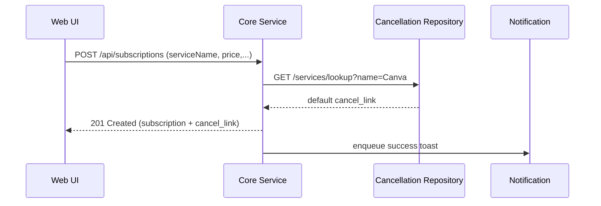
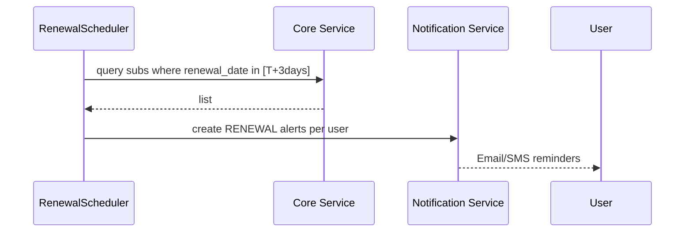
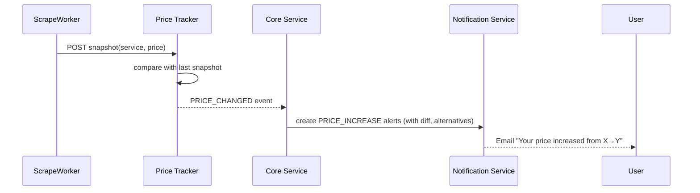
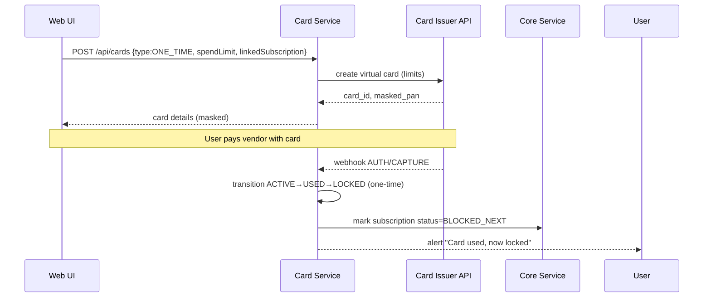
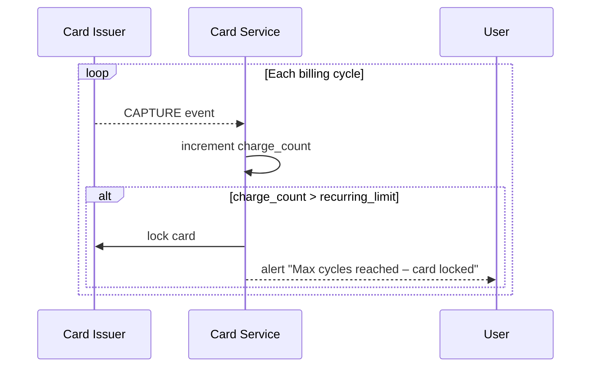
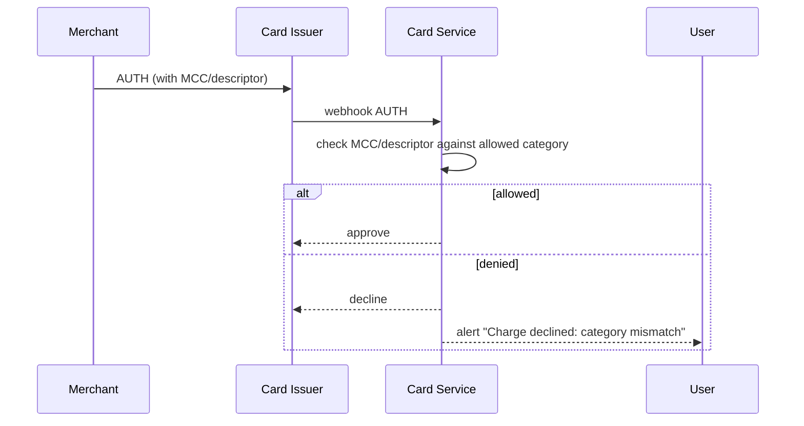

# Klard – High Level System Architecture & Data Flows (MVP + BurnerCard)

**Stack Focus:** Java 17/21/25 • Spring Boot 3 • PostgreSQL • Next.js (PWA) • Resend/Postmark • Twilio • Lithic/Privacy/Stripe Issuing • Puppeteer/Playwright scrapers • Kubernetes (K8s)

---

## 1) High‑Level Architecture (C4: Container level)

**Clients**

- Web PWA (Next.js 16, Tailwind): end‑user dashboard.
- Admin Console (restricted): feature flags, price DB curation, cancellation‑link repository.

**Edge**

- API Gateway (Spring Cloud Gateway or Nginx/Traefik): routing, auth propagation, rate‑limits.

**Back‑end Services (Spring Boot)**

1. **Auth Service**
    - JWT/OIDC (Access + Refresh), device tokens for PWA.
    - Roles: `USER`, `ADMIN`.
2. **Core Service**
    - Subscriptions CRUD, categories, analytics queries.
    - Cancellation Link repository (auto + manual).
    - Notification orchestration (renewal reminders, digests).
3. **Price Tracker Service**
    - Scraper workers (Puppeteer/Playwright via Node sidecars or Java Playwright).
    - Maintains `price_snapshot` history per service/region.
    - Emits `PRICE_CHANGED` domain events.
4. **Card Service (BurnerCard)**
    - Abstraction over **Lithic/Privacy/Stripe Issuing**.
    - Card lifecycle state machine + rules engine.
    - Webhook receivers for `AUTH`, `CAPTURE`, `DECLINE`, `REFUND` events.
5. **Notification Service**
    - Email (Resend/Postmark), SMS (Twilio), push (web push optional).
6. **Jobs Service**
    - Spring Scheduler / Quartz for cron: renewals, price refresh, card rule enforcement, weekly digests.

**Shared**

- PostgreSQL (managed): OLTP.
- Redis (optional): rate‑limiting, idempotency keys, short‑lived caches.
- Object Storage (S3/GCS): receipt CSV uploads, exports.
- Message Bus (optional, later): Kafka/NATS for events.
- Observability: OpenTelemetry → OTLP collector → Grafana/Tempo/Loki + Prometheus.

**3rd Parties**

- Card Issuer API (Lithic/Airwallex/Stripe Issuing) – PCI, KYC handled there.
- Email/SMS providers.

---

## 2) Domain Model (ERD)

```mermaid
erDiagram
    USERS ||--o{ SUBSCRIPTIONS : has
    USERS ||--o{ BURNER_CARDS : owns
    USERS ||--o{ ALERTS : receives
    SUBSCRIPTIONS ||--o| BURNER_CARDS : may_link
    SERVICES ||--o{ PRICE_SNAPSHOTS : has

    USERS {
      uuid id PK
      text email
      text plan
      text currency
      timestamptz created_at
    }
    SUBSCRIPTIONS {
      uuid id PK
      uuid user_id FK
      text service_name
      text category
      numeric price
      text billing_cycle  // MONTHLY|YEARLY|CUSTOM
      date renewal_date
      text status         // ACTIVE|CANCELLED|BLOCKED
      text cancel_link
      uuid burner_card_id FK nullable
      timestamptz created_at
      timestamptz updated_at
    }
    BURNER_CARDS {
      uuid id PK
      uuid user_id FK
      text provider_ref
      text type            // ONE_TIME|RECURRING_LIMITED|CATEGORY_LOCKED
      uuid linked_subscription nullable
      text category_lock nullable
      int recurring_limit nullable
      numeric spend_limit
      date expiry_date
      text status          // PROVISIONED|ACTIVE|USED|LOCKED|DELETED
      text masked_pan
      timestamptz created_at
      timestamptz updated_at
    }
    SERVICES {
      text key PK          // canonical slug: e.g., canva_pro
      text display_name
      text region          // default: GLOBAL
      text cancel_link_default
    }
    PRICE_SNAPSHOTS {
      uuid id PK
      text service_key FK
      text region
      numeric price
      timestamptz checked_at
      numeric prev_price nullable
      boolean change_detected
    }
    ALERTS {
      uuid id PK
      uuid user_id FK
      text type            // RENEWAL|PRICE_INCREASE|CARD_EVENT|WEEKLY_DIGEST
      text payload_json
      timestamptz created_at
      timestamptz sent_at nullable
    }

```

---

## 3) Service Responsibilities & Key Classes (Spring)

### 3.1 Core Service

- `SubscriptionController` – REST endpoints for CRUD, search, attach burner card, set cancel links.
- `SubscriptionService` – business logic; renewal schedule computation; analytics.
- `CancellationLinkService` – resolves auto links from repository with user override.
- `AnalyticsService` – monthly/annual totals, “top drainers”, savings tally.
- `RenewalScheduler` – daily scan → enqueue renewal alerts.

### 3.2 Price Tracker Service

- `PriceSourceRegistry` – map service → pricing URL + selector/JSON endpoint.
- `ScrapeWorker` – headless scraper (Node sidecar via gRPC/HTTP or Java Playwright).
- `PriceSnapshotRepository` – persists snapshots.
- `PriceChangeDetector` – compares last N snapshots; debounces false positives.
- Emits domain event `PRICE_CHANGED` (HTTP webhook to Core/Notification or Kafka topic).

### 3.3 Card Service (BurnerCard)

- `CardIssuerClient` (ports): `LithicClient`, `PrivacyClient`, `StripeIssuingClient`.
- `CardRulesEngine` – evaluates card state transitions and enforcement.
- `CardWebhookController` – receives issuer webhooks (auth, capture, decline).
- `CardLifecycleService` – state machine: `PROVISIONED→ACTIVE→USED→LOCKED/DELETED`.
- `CardEnforcementJob` – periodic check: apply expiry, recurring count, spend caps.

### 3.4 Notification Service

- `MailSender` (Resend/Postmark), `SmsSender` (Twilio), `DigestComposer`.
- Templating via Thymeleaf/Freemarker; localization.

---

## 4) API Design (selected endpoints)

### Auth (JWT)

- `POST /auth/register`
- `POST /auth/login`
- `POST /auth/refresh`

### Subscriptions

- `GET /api/subscriptions` → list with pagination & filters.
- `POST /api/subscriptions` → create.
- `GET /api/subscriptions/{id}` → details.
- `PATCH /api/subscriptions/{id}` → price, renewal_date, status.
- `DELETE /api/subscriptions/{id}`.
- `POST /api/subscriptions/{id}/cancel-link` { `url` }
- `POST /api/subscriptions/import/csv` → parse recurring candidates (async job).

**Request (create):**

```json
{
  "serviceName": "Canva Pro",
  "category": "Design",
  "price": 14.99,
  "billingCycle": "MONTHLY",
  "renewalDate": "2025-12-01",
  "cancelLink": null
}

```

**Response:** subscription entity with `id`.

### Cancellation Links Repository

- `GET /api/catalog/services` → known services (default cancel links, slugs).
- `GET /api/catalog/services/{key}` → details (pricing URL, cancel URL).

### Price Tracker

- `GET /api/prices/{serviceKey}/history?region=GLOBAL&limit=30`
- `POST /internal/prices/ingest` (from scraper workers)

### Burner Cards

- `POST /api/cards` (provision)

```json
{
  "type": "ONE_TIME",
  "linkedSubscriptionId": "uuid-...",
  "categoryLock": null,
  "recurringLimit": null,
  "spendLimit": 20.00,
  "expiryDays": 10
}

```

- `GET /api/cards` → list user cards (masked).
- `POST /api/cards/{id}/activate`
- `POST /api/cards/{id}/lock`
- `DELETE /api/cards/{id}` → delete (and call issuer to terminate).
- `POST /webhooks/issuer` (public) – signature‑validated.

### Alerts & Digests

- `GET /api/alerts` – user alerts feed.
- `POST /internal/alerts/send` – worker → mailer.

---

## 5) Key Data Flows (Sequence Diagrams)

### 5.1 Add Subscription with Auto Cancellation Link



### 5.2 Renewal Reminder Job



### 5.3 Price Change Detection



### 5.4 Create BurnerCard + Rule Enforcement (One‑time)



### 5.5 Recurring‑Limited Card (Max N cycles)



### 5.6 Category‑Locked Card



---

## 6) BurnerCard Rules Engine

**Inputs:** issuer event (auth/capture/decline), card definition, counters, MCC/category mapping, time.

**Deterministic checks (order):**

1. **Expiry**: `now > expiry_date` → `LOCK`.
2. **Spend Cap**: `total_spent + amount > spend_limit` → `DECLINE & LOCK`.
3. **Type**:
    - `ONE_TIME`: allow first capture → state `USED`, then `LOCK`.
    - `RECURRING_LIMITED`: allow until `charge_count == recurring_limit` → then `LOCK`.
    - `CATEGORY_LOCKED`: require MCC/descriptor in whitelist.
4. **Linked Subscription**: if provided, enforce merchant descriptor match.
5. **Notification hooks**: 80% spend threshold, final cycle, lock event.

**State Machine:** `PROVISIONED → ACTIVE → USED (optional) → LOCKED → DELETED`.

---

## 7) Security, Privacy, Compliance

- **No bank credentials** collected; payments handled by issuer.
- **Issuer webhooks:** HMAC signature verification; idempotency keys.
- **PII**: minimize; encrypt at rest (AES‑256) & in transit (TLS 1.3).
- **Secrets**: K8s Secrets + sealed‑secrets; rotate regularly.
- **AuthN/Z**: Spring Security (JWT); per‑user row‑level checks.
- **Rate limiting**: per IP/token via Gateway + Redis.
- **GDPR/CCPA**: data export/delete endpoints.

---

## 8) Deployment Topology (Kubernetes)

- Namespaces: `Klard-core`, `price`, `card`, `notif`, `jobs`.
- Pods per service with HPA (CPU 50%, RPS targets).
- Ingress: TLS, WAF rules (basic OWASP), Geo‑IP allow/deny (optional).
- Postgres: managed (Cloud SQL/Aurora/Neon). Backups + PITR.
- Scrapers as CronJobs/Queues with backoff.

---

## 9) Observability & SLOs

- **Tracing**: OpenTelemetry spans across gateway→services→issuer calls.
- **Metrics**: Prometheus – request latency, error rate, webhook failures, alert send rate.
- **Logs**: Loki – structured JSON.
- **SLOs**:
    - API p95 < 300 ms for read ops.
    - Price snapshots freshness ≤ 48h for top 200 services.
    - Webhook processing success ≥ 99.9%.

---

## 10) Testing Strategy

- Unit tests (JUnit 5), WebMvc/WebFlux tests.
- Contract tests for issuer clients (WireMock).
- Integration tests with Testcontainers (Postgres, Redis).
- End‑to‑end smoke via Playwright (UI flows).
- Chaos testing (optional later): inject webhook delays, scraper failures.

---

## 11) Migration Plan (MVP → V1)

- MVP: manual adds, renewal alerts, price snapshots for top 50 services, BurnerCard with ONE_TIME + RECURRING_LIMITED.
- V1: Category lock, cancellation‑link auto‑repo, CSV import, weekly digest, alternatives catalogue.
- V1.1: Email parsing (consent‑scoped), crowd‑verified price DB.

---

## 12) Configuration (Spring Boot examples)

```yaml
server:
  port: 8080
spring:
  datasource:
    url: jdbc:postgresql://db:5432/Klard
    username: ${DB_USER}
    password: ${DB_PASS}
  jpa:
    hibernate:
      ddl-auto: validate
    properties:
      hibernate.jdbc.time_zone: UTC
  jackson:
    serialization:
      WRITE_DATES_AS_TIMESTAMPS: false
security:
  jwt:
    issuer: https://api.Klard.app
    public-key: ${JWT_PUB}
    private-key: ${JWT_PRIV}
issuer:
  provider: lithic            # or privacy/stripe
  api-key: ${ISSUER_API_KEY}
  webhook-secret: ${ISSUER_WH_SECRET}
notifications:
  email:
    provider: resend
    api-key: ${RESEND_API_KEY}
  sms:
    provider: twilio
    sid: ${TWILIO_SID}
    token: ${TWILIO_TOKEN}
pricing:
  scrape:
    cron: "0 0 */6 * * *"    # every 6h
renewals:
  reminder-days: 3

```

---

## 13) Non‑Functional Requirements

- **Privacy‑first**: no bank connections required.
- **Performance**: dashboard loads < 1s for ≤ 50 subs; pagination beyond.
- **Resilience**: issuer webhook retries with exponential backoff.
- **Extensibility**: new issuer client plug‑in; new scraper adapters.

---

## 14) Detailed User Scenarios (Narratives)

**A) “Try & Forget” with One‑Time Card**

Tola wants to try a transcription tool for a month. In Klard, she creates a **ONE_TIME** card with a $20 cap, links it to the “TranscribeX” subscription, and pays. The card flips to **USED** and immediately **LOCKED** after capture. A month later, TranscribeX attempts auto‑renew; the issuer declines; Klard logs **$19.99 saved**, updates the subscription banner to **Blocked** and sends a celebratory email.

**B) “Stop the Creep” Price Guard**

Arjun tracks 12 subscriptions. The Price Tracker notices “Streamly” raised its family plan. Klard notifies him with a diff chart and proposes “Streamly Basic” or “FlixBox Family” as cheaper alternatives, showing **$84/year** potential savings. Arjun downgrades via the cancellation link and logs the new price; snapshots confirm the drop.

**C) Category‑Bound Team Budget**

Agency Amy issues a **CATEGORY_LOCKED** card for “Design” with a **recurring_limit=3**. The team uses it for Figma/Canva. When a video hosting platform attempts a charge (MCC mismatch), it’s declined and an alert educates the team about category policy.

**D) De‑risking Trials for Students**

Sam rotates through study tools. He keeps 5 active subs in Basic tier, upgrades to Pro for **price alerts and alternatives** during exams, and uses **BurnerCards** to avoid post‑trial surprises. His savings report becomes proof‑point for conversion: “You saved $126 this semester.”

---

## 15) Open Questions & Assumptions

- MCC/category mapping availability from issuer – confirm support per provider.
- Merchant descriptor fuzzy‑match strategy (normalize case, trim, vendor alias table).
- Regional pricing: start `GLOBAL`, add per‑country overrides as we scale.
- CSV import vendors: provide mapping UI for column headers.

---

## 16) Release Slices (Two‑Weekend Plan)

**Weekend 1**: Auth, Subscriptions CRUD, manual cancel links, renewal reminders, base UI.

**Weekend 2**: BurnerCard ONE_TIME (provision→use→lock), issuer webhook path, price snapshots for 10 top services, basic alternatives page, digest email.

---

## 17) Acceptance Criteria (MVP)

- Users can create/edit/delete subscriptions; see monthly total; get renewal emails 3 days prior.
- Cancellation link auto‑fills for ≥30 popular services; users can override per sub.
- Users can create a **ONE_TIME** burner card with spend limit and optional link to a subscription; after one successful charge, subsequent charges are blocked.
- Price tracker records snapshots for top 10 services and triggers alerts on increases ≥ 5%.
- Savings dashboard displays “blocked renewals” and calculated saved amount.

---

> This document is implementation‑ready. Next step: generate endpoint stubs and JPA entities, scaffold with Spring Initializr, and bootstrap K8s manifests for each service.
