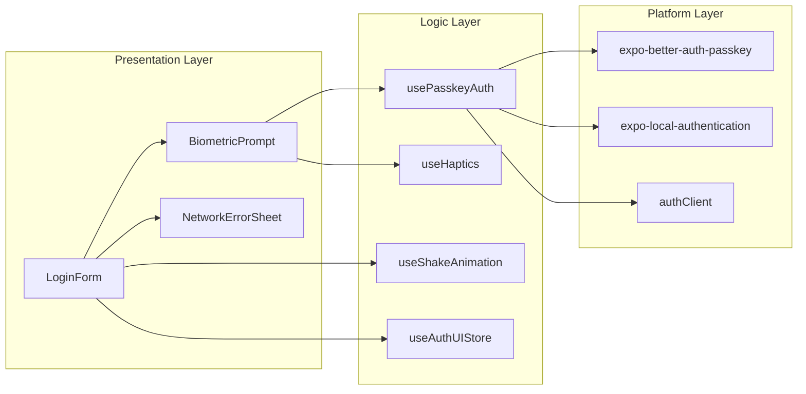
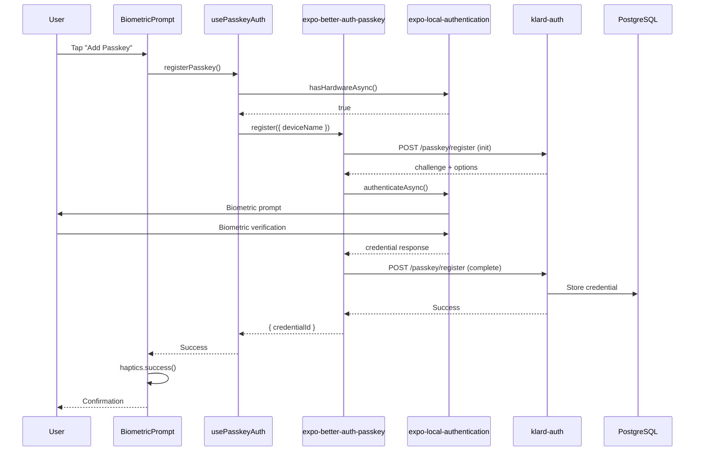
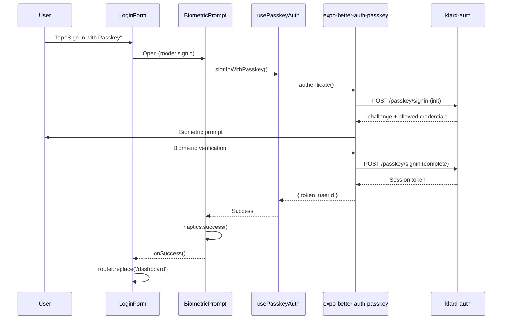
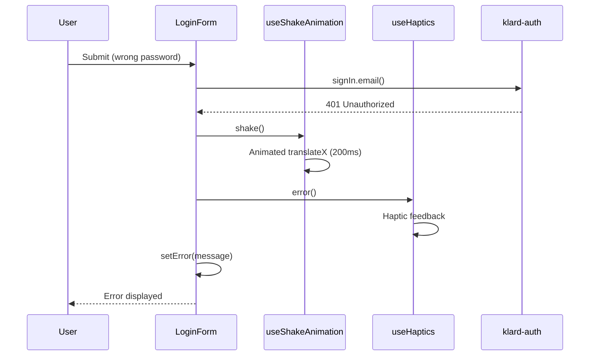

# Mobile Login Enhancements - Architecture Document

> **PRD:** [`docs/agile/prds/2025-12-16-mobile-login-enhancements-prd.md`](../prds/2025-12-16-mobile-login-enhancements-prd.md)
> **Status:** Approved
> **Date:** 2025-12-16

---

## Architecture Decisions

### ADR-001: Credential Manager Library

**Context:** Need a library to handle passkey/WebAuthn operations on mobile.

**Options:**
- A) `react-native-credentials-manager` - Full Credential Manager API
- B) `expo-better-auth-passkey` - Drop-in better-auth integration

**Decision:** **Option B - `expo-better-auth-passkey`**

**Rationale:** Tighter better-auth integration, consistent API surface, less glue code.

---

### ADR-002: Domain Verification File Hosting

**Context:** Passkeys require `/.well-known/` verification files for domain association.

**Options:**
- A) `klard-auth` Express server
- B) Separate CDN/static hosting
- C) Main web server (`klard-web`)

**Decision:** **Option A - `klard-auth` Express server**

**Rationale:** Same domain as auth `rpID`, single deployment, no extra infrastructure.

---

### ADR-003: Passkey Naming Convention

**Context:** Users may register passkeys from multiple devices.

**Options:**
- A) Auto-detect device name
- B) User-provided name
- C) Platform + timestamp

**Decision:** **Option A - Auto-detect device name**

**Rationale:** Zero friction for user, good defaults, can rename later if needed.

---

## System Architecture

### System Context Diagram

```mermaid
flowchart TB
    subgraph "klard-mobile (Expo)"
        UI[LoginForm]
        BP[BiometricPrompt]
        PA[usePasskeyAuth]
        SA[useShakeAnimation]
        NES[NetworkErrorSheet]
        EBP[expo-better-auth-passkey]
        ELA[expo-local-authentication]
    end

    subgraph "klard-auth (Express)"
        BA[better-auth]
        PP[@better-auth/passkey]
        DB[(PostgreSQL)]
        WK[/.well-known/]
    end

    UI --> BP
    UI --> SA
    UI --> NES
    BP --> PA
    PA --> EBP
    PA --> ELA
    EBP -->|"WebAuthn API"| BA
    BA --> PP
    PP --> DB

    EBP -.->|"Domain Verification"| WK
```

### Component Architecture



---

## Sequence Diagrams

### Passkey Registration Flow



### Passkey Sign-In Flow



### Auth Failure with Shake Animation



---

## Component Specifications

### 1. BiometricPrompt

**Location:** `/klard-mobile/src/components/auth/biometric-prompt/`

**Files:**
- `BiometricPrompt.tsx`
- `biometric-prompt.styles.ts`
- `index.ts`

**Interface:**
```typescript
interface BiometricPromptProps {
  mode: 'register' | 'signin';
  onSuccess: (result: PasskeyAuthResult) => void;
  onError: (error: PasskeyError) => void;
  onCancel: () => void;
  disabled?: boolean;
}
```

**SOLID Compliance:**
- **SRP:** UI presentation only, delegates logic to `usePasskeyAuth`
- **OCP:** Extensible via `mode` prop
- **LSP:** Substitutable for any component with same props
- **ISP:** Minimal focused interface
- **DIP:** Depends on abstractions (hooks)

---

### 2. usePasskeyAuth Hook

**Location:** `/klard-mobile/src/hooks/usePasskeyAuth.ts`

**Interface:**
```typescript
interface UsePasskeyAuthReturn {
  // State
  isLoading: boolean;
  isAvailable: boolean;
  biometricType: 'faceId' | 'touchId' | 'fingerprint' | 'none';
  error: PasskeyError | null;

  // Actions
  registerPasskey: (deviceName?: string) => Promise<PasskeyAuthResult>;
  signInWithPasskey: () => Promise<PasskeyAuthResult>;
  checkAvailability: () => Promise<void>;
  clearError: () => void;
}
```

**SOLID Compliance:**
- **SRP:** Passkey auth logic only
- **OCP:** New methods addable without modification
- **LSP:** Consistent interface across platforms
- **ISP:** Focused return interface
- **DIP:** Uses auth client abstraction

---

### 3. useShakeAnimation Hook

**Location:** `/klard-mobile/src/hooks/useShakeAnimation.ts`

**Interface:**
```typescript
interface UseShakeAnimationReturn {
  animatedStyle: AnimatedStyleProp<ViewStyle>;
  shake: () => void;
}
```

**Implementation:**
```typescript
// 200ms total: 4 segments × 50ms
const shake = () => {
  offset.value = withSequence(
    withTiming(-10, { duration: 50 }),
    withTiming(10, { duration: 50 }),
    withTiming(-10, { duration: 50 }),
    withTiming(0, { duration: 50 })
  );
};
```

**SOLID Compliance:**
- **SRP:** Animation only
- **OCP:** Configurable via constants
- **LSP:** Consistent style return
- **ISP:** 2 methods only
- **DIP:** Uses reanimated abstraction

---

### 4. NetworkErrorSheet

**Location:** `/klard-mobile/src/components/auth/network-error-sheet/`

**Files:**
- `NetworkErrorSheet.tsx`
- `network-error-sheet.styles.ts`
- `index.ts`

**Interface:**
```typescript
interface NetworkErrorSheetProps {
  open: boolean;
  onClose: () => void;
  onRetry: () => void;
  error: {
    message: string;
    code?: string;
  };
}
```

**SOLID Compliance:**
- **SRP:** Network error display only
- **OCP:** Extensible via error prop
- **LSP:** Substitutable for any error sheet
- **ISP:** Focused on network errors
- **DIP:** Uses BottomSheet abstraction

---

## Backend Changes

### klard-auth Configuration

**File:** `/klard-auth/src/lib/auth.ts`

**Changes:**
```typescript
import { passkey } from '@better-auth/passkey';

export const auth = betterAuth({
  // ... existing config
  plugins: [
    // ... existing plugins
    passkey({
      rpID: config.passkey.rpID,
      rpName: config.passkey.rpName,
      origin: config.passkey.origin,
      authenticatorAttachment: 'platform',
      userVerification: 'required',
    }),
  ],
});
```

### Domain Verification Endpoints

**File:** `/klard-auth/src/app.ts`

**Changes:**
```typescript
// Serve /.well-known/ static files
app.use('/.well-known', express.static('public/.well-known'));
```

**Files to create:**
- `/klard-auth/public/.well-known/assetlinks.json` (Android)
- `/klard-auth/public/.well-known/apple-app-site-association` (iOS)

### Database Schema

```sql
-- Auto-created by better-auth passkey plugin
CREATE TABLE passkey (
  id UUID PRIMARY KEY,
  user_id UUID REFERENCES "user"(id) ON DELETE CASCADE,
  credential_id TEXT NOT NULL UNIQUE,
  public_key TEXT NOT NULL,
  counter INTEGER DEFAULT 0,
  device_type TEXT,
  name TEXT,
  created_at TIMESTAMP DEFAULT NOW(),
  last_used_at TIMESTAMP
);

CREATE INDEX idx_passkey_user_id ON passkey(user_id);
CREATE INDEX idx_passkey_credential_id ON passkey(credential_id);
```

---

## Dependencies

### klard-mobile

```json
{
  "dependencies": {
    "expo-local-authentication": "~18.0.10",
    "expo-better-auth-passkey": "^1.0.0"
  }
}
```

### klard-auth

```json
{
  "dependencies": {
    "@better-auth/passkey": "^1.4.7"
  }
}
```

---

## Error Handling

### Error Types

```typescript
type PasskeyErrorCode =
  | 'BIOMETRIC_UNAVAILABLE'
  | 'USER_CANCELLED'
  | 'CREDENTIAL_FAILED'
  | 'NETWORK_ERROR'
  | 'RATE_LIMITED'
  | 'INVALID_CREDENTIAL';
```

### Error Messages

| Code | User-Facing Message |
|------|---------------------|
| `BIOMETRIC_UNAVAILABLE` | "Biometric authentication is not available. Please use your password." |
| `USER_CANCELLED` | (Silent - no error shown) |
| `CREDENTIAL_FAILED` | "Failed to verify credentials. Please try again." |
| `NETWORK_ERROR` | "Unable to connect. Check your internet and try again." |
| `RATE_LIMITED` | "Too many attempts. Please try again in {seconds} seconds." |
| `INVALID_CREDENTIAL` | "This passkey is no longer valid. Please use your password." |

---

## Implementation Phases

### Phase 1: Foundation
- [ ] Install dependencies
- [ ] Add passkey plugin to klard-auth
- [ ] Create `usePasskeyAuth` hook
- [ ] Update auth-client with passkey methods

### Phase 2: UI Components
- [ ] Create `BiometricPrompt` component
- [ ] Create `NetworkErrorSheet` component
- [ ] Create `useShakeAnimation` hook

### Phase 3: Integration
- [ ] Integrate into `LoginForm`
- [ ] Add shake animation on failure
- [ ] Add haptic feedback
- [ ] Replace ErrorBanner with NetworkErrorSheet for network errors

### Phase 4: Infrastructure
- [ ] Create domain verification files
- [ ] Add `NSFaceIDUsageDescription` to iOS
- [ ] Configure environment variables

### Phase 5: Testing
- [ ] Unit tests for hooks
- [ ] Component tests
- [ ] Integration tests
- [ ] Device testing (iOS/Android)

---

## Security Considerations

1. **Credential Storage:** Platform Secure Enclave (iOS) / StrongBox (Android)
2. **User Verification:** Required biometric for all operations
3. **Domain Binding:** Credentials bound to `rpID` domain
4. **Counter Protection:** Prevents replay attacks
5. **Rate Limiting:** Passkey endpoints rate-limited

---

## Performance Targets

| Operation | Target |
|-----------|--------|
| Passkey registration | < 2s |
| Passkey sign-in | < 1s |
| Shake animation | 200ms |
| NetworkErrorSheet open | < 100ms |

---

## Next Steps

Run `/agile:stories mobile-login-enhancements` to generate user stories.
