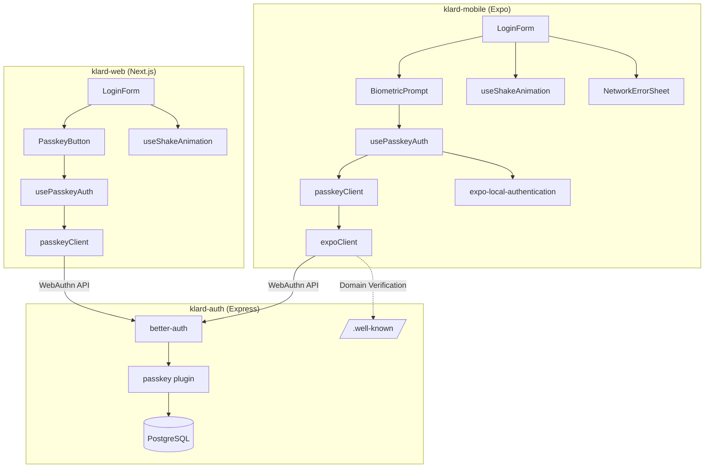
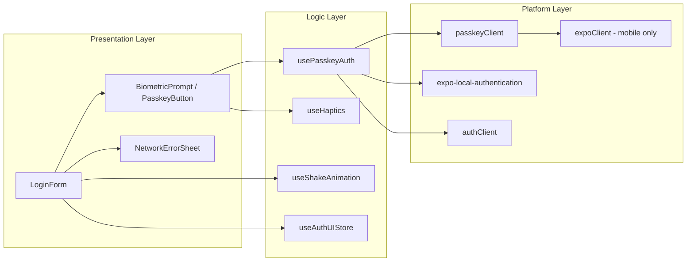
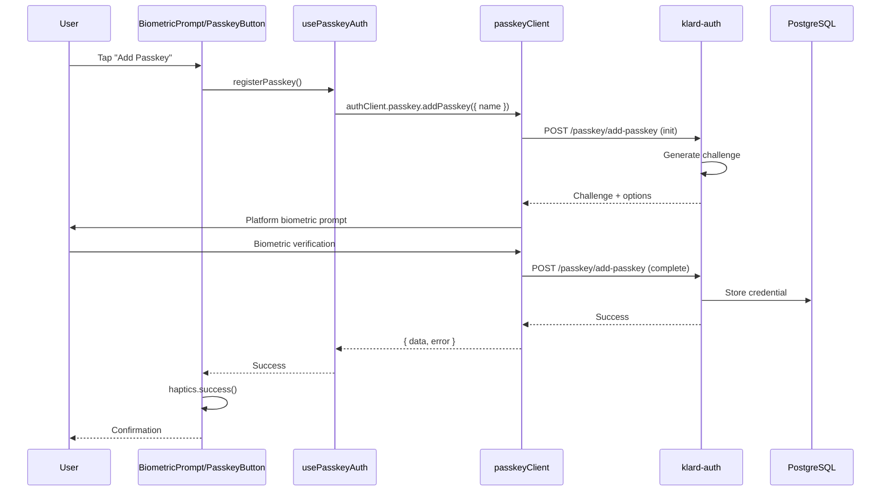
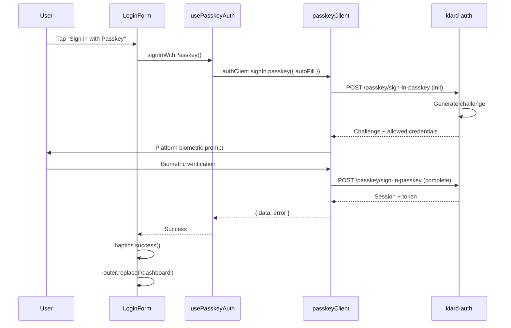
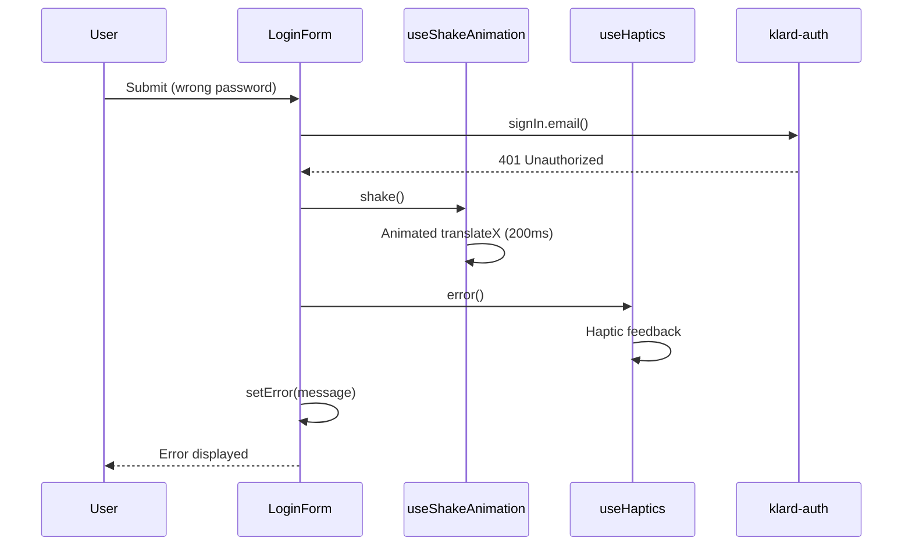

# Login Enhancements (Passkey/WebAuthn) - Architecture Document

> **PRD:** [`docs/agile/prds/2025-12-16-passkey-auth-prd.md`](../prds/2025-12-16-passkey-auth-prd.md)
> **Status:** Approved
> **Date:** 2025-12-16

---

## Architecture Decisions

### ADR-001: Passkey Client Library

**Context:** Need a library to handle passkey/WebAuthn operations on both web and mobile.

**Options:**
- A) `react-native-credentials-manager` - React Native Credential Manager API wrapper
- B) `expo-better-auth-passkey` - Third-party Expo integration
- C) `@better-auth/passkey/client` - Official better-auth passkey client with `passkeyClient()`

**Decision:** **Option C - `@better-auth/passkey/client` with `passkeyClient()`**

**Rationale:**
- Official better-auth library, guaranteed compatibility
- Same API surface on web and mobile (via `expoClient()` integration)
- No third-party dependencies to maintain
- Handles cookie/challenge flow automatically on Expo
- SimpleWebAuthn under the hood (industry standard)

---

### ADR-002: Domain Verification File Hosting

**Context:** Passkeys require `/.well-known/` verification files for domain association.

**Options:**
- A) `klard-auth` Express server
- B) Separate CDN/static hosting
- C) Main web server (`klard-web`)

**Decision:** **Option A - `klard-auth` Express server**

**Rationale:** Same domain as auth `rpID`, single deployment, no extra infrastructure.

---

### ADR-003: Passkey Naming Convention

**Context:** Users may register passkeys from multiple devices.

**Options:**
- A) Auto-detect device name
- B) User-provided name
- C) Platform + timestamp

**Decision:** **Option A - Auto-detect device name**

**Rationale:** Zero friction for user, good defaults, can rename later via `updatePasskey()`.

---

## System Architecture

### System Context Diagram



### Component Architecture



---

## Sequence Diagrams

### Passkey Registration Flow



### Passkey Sign-In Flow



### Auth Failure with Shake Animation



---

## Component Specifications

### 1. BiometricPrompt (Mobile)

**Location:** `/klard-mobile/src/components/auth/biometric-prompt/`

**Files:**
- `BiometricPrompt.tsx`
- `biometric-prompt.styles.ts`
- `index.ts`

**Interface:**
```typescript
interface BiometricPromptProps {
  mode: 'register' | 'signin';
  onSuccess: (result: PasskeyAuthResult) => void;
  onError: (error: PasskeyError) => void;
  onCancel: () => void;
  disabled?: boolean;
}
```

**SOLID Compliance:**
- **SRP:** UI presentation only, delegates logic to `usePasskeyAuth`
- **OCP:** Extensible via `mode` prop
- **LSP:** Substitutable for any component with same props
- **ISP:** Minimal focused interface
- **DIP:** Depends on abstractions (hooks)

---

### 2. PasskeyButton (Web)

**Location:** `/klard-web/src/components/auth/passkey-button/`

**Files:**
- `PasskeyButton.tsx`
- `index.ts`

**Interface:**
```typescript
interface PasskeyButtonProps {
  mode: 'register' | 'signin';
  onSuccess: () => void;
  onError: (error: Error) => void;
  disabled?: boolean;
  className?: string;
}
```

**SOLID Compliance:**
- **SRP:** Button UI + trigger only
- **OCP:** Extensible via `mode` prop
- **LSP:** Substitutable for any button
- **ISP:** Minimal interface
- **DIP:** Uses `usePasskeyAuth` hook

---

### 3. usePasskeyAuth Hook

**Location:**
- `/klard-mobile/src/hooks/usePasskeyAuth.ts`
- `/klard-web/src/hooks/usePasskeyAuth.ts`

**Interface (shared):**
```typescript
interface UsePasskeyAuthReturn {
  // State
  isLoading: boolean;
  isAvailable: boolean;
  biometricType: 'faceId' | 'touchId' | 'fingerprint' | 'none'; // mobile only
  error: PasskeyError | null;

  // Actions
  registerPasskey: (name?: string) => Promise<PasskeyAuthResult>;
  signInWithPasskey: (email: string, callbackURL?: string) => Promise<PasskeyAuthResult>;
  preloadPasskeys: () => void; // Web only: enables Conditional UI autocomplete
  listPasskeys: () => Promise<Passkey[]>;
  deletePasskey: (id: string) => Promise<void>;
  checkAvailability: () => Promise<void>; // mobile: checks biometric hardware
  clearError: () => void;
}
```

**Key Implementation Notes:**
- `registerPasskey` → calls `authClient.passkey.addPasskey({ name, authenticatorAttachment: 'platform' })`
- `signInWithPasskey` → calls `authClient.signIn.passkey({ email, callbackURL })`
- `preloadPasskeys` (Web) → calls `authClient.signIn.passkey({ autoFill: true })` on mount for Conditional UI

**SOLID Compliance:**
- **SRP:** Passkey auth logic only
- **OCP:** New methods addable without modification
- **LSP:** Consistent interface across platforms
- **ISP:** Focused return interface
- **DIP:** Uses authClient abstraction

---

### 4. useShakeAnimation Hook

**Location:**
- `/klard-mobile/src/hooks/useShakeAnimation.ts` (Reanimated)
- `/klard-web/src/hooks/useShakeAnimation.ts` (CSS)

**Interface:**
```typescript
interface UseShakeAnimationReturn {
  // Mobile: AnimatedStyleProp, Web: className
  animatedStyle: AnimatedStyleProp<ViewStyle> | string;
  shake: () => void;
}
```

**Key Implementation Notes:**
- **Mobile:** Uses Reanimated `withSequence` + `withTiming` for 200ms shake (4 × 50ms segments)
- **Web:** Toggles CSS class with `@keyframes` animation, 200ms duration

**SOLID Compliance:**
- **SRP:** Animation only
- **OCP:** Configurable via constants
- **LSP:** Consistent API return
- **ISP:** 2 methods only
- **DIP:** Uses platform animation abstraction

---

### 5. NetworkErrorSheet (Mobile)

**Location:** `/klard-mobile/src/components/auth/network-error-sheet/`

**Files:**
- `NetworkErrorSheet.tsx`
- `network-error-sheet.styles.ts`
- `index.ts`

**Interface:**
```typescript
interface NetworkErrorSheetProps {
  open: boolean;
  onClose: () => void;
  onRetry: () => void;
  error: {
    message: string;
    code?: string;
  };
}
```

**SOLID Compliance:**
- **SRP:** Network error display only
- **OCP:** Extensible via error prop
- **LSP:** Substitutable for any error sheet
- **ISP:** Focused on network errors
- **DIP:** Uses BottomSheet abstraction

---

## Backend Changes

### klard-auth Configuration

**File:** `/klard-auth/src/lib/auth.ts`

**Changes:**
```typescript
import { passkey } from '@better-auth/passkey';

export const auth = betterAuth({
  // ... existing config (expo() already configured)
  plugins: [
    // ... existing plugins
    passkey({
      rpID: config.passkey.rpID,           // e.g., 'klard.app' or 'localhost'
      rpName: config.passkey.rpName,       // e.g., 'Klard'
      origin: config.passkey.origin,       // e.g., 'https://klard.app'
      // Optional: customize challenge cookie name
      advanced: {
        webAuthnChallengeCookie: "better-auth-passkey"
      }
    }),
  ],
});
```

> **Note:** `authenticatorAttachment`, `userVerification`, and `residentKey` are **client-side options** passed to `addPasskey()`, not server configuration.

### Domain Verification Endpoints

**File:** `/klard-auth/src/app.ts`

**Changes:**
```typescript
// Serve /.well-known/ static files
app.use('/.well-known', express.static('public/.well-known'));
```

**Files to create:**
- `/klard-auth/public/.well-known/assetlinks.json` (Android)
- `/klard-auth/public/.well-known/apple-app-site-association` (iOS)

### Database Schema

```sql
-- Auto-managed by better-auth passkey plugin (run: pnpm dlx @better-auth/cli migrate)
CREATE TABLE passkey (
  id TEXT PRIMARY KEY,
  name TEXT,
  public_key TEXT NOT NULL,
  user_id TEXT REFERENCES "user"(id) ON DELETE CASCADE,
  credential_id TEXT NOT NULL UNIQUE,
  counter INTEGER NOT NULL DEFAULT 0,
  device_type TEXT,
  backed_up BOOLEAN,
  transports TEXT,
  aaguid TEXT,
  created_at TIMESTAMP DEFAULT NOW()
);

CREATE INDEX idx_passkey_user_id ON passkey(user_id);
CREATE INDEX idx_passkey_credential_id ON passkey(credential_id);
```

---

## Dependencies

### klard-mobile

```json
{
  "dependencies": {
    "@better-auth/passkey": "^1.4.7",
    "expo-local-authentication": "~18.0.10"
  }
}
```

### klard-web

```json
{
  "dependencies": {
    "@better-auth/passkey": "^1.4.7"
  }
}
```

### klard-auth

```json
{
  "dependencies": {
    "@better-auth/passkey": "^1.4.7"
  }
}
```

---

## Auth Client Configuration

### klard-web

Add `passkeyClient()` plugin to existing auth client.

### klard-mobile

Add `passkeyClient()` plugin alongside existing `expoClient()`. Required expoClient options:
- `scheme: "klard"` - Deep link scheme for OAuth
- `storagePrefix: "klard"` - SecureStore key prefix
- `storage: SecureStore` - Secure storage provider
- `cookiePrefix: "better-auth"` - Must match server cookie prefix

---

## Error Handling

### Error Types

```typescript
type PasskeyErrorCode =
  | 'BIOMETRIC_UNAVAILABLE'
  | 'USER_CANCELLED'
  | 'CREDENTIAL_FAILED'
  | 'NETWORK_ERROR'
  | 'RATE_LIMITED'
  | 'INVALID_CREDENTIAL';
```

### Error Messages

| Code | User-Facing Message |
|------|---------------------|
| `BIOMETRIC_UNAVAILABLE` | "Biometric authentication is not available. Please use your password." |
| `USER_CANCELLED` | (Silent - no error shown) |
| `CREDENTIAL_FAILED` | "Failed to verify credentials. Please try again." |
| `NETWORK_ERROR` | "Unable to connect. Check your internet and try again." |
| `RATE_LIMITED` | "Too many attempts. Please try again in {seconds} seconds." |
| `INVALID_CREDENTIAL` | "This passkey is no longer valid. Please use your password." |

---

## Implementation Phases

### Phase 1: Foundation
- [ ] Install `@better-auth/passkey` in all packages
- [ ] Add passkey plugin to klard-auth
- [ ] Configure `passkeyClient()` in klard-web auth-client
- [ ] Configure `passkeyClient()` + `expoClient()` in klard-mobile auth-client
- [ ] Run database migration

### Phase 2: Hooks
- [ ] Create `usePasskeyAuth` hook (mobile)
- [ ] Create `usePasskeyAuth` hook (web)
- [ ] Create `useShakeAnimation` hook (mobile - Reanimated)
- [ ] Create `useShakeAnimation` hook (web - CSS)

### Phase 3: UI Components
- [ ] Create `BiometricPrompt` component (mobile)
- [ ] Create `PasskeyButton` component (web)
- [ ] Create `NetworkErrorSheet` component (mobile)

### Phase 4: Integration
- [ ] Integrate into `LoginForm` (mobile)
- [ ] Integrate into `LoginForm` (web)
- [ ] Add shake animation on failure
- [ ] Add haptic feedback (mobile)
- [ ] Add Conditional UI with `autocomplete="webauthn"` (web)

### Phase 5: Infrastructure
- [ ] Create domain verification files
- [ ] Add `NSFaceIDUsageDescription` to iOS Info.plist
- [ ] Configure environment variables

### Phase 6: Testing
- [ ] Unit tests for hooks
- [ ] Component tests
- [ ] Integration tests
- [ ] Device testing (iOS/Android)
- [ ] Browser testing (Chrome, Safari, Firefox)

---

## Security Considerations

1. **Credential Storage:** Platform Secure Enclave (iOS) / StrongBox (Android) / Browser WebAuthn
2. **User Verification:** Required biometric for all operations
3. **Domain Binding:** Credentials bound to `rpID` domain
4. **Counter Protection:** Prevents replay attacks
5. **Rate Limiting:** Passkey endpoints rate-limited
6. **Cookie Security:** Challenge cookie with `cookiePrefix` matching on Expo

---

## Performance Targets

| Operation | Target |
|-----------|--------|
| Passkey registration | < 2s |
| Passkey sign-in | < 1s |
| Shake animation | 200ms |
| NetworkErrorSheet open | < 100ms |

---

## Next Steps

Run `/agile:stories passkey-auth` to generate user stories.