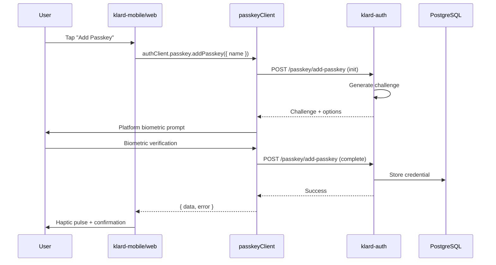
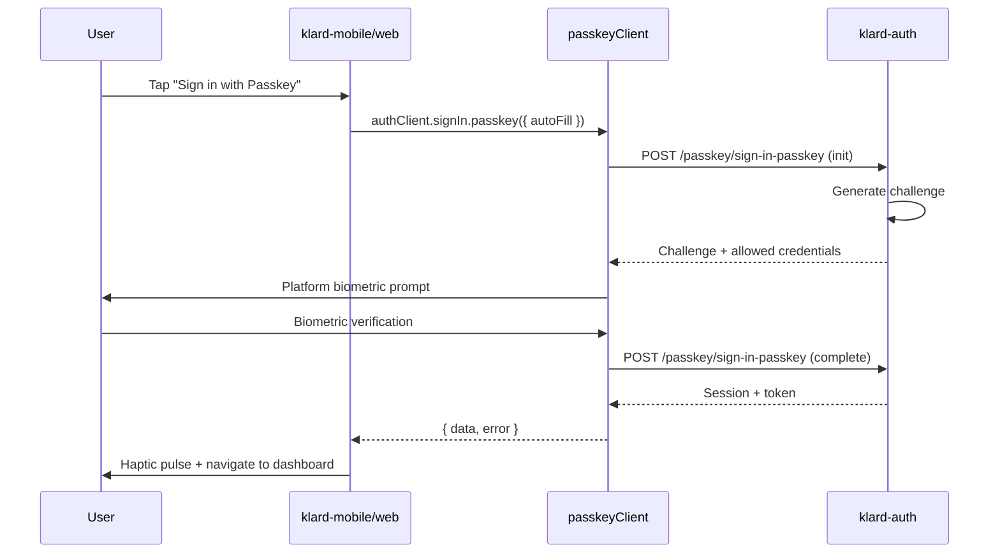

---
# PRD Metadata (Machine-Readable)
prd:
  id: "PRD-001"
  title: "Login Enhancements (Passkey/WebAuthn)"
  version: "1.1.0"
  created: "2025-12-16"
  updated: "2025-12-16"

  status: "draft"
  priority: "high"

  product_owner: "@Gbenga Tofade"
  tech_lead: "@Gbenga Tofade"
  team:
    - name: "Gbenga Tofade"
      role: "Full-Stack Developer"

  tracking:
    epic: "Authentication"
    milestone: "MVP"

  dependencies:
    - id: "better-auth-passkey"
      title: "@better-auth/passkey plugin (server + client)"
      type: "requires"

  tags: ["mobile", "web", "authentication", "passkey", "biometric", "ux"]
---

# Login Enhancements (Passkey/WebAuthn)

## Summary

> **One-liner:** Enhance login across mobile and web with Passkey/WebAuthn authentication, biometric prompts, haptic feedback, and improved error handling.

| Field | Value |
|-------|-------|
| **Status** | `draft` |
| **Priority** | High |
| **Product Owner** | @Gbenga Tofade |
| **Tech Lead** | @Gbenga Tofade |
| **Epic** | Authentication |

---

## Problem Definition

### Objective/Outcomes

**What problem are we solving?**

Login across mobile and web lacks platform-native UX polish and modern authentication that users expect:
- No passwordless authentication option (Passkey/WebAuthn)
- No biometric authentication for returning users
- No tactile feedback confirming successful actions
- Network errors displayed as inline banners (not prominent enough)
- No visual feedback when authentication fails

**What is our approach?**

Full-stack Passkey/WebAuthn implementation using better-auth's official `@better-auth/passkey` plugin. The same `passkeyClient()` from `@better-auth/passkey/client` works on both web and mobile (via Expo integration with `expoClient()`). Enhanced with haptic feedback, form animations, and improved error handling through layered component composition.

### Success Metrics

This feature will be successful if:

- [ ] Passkey registration works for authenticated users on iOS 16+ and Android 10+
- [ ] Passkey sign-in authenticates users without password entry
- [ ] Biometric prompt displays correctly (Face ID/Touch ID on iOS, Fingerprint on Android)
- [ ] Form shake animation triggers on authentication failure (200ms duration)
- [ ] Haptic pulse fires on successful login (all methods)
- [ ] Network errors display in BottomSheet modal (mobile)
- [ ] Conditional UI with `autocomplete="webauthn"` works on web
- [ ] 100% test coverage on all new components/hooks/endpoints
- [ ] Zero breaking changes to existing authentication flows
- [ ] Domain verification files deployed (AASA + assetlinks.json)

### Scope & Constraints

#### In Scope

**Backend Changes (klard-auth):**
- [ ] Add `@better-auth/passkey` plugin to auth configuration
- [ ] Database migration for passkey credential storage (auto-managed by plugin)
- [ ] New endpoints (auto-provided by plugin):
  - `POST /api/auth/passkey/add-passkey` - Register new passkey
  - `POST /api/auth/passkey/sign-in-passkey` - Authenticate with passkey
  - `DELETE /api/auth/passkey/delete-passkey` - Remove passkey
  - `GET /api/auth/passkey/list-user-passkeys` - List user's passkeys
  - `PUT /api/auth/passkey/update-passkey` - Update passkey name
- [ ] Rate limiting for passkey endpoints

**Frontend Changes (klard-mobile):**
- [ ] Add `@better-auth/passkey` (includes `/client` exports)
- [ ] Configure `passkeyClient()` with `expoClient()` in auth-client
- [ ] `BiometricPrompt` component - Passkey registration/sign-in UI
- [ ] `usePasskeyAuth` hook - Handles passkey flows via `authClient.passkey.*`
- [ ] `useShakeAnimation` hook - Form shake effect (Reanimated)
- [ ] `NetworkErrorSheet` - BottomSheet for network errors
- [ ] Enhanced `LoginForm` - Integration of passkey option
- [ ] Haptic feedback on success via existing `useHaptics`
- [ ] `expo-local-authentication` for biometric capability detection

**Frontend Changes (klard-web):**
- [ ] Add `@better-auth/passkey` (includes `/client` exports)
- [ ] Configure `passkeyClient()` in auth-client
- [ ] `PasskeyButton` component - Passkey registration/sign-in UI
- [ ] `usePasskeyAuth` hook - Handles passkey flows via `authClient.passkey.*`
- [ ] `useShakeAnimation` hook - Form shake effect (CSS animation)
- [ ] Enhanced `LoginForm` - Integration of passkey option
- [ ] Conditional UI support with `autocomplete="webauthn"` inputs

**Infrastructure Changes:**
- [ ] Host `/.well-known/assetlinks.json` (Android domain verification)
- [ ] Host `/.well-known/apple-app-site-association` (iOS domain verification)
- [ ] Add `NSFaceIDUsageDescription` to iOS Info.plist

#### Out of Scope

- Biometric enrollment management UI (future phase)
- Cross-device passkey sync management
- Passkey migration from other providers

#### Constraints

- Requires iOS 16+ and Android 10+ (platform requirement)
- Must use Expo development builds (Expo Go not supported)
- Must use existing better-auth infrastructure
- Must follow SOLID principles (per project standards)
- Must have 100% test coverage (TDD requirement)
- Must not break existing login functionality

---

## Solution Definition

### Architecture

**System Context Diagram:**

```mermaid
flowchart TB
    subgraph "klard-web (Next.js)"
        WLF[LoginForm]
        WPB[PasskeyButton]
        WPA[usePasskeyAuth]
        WSA[useShakeAnimation]
        WPC[passkeyClient]
    end

    subgraph "klard-mobile (Expo)"
        MLF[LoginForm]
        MBP[BiometricPrompt]
        MPA[usePasskeyAuth]
        MSA[useShakeAnimation]
        NES[NetworkErrorSheet]
        MPC[passkeyClient]
        EC[expoClient]
        ELA[expo-local-authentication]
    end

    subgraph "klard-auth (Express)"
        BA[better-auth]
        PP[@better-auth/passkey]
        DB[(PostgreSQL)]
        WK[/.well-known/]
    end

    WLF --> WPB
    WLF --> WSA
    WPB --> WPA
    WPA --> WPC
    WPC -->|"WebAuthn API"| BA

    MLF --> MBP
    MLF --> MSA
    MLF --> NES
    MBP --> MPA
    MPA --> MPC
    MPC --> EC
    MPA --> ELA
    EC -->|"WebAuthn API"| BA

    BA --> PP
    PP --> DB

    EC -.->|"Domain Verification"| WK
```

**Sequence Diagram - Passkey Registration:**



**Sequence Diagram - Passkey Sign-In:**



### Technical Specification

> **Implementation details:** See [Architecture Document](../architecture/2025-12-16-passkey-auth-arch.md)

#### Client SDK Methods

| Method | Purpose | Auth Required |
|--------|---------|---------------|
| `authClient.passkey.addPasskey()` | Register new passkey | Yes |
| `authClient.signIn.passkey()` | Authenticate with passkey | No |
| `authClient.passkey.listUserPasskeys()` | List user's passkeys | Yes |
| `authClient.passkey.deletePasskey()` | Remove a passkey | Yes |
| `authClient.passkey.updatePasskey()` | Rename a passkey | Yes |

#### Error Handling

| Status Code | Error Code | Description | User Action |
|-------------|------------|-------------|-------------|
| 400 | `invalid_credential` | Credential verification failed | Show error, offer password login |
| 401 | `unauthorized` | Not authenticated (for registration) | Redirect to login |
| 404 | `passkey_not_found` | No passkey for user | Offer password login or registration |
| 429 | `rate_limited` | Too many attempts | Show retry timer |
| 500 | `internal_error` | Server error | Show network error modal |

#### Data Model Changes

New `passkey` table auto-managed by better-auth passkey plugin. Key fields:
- `credential_id` - Unique WebAuthn credential identifier
- `public_key` - Stored public key for verification
- `user_id` - Foreign key to user table
- `counter` - Replay attack prevention
- `device_type` - Platform or cross-platform
- `backed_up` - Whether synced to cloud keychain

> **Schema details:** See [Architecture Document](../architecture/2025-12-16-passkey-auth-arch.md#database-schema)

---

## Decision Log

| # | Question | Decision | Decider | Date |
|---|----------|----------|---------|------|
| 1 | Biometric prompt text style | Generic "Unlock with Biometrics" + icon (not device-specific) | @Gbenga Tofade | 2025-12-16 |
| 2 | Network error retry behavior | Preserve form values on retry | @Gbenga Tofade | 2025-12-16 |
| 3 | Haptic feedback consistency | Uniform pulse for all login methods | @Gbenga Tofade | 2025-12-16 |
| 4 | Passkey architecture | Option C: Full WebAuthn/Passkey (most secure, future-proof) | @Gbenga Tofade | 2025-12-16 |
| 5 | Passkey client library | Official `@better-auth/passkey/client` with `passkeyClient()` for both platforms | @Gbenga Tofade | 2025-12-16 |

---

## User Stories

> **See:** [`docs/agile/stories/2025-12-16-passkey-auth-stories.md`](../stories/2025-12-16-passkey-auth-stories.md)
>
> Generate with: `/agile:stories passkey-auth`

**Epic Summary:**
- **Epic 1: Passkey Authentication** - Registration and sign-in flows
- **Epic 2: Error Handling & Feedback** - Shake, haptics, network errors

---

## Testing Strategy

> **See:** [`docs/agile/qa/2025-12-16-passkey-auth-qa.md`](../qa/2025-12-16-passkey-auth-qa.md)
>
> Generate with: `/agile:qa passkey-auth`

**Coverage Summary:**
- Unit tests: hooks, components, utilities
- Integration tests: passkey endpoints, full auth flow
- TDD required per project standards

---

## Risk Assessment

| Risk | Likelihood | Impact | Mitigation |
|------|------------|--------|------------|
| Passkey not supported on older devices | Medium | Medium | Graceful fallback to password; check biometric availability before offering |
| Domain verification files misconfigured | Medium | High | Test AASA/assetlinks.json on staging before prod; use validation tools |
| User cancels biometric mid-flow | High | Low | Handle cancellation gracefully; return to login form without error |
| Rate limiting blocks legitimate users | Low | Medium | Tune limits based on usage; provide clear retry messaging |
| Expo Go incompatibility | High | Medium | Document dev build requirement; CI uses EAS builds |
| Cookie prefix mismatch (Expo) | Low | High | Ensure `cookiePrefix` in expoClient matches server's `webAuthnChallengeCookie` |

**Systems Affected:**
- `klard-auth` - New passkey plugin and database schema
- `klard-mobile` - New dependency, auth-client configuration
- `klard-web` - New dependency, auth-client configuration
- Infrastructure - Domain verification file hosting

---

## References

- [better-auth passkey plugin](https://www.better-auth.com/docs/plugins/passkey)
- [better-auth Expo integration](https://www.better-auth.com/docs/integrations/expo)
- [Expo Local Authentication](https://docs.expo.dev/versions/v54.0.0/sdk/local-authentication/)
- [SimpleWebAuthn (underlying library)](https://simplewebauthn.dev/)
- [Planning Document](../plans/2025-12-16-passkey-auth-plan.md)