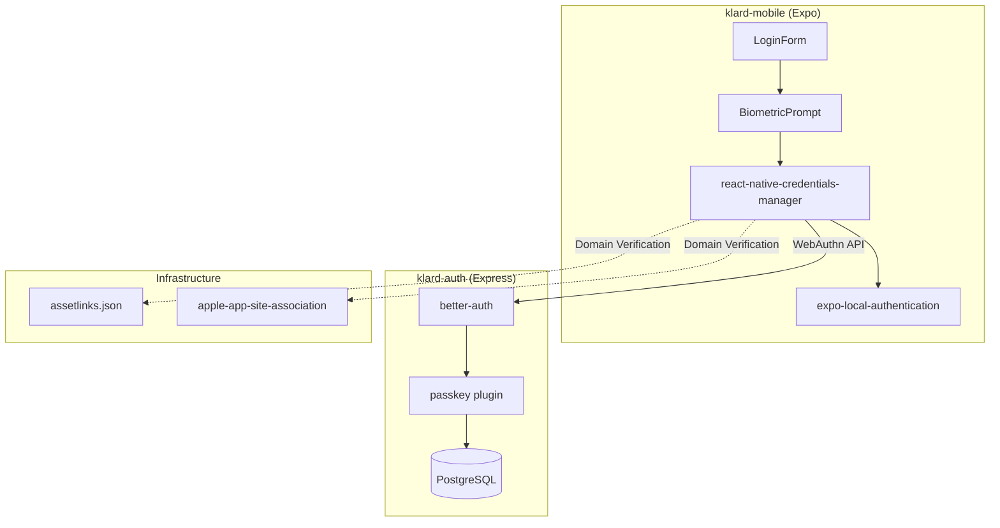
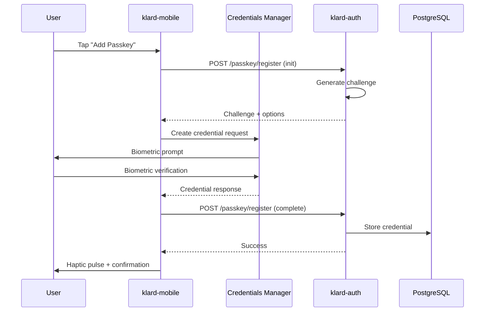
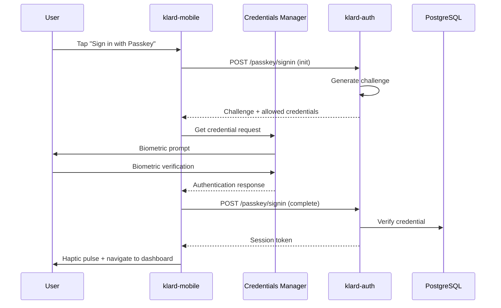

---
# PRD Metadata (Machine-Readable)
prd:
  id: "PRD-001"
  title: "Mobile Login Enhancements"
  version: "1.0.0"
  created: "2025-12-16"
  updated: "2025-12-16"

  status: "draft"
  priority: "high"

  product_owner: "@Gbenga Tofade"
  tech_lead: "@Gbenga Tofade"
  team:
    - name: "Gbenga Tofade"
      role: "Full-Stack Developer"

  tracking:
    epic: "Authentication"
    milestone: "MVP"

  dependencies:
    - id: "better-auth-passkey"
      title: "@better-auth/passkey plugin"
      type: "requires"
    - id: "react-native-credentials-manager"
      title: "Credential Manager for RN"
      type: "requires"

  tags: ["mobile", "authentication", "passkey", "biometric", "ux"]
---

# Mobile Login Enhancements

## Summary

> **One-liner:** Enhance the mobile login experience with Passkey/WebAuthn authentication, biometric prompts, haptic feedback, and improved error handling.

| Field | Value |
|-------|-------|
| **Status** | `draft` |
| **Priority** | High |
| **Product Owner** | @Gbenga Tofade |
| **Tech Lead** | @Gbenga Tofade |
| **Epic** | Authentication |

---

## Problem Definition

### Objective/Outcomes

**What problem are we solving?**

Mobile login lacks platform-native UX polish and modern authentication that users expect:
- No passwordless authentication option (Passkey/WebAuthn)
- No biometric authentication for returning users
- No tactile feedback confirming successful actions
- Network errors displayed as inline banners (not prominent enough)
- No visual feedback when authentication fails

**What is our approach?**

Full-stack Passkey/WebAuthn implementation using better-auth's passkey plugin on the backend and react-native-credentials-manager on the frontend. Enhanced with haptic feedback, form animations, and improved error handling through layered component composition.

### Success Metrics

This feature will be successful if:

- [ ] Passkey registration works for authenticated users on iOS 16+ and Android 10+
- [ ] Passkey sign-in authenticates users without password entry
- [ ] Biometric prompt displays correctly (Face ID/Touch ID on iOS, Fingerprint on Android)
- [ ] Form shake animation triggers on authentication failure (200ms duration)
- [ ] Haptic pulse fires on successful login (all methods)
- [ ] Network errors display in BottomSheet modal
- [ ] 100% test coverage on all new components/hooks/endpoints
- [ ] Zero breaking changes to existing authentication flows
- [ ] Domain verification files deployed (AASA + assetlinks.json)

### Scope & Constraints

#### In Scope

**Backend Changes (klard-auth):**
- [ ] Add `@better-auth/passkey` plugin to auth configuration
- [ ] Database migration for passkey credential storage
- [ ] New endpoints (auto-provided by plugin):
  - `POST /api/auth/passkey/register` - Register new passkey
  - `POST /api/auth/passkey/signin` - Authenticate with passkey
  - `DELETE /api/auth/passkey/{id}` - Remove passkey
- [ ] Rate limiting for passkey endpoints

**Frontend Changes (klard-mobile):**
- [ ] Add `react-native-credentials-manager` OR `expo-better-auth-passkey`
- [ ] `BiometricPrompt` component - Passkey registration/sign-in UI
- [ ] `usePasskeyAuth` hook - Handles passkey flows
- [ ] `useShakeAnimation` hook - Form shake effect
- [ ] `NetworkErrorSheet` - BottomSheet for network errors
- [ ] Enhanced `LoginForm` - Integration of passkey option
- [ ] Haptic feedback on success via existing `useHaptics`
- [ ] `expo-local-authentication` for biometric capability detection

**Infrastructure Changes:**
- [ ] Host `/.well-known/assetlinks.json` (Android domain verification)
- [ ] Host `/.well-known/apple-app-site-association` (iOS domain verification)
- [ ] Add `NSFaceIDUsageDescription` to iOS Info.plist

#### Out of Scope

- Biometric enrollment management UI (future phase)
- Cross-device passkey sync management
- Passkey migration from other providers
- Web client passkey support (separate feature)

#### Constraints

- Requires iOS 16+ and Android 10+ (platform requirement)
- Must use Expo development builds (Expo Go not supported)
- Must use existing better-auth infrastructure
- Must follow SOLID principles (per project standards)
- Must have 100% test coverage (TDD requirement)
- Must not break existing login functionality

---

## Solution Definition

### Architecture

**System Context Diagram:**



**Sequence Diagram - Passkey Registration:**



**Sequence Diagram - Passkey Sign-In:**



### Technical Specification

#### API Contracts

**Endpoint:** `POST /api/auth/passkey/register`

Request (provided by better-auth plugin):
```json
{
  "name": "My iPhone",
  "authenticatorAttachment": "platform"
}
```

Response (Success):
```json
{
  "message": "Passkey registered successfully."
}
```

**Endpoint:** `POST /api/auth/passkey/signin`

Request:
```json
{
  "autoFill": false
}
```

Response (Success):
```json
{
  "message": "Successfully signed in with passkey.",
  "userId": "user_123abc",
  "token": "eyJhbGciOiJIUzI1NiIs..."
}
```

#### Error Handling

| Status Code | Error Code | Description | User Action |
|-------------|------------|-------------|-------------|
| 400 | `invalid_credential` | Credential verification failed | Show error, offer password login |
| 401 | `unauthorized` | Not authenticated (for registration) | Redirect to login |
| 404 | `passkey_not_found` | No passkey for user | Offer password login or registration |
| 429 | `rate_limited` | Too many attempts | Show retry timer |
| 500 | `internal_error` | Server error | Show network error modal |

#### Data Model Changes

```sql
-- Passkey credentials table (managed by better-auth passkey plugin)
CREATE TABLE passkey (
  id UUID PRIMARY KEY,
  user_id UUID REFERENCES user(id),
  credential_id TEXT NOT NULL,
  public_key TEXT NOT NULL,
  counter INTEGER DEFAULT 0,
  device_type TEXT,
  name TEXT,
  created_at TIMESTAMP DEFAULT NOW(),
  last_used_at TIMESTAMP
);

CREATE INDEX idx_passkey_user_id ON passkey(user_id);
CREATE INDEX idx_passkey_credential_id ON passkey(credential_id);
```

---

## Decision Log

| # | Question | Decision | Decider | Date |
|---|----------|----------|---------|------|
| 1 | Biometric prompt text style | Generic "Unlock with Biometrics" + icon (not device-specific) | @Gbenga Tofade | 2025-12-16 |
| 2 | Network error retry behavior | Preserve form values on retry | @Gbenga Tofade | 2025-12-16 |
| 3 | Haptic feedback consistency | Uniform pulse for all login methods | @Gbenga Tofade | 2025-12-16 |
| 4 | Passkey architecture | Option C: Full WebAuthn/Passkey (most secure, future-proof) | @Gbenga Tofade | 2025-12-16 |
| 5 | Credential manager library | `react-native-credentials-manager` or `expo-better-auth-passkey` | TBD | - |

---

## User Stories

> **See:** [`docs/agile/stories/2025-12-16-mobile-login-enhancements-stories.md`](../stories/2025-12-16-mobile-login-enhancements-stories.md)
>
> Generate with: `/agile:stories mobile-login-enhancements`

**Epic Summary:**
- **Epic 1: Passkey Authentication** - Registration and sign-in flows
- **Epic 2: Error Handling & Feedback** - Shake, haptics, network errors

---

## Testing Strategy

> **See:** [`docs/agile/qa/2025-12-16-mobile-login-enhancements-qa.md`](../qa/2025-12-16-mobile-login-enhancements-qa.md)
>
> Generate with: `/agile:qa mobile-login-enhancements`

**Coverage Summary:**
- Unit tests: hooks, components, utilities
- Integration tests: passkey endpoints, full auth flow
- TDD required per project standards

---

## Risk Assessment

| Risk | Likelihood | Impact | Mitigation |
|------|------------|--------|------------|
| Passkey not supported on older devices | Medium | Medium | Graceful fallback to password; check `hasHardwareAsync()` before offering |
| Domain verification files misconfigured | Medium | High | Test AASA/assetlinks.json on staging before prod; use validation tools |
| User cancels biometric mid-flow | High | Low | Handle cancellation gracefully; return to login form without error |
| Rate limiting blocks legitimate users | Low | Medium | Tune limits based on usage; provide clear retry messaging |
| Expo Go incompatibility | High | Medium | Document dev build requirement; CI uses EAS builds |
| Credential manager API differences (iOS vs Android) | Medium | Medium | Abstract via `react-native-credentials-manager`; platform-specific tests |

**Systems Affected:**
- `klard-auth` - New passkey plugin and database schema
- `klard-mobile` - New dependencies, native module integration
- Infrastructure - Domain verification file hosting

---

## References

- [better-auth passkey plugin](https://www.better-auth.com/docs/plugins/passkey)
- [expo-better-auth-passkey](https://github.com/kevcube/expo-better-auth-passkey)
- [react-native-credentials-manager](https://docs.benjamineruvieru.com/docs/category/react-native-credentials-manager)
- [Expo Local Authentication](https://docs.expo.dev/versions/v54.0.0/sdk/local-authentication/)
- [Planning Document](../plans/2025-12-16-mobile-login-enhancements-plan.md)
