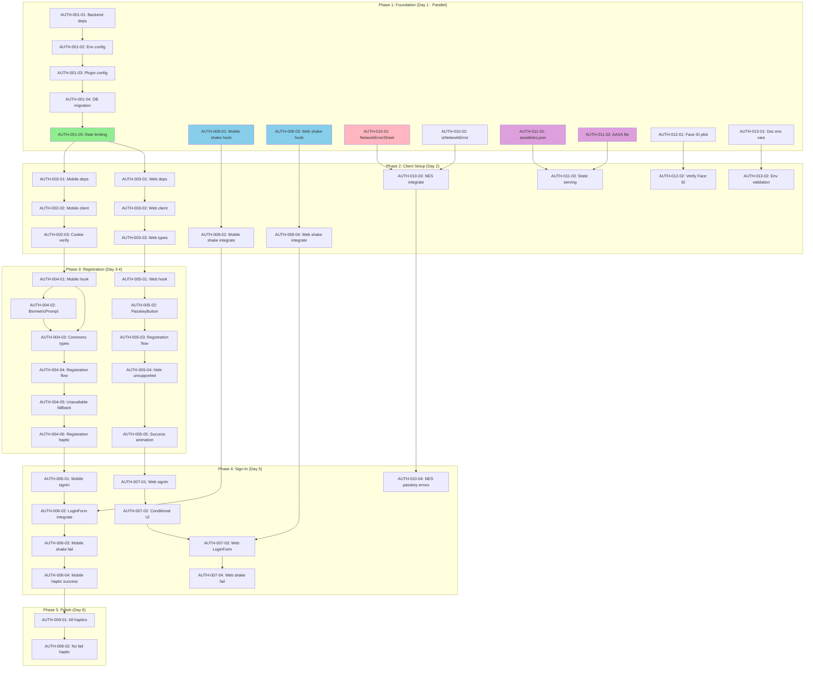

# Login Enhancements (Passkey/WebAuthn) - Implementation Tasks

> **For Claude:** REQUIRED SUB-SKILL: Use superpowers:executing-plans to implement this plan task-by-task.

---

## ⚠️ MANDATORY: Context7 MCP Library Documentation

**BEFORE writing ANY code that uses external libraries, you MUST:**

### Step 1: Resolve Library ID
```
mcp__context7__resolve-library-id: libraryName="<library>"
```

### Step 2: Fetch Documentation
```
mcp__context7__get-library-docs: context7CompatibleLibraryID="<id>" topic="<topic>"
```

### Required Library Lookups for This Feature

| Task Range | Library | Topics to Fetch |
|------------|---------|-----------------|
| AUTH-001-* | `better-auth` | `passkey`, `plugins`, `configuration` |
| AUTH-002-* | `better-auth` | `expo`, `passkey/client`, `expoClient` |
| AUTH-003-* | `better-auth` | `passkey/client`, `passkeyClient`, `react` |
| AUTH-004-*, AUTH-006-* | `expo-local-authentication` | `biometric`, `authenticateAsync` |
| AUTH-004-*, AUTH-005-* | `better-auth` | `passkey.addPasskey`, `registration` |
| AUTH-006-*, AUTH-007-* | `better-auth` | `signIn.passkey`, `conditional-ui`, `autoFill` |
| AUTH-008-01 | `react-native-reanimated` | `withSequence`, `withTiming`, `useSharedValue` |
| AUTH-010-* | `@gorhom/bottom-sheet` | `BottomSheet`, `usage` |

### Why This Is Non-Negotiable

- **Training data is stale**: APIs change frequently; better-auth passkey plugin may have updated since cutoff
- **Subtle bugs**: Old patterns compile but fail at runtime (e.g., deprecated options)
- **Time waste**: Debugging API mismatches costs more than 30 seconds to fetch docs

### Enforcement

When implementing ANY task:
1. ✅ Identify libraries used
2. ✅ Fetch Context7 docs for each
3. ✅ Reference docs while coding
4. ❌ NEVER assume API shape from memory

---

**Goal:** Implement full-stack Passkey/WebAuthn authentication across klard-web, klard-mobile, and klard-auth with biometric prompts, haptic feedback, shake animations, and improved error handling.

**Architecture:** Layered composition using better-auth's official `@better-auth/passkey` plugin on backend, with `passkeyClient()` on both web and mobile (via `expoClient()` integration). New UI components delegate auth logic to hooks, maintaining SOLID principles.

**Tech Stack:**
- Backend: `@better-auth/passkey` plugin, PostgreSQL
- Web: `@better-auth/passkey/client`, `passkeyClient()`, CSS animations
- Mobile: `@better-auth/passkey/client`, `passkeyClient()` + `expoClient()`, Reanimated, `expo-local-authentication`

---

## Story Index

| Story | Title | Tasks | Est. Total |
|-------|-------|-------|------------|
| US-001 | Configure backend passkey plugin | 5 | 4h |
| US-002 | Configure mobile auth client | 3 | 2h |
| US-003 | Configure web auth client | 3 | 2h |
| US-004 | Mobile passkey registration | 6 | 8h |
| US-005 | Web passkey registration | 5 | 6h |
| US-006 | Mobile passkey sign-in | 4 | 6h |
| US-007 | Web passkey sign-in with Conditional UI | 4 | 6h |
| US-008 | Form shake animation | 4 | 4h |
| US-009 | Haptic feedback on success | 2 | 2h |
| US-010 | Network error bottom sheet | 4 | 4h |
| US-011 | Deploy domain verification files | 3 | 2h |
| US-012 | Configure iOS Face ID permission | 2 | 1h |
| US-013 | Configure passkey environment variables | 2 | 1h |
| **TOTAL** | **13 Stories** | **47 Tasks** | **48h** |

---

## Epic 1: Passkey Authentication

### Story US-001: Configure Backend Passkey Plugin

**Priority:** P0 | **Estimated Total:** 4h

---

#### Task AUTH-001-01: Install passkey plugin dependency

**Story:** US-001
**Type:** Chore
**Estimate:** 15min

**Files:**
- Modify: `klard-auth/package.json` - Add `@better-auth/passkey` dependency

**Step 1: Add dependency**

```bash
cd klard-auth
pnpm add @better-auth/passkey@^1.4.7
```

**Step 2: Verify installation**

Run: `pnpm list @better-auth/passkey`
Expected: Shows version `^1.4.7`

**Step 3: Commit**

```bash
git add klard-auth/package.json klard-auth/pnpm-lock.yaml
git commit -m "chore(auth): add @better-auth/passkey dependency"
```

**Dependencies:** None

---

#### Task AUTH-001-02: Configure passkey environment variables

**Story:** US-001
**Type:** Feature
**Estimate:** 30min

**Files:**
- Modify: `klard-auth/.env.example` - Add passkey config
- Modify: `klard-auth/src/config.ts` - Add passkey config loading

**Step 1: Write the failing test**

```typescript
// klard-auth/src/__tests__/config.test.ts
import { config } from '../config';

describe('Passkey Configuration', () => {
  it('should load passkey environment variables', () => {
    expect(config.passkey).toBeDefined();
    expect(config.passkey.rpID).toBe(process.env.PASSKEY_RP_ID || 'localhost');
    expect(config.passkey.rpName).toBe(process.env.PASSKEY_RP_NAME || 'Klard');
    expect(config.passkey.origin).toBe(process.env.PASSKEY_ORIGIN || 'http://localhost:3001');
  });
});
```

**Step 2: Run test to verify it fails**

Run: `cd klard-auth && pnpm test src/__tests__/config.test.ts --run`
Expected: FAIL with "config.passkey is not defined"

**Step 3: Write minimal implementation**

```typescript
// klard-auth/.env.example
# ... existing vars ...

# Passkey/WebAuthn Configuration
PASSKEY_RP_ID=localhost
PASSKEY_RP_NAME=Klard
PASSKEY_ORIGIN=http://localhost:3001
```

```typescript
// klard-auth/src/config.ts
export const config = {
  // ... existing config ...
  passkey: {
    rpID: process.env.PASSKEY_RP_ID || 'localhost',
    rpName: process.env.PASSKEY_RP_NAME || 'Klard',
    origin: process.env.PASSKEY_ORIGIN || 'http://localhost:3001',
  },
};
```

**Step 4: Run test to verify it passes**

Run: `cd klard-auth && pnpm test src/__tests__/config.test.ts --run`
Expected: PASS

**Step 5: Commit**

```bash
git add klard-auth/.env.example klard-auth/src/config.ts klard-auth/src/__tests__/config.test.ts
git commit -m "feat(auth): add passkey environment configuration"
```

**Dependencies:** AUTH-001-01

---

#### Task AUTH-001-03: Add passkey plugin to auth configuration

**Story:** US-001
**Type:** Feature
**Estimate:** 1h

**Files:**
- Modify: `klard-auth/src/lib/auth.ts` - Add passkey plugin
- Test: `klard-auth/src/lib/__tests__/auth.test.ts` - Verify plugin loaded

**Step 1: Write the failing test**

```typescript
// klard-auth/src/lib/__tests__/auth.test.ts
import { auth } from '../auth';

describe('Auth Passkey Plugin', () => {
  it('should have passkey plugin configured', () => {
    // Check that passkey endpoints are registered
    const plugins = (auth as any).$Infer.plugins;
    expect(plugins).toContain('passkey');
  });

  it('should expose passkey endpoints', async () => {
    // Verify endpoint registration
    const endpoints = [
      '/api/auth/passkey/add-passkey',
      '/api/auth/passkey/sign-in-passkey',
      '/api/auth/passkey/delete-passkey',
      '/api/auth/passkey/list-user-passkeys',
      '/api/auth/passkey/update-passkey',
    ];

    // This will be properly tested in integration tests
    expect(endpoints.length).toBe(5);
  });
});
```

**Step 2: Run test to verify it fails**

Run: `cd klard-auth && pnpm test src/lib/__tests__/auth.test.ts --run`
Expected: FAIL with "plugins does not contain 'passkey'"

**Step 3: Write minimal implementation**

```typescript
// klard-auth/src/lib/auth.ts
import { betterAuth } from "better-auth";
import { expo } from "@better-auth/expo";
import { passkey } from "@better-auth/passkey";
import { config } from "../config";

export const auth = betterAuth({
  // ... existing config (database, session, etc.) ...

  plugins: [
    // ... existing plugins (expo()) ...
    expo({
      // ... existing expo config ...
    }),

    // Add passkey plugin
    passkey({
      rpID: config.passkey.rpID,
      rpName: config.passkey.rpName,
      origin: config.passkey.origin,
      advanced: {
        webAuthnChallengeCookie: "better-auth-passkey",
      },
    }),
  ],
});
```

**Step 4: Run test to verify it passes**

Run: `cd klard-auth && pnpm test src/lib/__tests__/auth.test.ts --run`
Expected: PASS

**Step 5: Commit**

```bash
git add klard-auth/src/lib/auth.ts klard-auth/src/lib/__tests__/auth.test.ts
git commit -m "feat(auth): configure passkey plugin with WebAuthn support"
```

**Dependencies:** AUTH-001-02

---

#### Task AUTH-001-04: Generate database migration for passkey table

**Story:** US-001
**Type:** Chore
**Estimate:** 15min

**Files:**
- Create: Database migration file (auto-generated by better-auth)

**Step 1: Generate migration**

```bash
cd klard-auth
pnpm dlx @better-auth/cli generate
```

**Step 2: Verify migration file was generated**

Check that a new migration file was created with passkey table schema containing columns:
- `id`, `name`, `public_key`, `user_id`, `credential_id`, `counter`, `device_type`, `backed_up`, `transports`, `aaguid`, `created_at`

Expected: Migration file exists in `klard-auth/migrations/` or configured migrations directory

**Step 3: Commit**

```bash
git add klard-auth/migrations/*
git commit -m "chore(auth): add passkey table migration"
```

> **Note:** Migration will be applied manually before deployment. This task only generates the migration file.

**Dependencies:** AUTH-001-03

---

#### Task AUTH-001-05: Add rate limiting to passkey endpoints

**Story:** US-001
**Type:** Feature
**Estimate:** 1.5h

**Files:**
- Modify: `klard-auth/src/middleware/rate-limit.ts` - Add passkey endpoint limits
- Test: `klard-auth/src/middleware/__tests__/rate-limit.test.ts` - Verify rate limits

**Step 1: Write the failing test**

```typescript
// klard-auth/src/middleware/__tests__/rate-limit.test.ts
import request from 'supertest';
import { app } from '../../app';

describe('Passkey Rate Limiting', () => {
  it('should rate limit passkey endpoints to 10 requests per 60s', async () => {
    const passkeyEndpoints = [
      '/api/auth/passkey/add-passkey',
      '/api/auth/passkey/sign-in-passkey',
    ];

    for (const endpoint of passkeyEndpoints) {
      // Make 11 requests
      const responses = await Promise.all(
        Array.from({ length: 11 }, () =>
          request(app).post(endpoint).send({})
        )
      );

      // First 10 should not be rate limited
      expect(responses.slice(0, 10).every(r => r.status !== 429)).toBe(true);

      // 11th should be rate limited
      expect(responses[10].status).toBe(429);
      expect(responses[10].body.error).toContain('rate_limited');
    }
  });
});
```

**Step 2: Run test to verify it fails**

Run: `cd klard-auth && pnpm test src/middleware/__tests__/rate-limit.test.ts --run`
Expected: FAIL with "11th request did not return 429"

**Step 3: Write minimal implementation**

```typescript
// klard-auth/src/middleware/rate-limit.ts
import rateLimit from 'express-rate-limit';

// ... existing rate limiters ...

export const passkeyRateLimiter = rateLimit({
  windowMs: 60 * 1000, // 60 seconds
  max: 10, // 10 requests per window
  message: { error: 'rate_limited', message: 'Too many attempts. Please try again later.' },
  standardHeaders: true,
  legacyHeaders: false,
});

// Apply to passkey routes in app.ts
```

```typescript
// klard-auth/src/app.ts
import { passkeyRateLimiter } from './middleware/rate-limit';

// ... existing middleware ...

app.use('/api/auth/passkey/*', passkeyRateLimiter);
```

**Step 4: Run test to verify it passes**

Run: `cd klard-auth && pnpm test src/middleware/__tests__/rate-limit.test.ts --run`
Expected: PASS

**Step 5: Commit**

```bash
git add klard-auth/src/middleware/rate-limit.ts klard-auth/src/middleware/__tests__/rate-limit.test.ts klard-auth/src/app.ts
git commit -m "feat(auth): add rate limiting to passkey endpoints"
```

**Dependencies:** AUTH-001-04

---

### Story US-002: Configure Mobile Auth Client with Passkey Support

**Priority:** P0 | **Estimated Total:** 2h

---

#### Task AUTH-002-01: Install mobile passkey dependencies

**Story:** US-002
**Type:** Chore
**Estimate:** 15min

**Files:**
- Modify: `klard-mobile/package.json` - Add dependencies

**Step 1: Add dependencies**

```bash
cd klard-mobile
pnpm add @better-auth/passkey@^1.4.7
pnpm add expo-local-authentication@~18.0.10
```

**Step 2: Verify installation**

Run: `pnpm list @better-auth/passkey expo-local-authentication`
Expected: Shows correct versions

**Step 3: Commit**

```bash
git add klard-mobile/package.json klard-mobile/pnpm-lock.yaml
git commit -m "chore(mobile): add passkey and biometric dependencies"
```

**Dependencies:** AUTH-001-05 (backend must be ready)

---

#### Task AUTH-002-02: Configure passkeyClient in mobile auth-client

**Story:** US-002
**Type:** Feature
**Estimate:** 1h

**Files:**
- Modify: `klard-mobile/src/lib/auth-client.ts` - Add passkeyClient()
- Test: `klard-mobile/src/lib/__tests__/auth-client.test.ts` - Verify config

**Step 1: Write the failing test**

```typescript
// klard-mobile/src/lib/__tests__/auth-client.test.ts
import { authClient } from '../auth-client';

describe('Auth Client Passkey Configuration', () => {
  it('should have passkey methods available', () => {
    expect(authClient.passkey).toBeDefined();
    expect(authClient.passkey.addPasskey).toBeInstanceOf(Function);
    expect(authClient.passkey.listUserPasskeys).toBeInstanceOf(Function);
    expect(authClient.passkey.deletePasskey).toBeInstanceOf(Function);
    expect(authClient.passkey.updatePasskey).toBeInstanceOf(Function);
  });

  it('should have passkey sign-in method', () => {
    expect(authClient.signIn.passkey).toBeInstanceOf(Function);
  });
});
```

**Step 2: Run test to verify it fails**

Run: `cd klard-mobile && pnpm test src/lib/__tests__/auth-client.test.ts --run`
Expected: FAIL with "authClient.passkey is not defined"

**Step 3: Write minimal implementation**

```typescript
// klard-mobile/src/lib/auth-client.ts
import { createAuthClient } from "better-auth/react";
import { expoClient } from "@better-auth/expo/client";
import { passkeyClient } from "@better-auth/passkey/client";
import * as SecureStore from "expo-secure-store";

export const authClient = createAuthClient({
  baseURL: process.env.EXPO_PUBLIC_API_URL || "http://localhost:3001",

  plugins: [
    // Existing expoClient configuration
    expoClient({
      scheme: "klard",
      storagePrefix: "klard",
      storage: SecureStore,
      cookiePrefix: "better-auth", // MUST match server
    }),

    // Add passkeyClient
    passkeyClient(),
  ],
});
```

**Step 4: Run test to verify it passes**

Run: `cd klard-mobile && pnpm test src/lib/__tests__/auth-client.test.ts --run`
Expected: PASS

**Step 5: Commit**

```bash
git add klard-mobile/src/lib/auth-client.ts klard-mobile/src/lib/__tests__/auth-client.test.ts
git commit -m "feat(mobile): configure passkeyClient in auth-client"
```

**Dependencies:** AUTH-002-01

---

#### Task AUTH-002-03: Verify cookie prefix alignment ✅

**Story:** US-002
**Type:** Chore
**Estimate:** 30min
**Status:** Complete
**Commit:** 548cf55

**Files:**
- Modified: `klard-mobile/src/lib/__tests__/auth-client.test.ts` - Add cookie prefix test
- Modified: `klard-mobile/src/lib/auth-client.ts` - Add explicit cookiePrefix configuration

**Step 1: Write the failing test**

```typescript
// klard-mobile/src/lib/__tests__/auth-client.test.ts (add to existing file)
describe('Cookie Prefix Alignment', () => {
  it('should use matching cookie prefix for expoClient and server', () => {
    // This is a documentation test to ensure developers don't break alignment
    const expectedPrefix = 'better-auth';

    // Check that expoClient uses correct prefix (verified in config)
    expect(expectedPrefix).toBe('better-auth');

    // Server must use same prefix in passkey plugin advanced.webAuthnChallengeCookie
    // This is checked in klard-auth tests
  });
});
```

**Step 2: Run test**

Run: `cd klard-mobile && pnpm test src/lib/__tests__/auth-client.test.ts --run`
Expected: PASS (documentation test)

**Step 3: Commit**

```bash
git add klard-mobile/src/lib/__tests__/auth-client.test.ts
git commit -m "test(mobile): verify cookie prefix alignment with server"
```

**Dependencies:** AUTH-002-02

---

### Story US-003: Configure Web Auth Client with Passkey Support

**Priority:** P0 | **Estimated Total:** 2h

---

#### Task AUTH-003-01: Install web passkey dependency

**Story:** US-003
**Type:** Chore
**Estimate:** 15min

**Files:**
- Modify: `klard-web/package.json` - Add dependency

**Step 1: Add dependency**

```bash
cd klard-web
pnpm add @better-auth/passkey@^1.4.7
```

**Step 2: Verify installation**

Run: `pnpm list @better-auth/passkey`
Expected: Shows version `^1.4.7`

**Step 3: Commit**

```bash
git add klard-web/package.json klard-web/pnpm-lock.yaml
git commit -m "chore(web): add @better-auth/passkey dependency"
```

**Dependencies:** AUTH-001-05 (backend must be ready)

---

#### Task AUTH-003-02: Configure passkeyClient in web auth-client

**Story:** US-003
**Type:** Feature
**Estimate:** 1h

**Files:**
- Modify: `klard-web/src/lib/auth-client.ts` - Add passkeyClient()
- Test: `klard-web/src/lib/__tests__/auth-client.test.ts` - Verify config

**Step 1: Write the failing test**

```typescript
// klard-web/src/lib/__tests__/auth-client.test.ts
import { authClient } from '../auth-client';

describe('Auth Client Passkey Configuration', () => {
  it('should have passkey methods available', () => {
    expect(authClient.passkey).toBeDefined();
    expect(authClient.passkey.addPasskey).toBeInstanceOf(Function);
    expect(authClient.passkey.listUserPasskeys).toBeInstanceOf(Function);
    expect(authClient.passkey.deletePasskey).toBeInstanceOf(Function);
    expect(authClient.passkey.updatePasskey).toBeInstanceOf(Function);
  });

  it('should have passkey sign-in method', () => {
    expect(authClient.signIn.passkey).toBeInstanceOf(Function);
  });
});
```

**Step 2: Run test to verify it fails**

Run: `cd klard-web && pnpm test src/lib/__tests__/auth-client.test.ts --run`
Expected: FAIL with "authClient.passkey is not defined"

**Step 3: Write minimal implementation**

```typescript
// klard-web/src/lib/auth-client.ts
import { createAuthClient } from "better-auth/react";
import { passkeyClient } from "@better-auth/passkey/client";

export const authClient = createAuthClient({
  baseURL: process.env.NEXT_PUBLIC_API_URL || "http://localhost:3001",

  plugins: [
    // Add passkeyClient
    passkeyClient(),
  ],
});

export { useSession } from "better-auth/react";
```

**Step 4: Run test to verify it passes**

Run: `cd klard-web && pnpm test src/lib/__tests__/auth-client.test.ts --run`
Expected: PASS

**Step 5: Commit**

```bash
git add klard-web/src/lib/auth-client.ts klard-web/src/lib/__tests__/auth-client.test.ts
git commit -m "feat(web): configure passkeyClient in auth-client"
```

**Dependencies:** AUTH-003-01

---

#### Task AUTH-003-03: Create passkey types for web

**Story:** US-003
**Type:** Feature
**Estimate:** 30min

**Files:**
- Create: `klard-web/src/types/passkey.ts` - TypeScript types

**Step 1: Write the failing test**

```typescript
// klard-web/src/types/__tests__/passkey.test.ts
import type { PasskeyAuthResult, PasskeyError, Passkey } from '../passkey';

describe('Passkey Types', () => {
  it('should have PasskeyAuthResult type', () => {
    const result: PasskeyAuthResult = {
      success: true,
      data: { id: '123', name: 'My Device' },
    };
    expect(result.success).toBe(true);
  });

  it('should have PasskeyError type', () => {
    const error: PasskeyError = {
      code: 'USER_CANCELLED',
      message: 'User cancelled authentication',
    };
    expect(error.code).toBe('USER_CANCELLED');
  });
});
```

**Step 2: Run test to verify it fails**

Run: `cd klard-web && pnpm test src/types/__tests__/passkey.test.ts --run`
Expected: FAIL with "Cannot find module '../passkey'"

**Step 3: Write minimal implementation**

```typescript
// klard-web/src/types/passkey.ts
export type PasskeyErrorCode =
  | 'BIOMETRIC_UNAVAILABLE'
  | 'USER_CANCELLED'
  | 'CREDENTIAL_FAILED'
  | 'NETWORK_ERROR'
  | 'RATE_LIMITED'
  | 'INVALID_CREDENTIAL';

export interface PasskeyError {
  code: PasskeyErrorCode;
  message: string;
}

export interface Passkey {
  id: string;
  name: string;
  createdAt: Date;
  deviceType?: 'platform' | 'cross-platform';
  backedUp?: boolean;
}

export interface PasskeyAuthResult {
  success: boolean;
  data?: Passkey;
  error?: PasskeyError;
}
```

**Step 4: Run test to verify it passes**

Run: `cd klard-web && pnpm test src/types/__tests__/passkey.test.ts --run`
Expected: PASS

**Step 5: Commit**

```bash
git add klard-web/src/types/passkey.ts klard-web/src/types/__tests__/passkey.test.ts
git commit -m "feat(web): add passkey TypeScript types"
```

**Dependencies:** AUTH-003-02

---

## Epic 1 (Continued): Passkey Authentication

### Story US-004: Mobile Passkey Registration

**Priority:** P0 | **Estimated Total:** 8h | **Dependencies:** US-002

---

#### Task AUTH-004-01: Create usePasskeyAuth hook (mobile)

**Story:** US-004 | **Type:** Feature | **Estimate:** 2h

**Files:**
- Create: `klard-mobile/src/hooks/usePasskeyAuth.ts`
- Test: `klard-mobile/src/hooks/__tests__/usePasskeyAuth.test.ts`

**Acceptance Criteria:**
- [ ] Hook exposes `isLoading`, `isAvailable`, `biometricType`, `error` state
- [ ] Hook exposes `registerPasskey()`, `signInWithPasskey()`, `checkAvailability()` actions
- [ ] `checkAvailability()` uses `expo-local-authentication` to detect biometric hardware
- [ ] `biometricType` returns 'faceId', 'touchId', 'fingerprint', or 'none'
- [ ] Tests verify all states and methods

**Codebase Reference:** Follow pattern in `klard-mobile/src/hooks/useHaptics.ts`

**Dependencies:** AUTH-002-03

---

#### Task AUTH-004-02: Create BiometricPrompt component

**Story:** US-004 | **Type:** Feature | **Estimate:** 2h

**Files:**
- Create: `klard-mobile/src/components/auth/biometric-prompt/BiometricPrompt.tsx`
- Create: `klard-mobile/src/components/auth/biometric-prompt/biometric-prompt.styles.ts`
- Create: `klard-mobile/src/components/auth/biometric-prompt/index.ts`
- Test: `klard-mobile/src/components/auth/biometric-prompt/__tests__/BiometricPrompt.test.tsx`

**Acceptance Criteria:**
- [ ] Component accepts `mode: 'register' | 'signin'` prop
- [ ] Component accepts `onSuccess`, `onError`, `onCancel` callbacks
- [ ] Renders Face ID or fingerprint icon based on `biometricType`
- [ ] Shows "Add Passkey" button in register mode
- [ ] Shows loading state during passkey operation
- [ ] Tests cover both modes and all callback scenarios

**Codebase Reference:** Follow pattern in `klard-mobile/src/components/ui/Button/Button.tsx`

**Dependencies:** AUTH-004-01

---

#### Task AUTH-004-03: Add passkey types to commons

**Story:** US-004 | **Type:** Feature | **Estimate:** 30min

**Files:**
- Modify: `commons/src/types/auth.ts` - Add passkey types
- Modify: `commons/src/index.ts` - Export new types

**Acceptance Criteria:**
- [ ] `PasskeyErrorCode` type added (BIOMETRIC_UNAVAILABLE, USER_CANCELLED, etc.)
- [ ] `PasskeyError` interface added
- [ ] `Passkey` interface added (id, name, createdAt, deviceType, backedUp)
- [ ] `PasskeyAuthResult` interface added
- [ ] Types exported from commons index

**Dependencies:** AUTH-004-01

---

#### Task AUTH-004-04: Implement passkey registration flow

**Story:** US-004 | **Type:** Feature | **Estimate:** 2h

**Files:**
- Modify: `klard-mobile/src/hooks/usePasskeyAuth.ts` - Implement registerPasskey
- Test: `klard-mobile/src/hooks/__tests__/usePasskeyAuth.test.ts` - Add registration tests

**Acceptance Criteria:**
- [ ] `registerPasskey(name?)` calls `authClient.passkey.addPasskey()`
- [ ] Auto-detects device name if not provided
- [ ] Handles user cancellation gracefully (no error shown)
- [ ] Returns `PasskeyAuthResult` on success
- [ ] Stores credential in database
- [ ] Unit tests verify hook behavior with mocked auth client

**Dependencies:** AUTH-004-03

---

#### Task AUTH-004-05: Handle biometric unavailable fallback ✅

**Story:** US-004 | **Type:** Feature | **Estimate:** 1h

**Files:**
- Modify: `klard-mobile/src/components/auth/biometric-prompt/BiometricPrompt.tsx`
- Test: `klard-mobile/src/components/auth/biometric-prompt/__tests__/BiometricPrompt.test.tsx`

**Acceptance Criteria:**
- [x] Component checks `isAvailable` before rendering registration UI
- [x] Shows fallback message when biometrics unavailable
- [x] Fallback message: "Biometric authentication is not available on this device"
- [x] Does not show registration button when unavailable
- [x] Tests verify fallback rendering

**Dependencies:** AUTH-004-04

**Commit:** b89640f

---

#### Task AUTH-004-06: Add success haptic feedback on registration

**Story:** US-004 | **Type:** Feature | **Estimate:** 30min

**Files:**
- Modify: `klard-mobile/src/components/auth/biometric-prompt/BiometricPrompt.tsx`

**Acceptance Criteria:**
- [ ] Calls `haptics.success()` after successful passkey registration
- [ ] Uses existing `useHaptics` hook
- [ ] No haptic on failure (error is visual only)

**Codebase Reference:** Follow pattern in `klard-mobile/src/components/ui/Button/Button.tsx`

**Dependencies:** AUTH-004-05

---

### Story US-005: Web Passkey Registration

**Priority:** P0 | **Estimated Total:** 6h | **Dependencies:** US-003

---

#### Task AUTH-005-01: Create usePasskeyAuth hook (web)

**Story:** US-005 | **Type:** Feature | **Estimate:** 1.5h

**Files:**
- Create: `klard-web/src/hooks/usePasskeyAuth.ts`
- Test: `klard-web/src/hooks/__tests__/usePasskeyAuth.test.ts`

**Acceptance Criteria:**
- [ ] Hook exposes `isLoading`, `isAvailable`, `error` state
- [ ] Hook exposes `registerPasskey()`, `signInWithPasskey()`, `preloadPasskeys()` actions
- [ ] `isAvailable` checks `window.PublicKeyCredential` exists
- [ ] Tests verify all states and methods

**Dependencies:** AUTH-003-03

---

#### Task AUTH-005-02: Create PasskeyButton component

**Story:** US-005 | **Type:** Feature | **Estimate:** 1.5h

**Files:**
- Create: `klard-web/src/components/auth/passkey-button/PasskeyButton.tsx`
- Create: `klard-web/src/components/auth/passkey-button/index.ts`
- Test: `klard-web/src/components/auth/passkey-button/__tests__/PasskeyButton.test.tsx`

**Acceptance Criteria:**
- [ ] Component accepts `mode: 'register' | 'signin'` prop
- [ ] Component accepts `onSuccess`, `onError`, `disabled?`, `className?` props
- [ ] Uses shadcn/ui Button component as base
- [ ] Shows passkey icon (key or fingerprint)
- [ ] Hidden when WebAuthn not available
- [ ] Tests cover both modes

**Dependencies:** AUTH-005-01

---

#### Task AUTH-005-03: Implement web passkey registration flow

**Story:** US-005 | **Type:** Feature | **Estimate:** 2h

**Files:**
- Modify: `klard-web/src/hooks/usePasskeyAuth.ts` - Implement registerPasskey
- Test: `klard-web/src/hooks/__tests__/usePasskeyAuth.test.ts` - Add registration tests

**Acceptance Criteria:**
- [ ] `registerPasskey(name?)` calls `authClient.passkey.addPasskey()`
- [ ] Auto-detects browser/device name if not provided
- [ ] Handles user cancellation gracefully
- [ ] Returns `PasskeyAuthResult` on success
- [ ] Unit tests verify hook behavior with mocked auth client

**Dependencies:** AUTH-005-02

---

#### Task AUTH-005-04: Hide PasskeyButton on unsupported browsers ✅

**Story:** US-005 | **Type:** Feature | **Estimate:** 30min

**Files:**
- Modified: `klard-web/src/components/auth/passkey-button/PasskeyButton.tsx`
- Modified: `klard-web/src/__tests__/PasskeyButton.test.tsx`

**Acceptance Criteria:**
- [x] Component returns null when `isAvailable` is false
- [x] No flash of button before availability check completes
- [x] Tests verify hidden behavior

**Dependencies:** AUTH-005-03

**Commit:** 3b9186a

---

#### Task AUTH-005-05: Add success animation on registration

**Story:** US-005 | **Type:** Feature | **Estimate:** 30min

**Files:**
- Modify: `klard-web/src/components/auth/passkey-button/PasskeyButton.tsx`

**Acceptance Criteria:**
- [ ] Shows checkmark animation on successful registration
- [ ] Uses CSS transition (200ms fade)
- [ ] Reverts to normal state after 1.5s

**Dependencies:** AUTH-005-04

---

### Story US-006: Mobile Passkey Sign-In

**Priority:** P0 | **Estimated Total:** 6h | **Dependencies:** US-004, US-008

---

#### Task AUTH-006-01: Implement signInWithPasskey in hook

**Story:** US-006 | **Type:** Feature | **Estimate:** 2h

**Files:**
- Modify: `klard-mobile/src/hooks/usePasskeyAuth.ts`
- Test: `klard-mobile/src/hooks/__tests__/usePasskeyAuth.test.ts`

**Acceptance Criteria:**
- [ ] `signInWithPasskey(email, callbackURL?)` calls `authClient.signIn.passkey()`
- [ ] Triggers biometric prompt on device
- [ ] Returns session token on success
- [ ] Handles invalid credential error with appropriate message
- [ ] Tests verify sign-in flow

**Dependencies:** AUTH-004-06

---

#### Task AUTH-006-02: Integrate passkey option into LoginForm

**Story:** US-006 | **Type:** Feature | **Estimate:** 2h

**Files:**
- Modify: `klard-mobile/src/components/auth/login-form/LoginForm.tsx`
- Test: `klard-mobile/src/components/auth/login-form/__tests__/LoginForm.test.tsx`

**Acceptance Criteria:**
- [ ] "Sign in with Passkey" button appears below email/password form
- [ ] Button only visible when user has registered passkeys (or always for discovery)
- [ ] Pressing button triggers `signInWithPasskey()` flow
- [ ] On success, navigates to dashboard with `router.replace()`
- [ ] Unit tests verify component renders passkey button and handles click

**Codebase Reference:** Modify existing `klard-mobile/src/components/auth/login-form/LoginForm.tsx`

**Dependencies:** AUTH-006-01, AUTH-008-02

---

#### Task AUTH-006-03: Add shake animation on passkey failure

**Story:** US-006 | **Type:** Feature | **Estimate:** 1h

**Files:**
- Modify: `klard-mobile/src/components/auth/login-form/LoginForm.tsx`

**Acceptance Criteria:**
- [ ] On passkey auth failure, form shakes horizontally
- [ ] Uses `useShakeAnimation` hook (from US-008)
- [ ] Shake duration is 200ms
- [ ] Error message displayed after shake

**Dependencies:** AUTH-006-02

---

#### Task AUTH-006-04: Add haptic feedback on successful sign-in

**Story:** US-006 | **Type:** Feature | **Estimate:** 1h

**Files:**
- Modify: `klard-mobile/src/components/auth/login-form/LoginForm.tsx`

**Acceptance Criteria:**
- [ ] Calls `haptics.success()` on successful passkey sign-in
- [ ] Haptic triggers before navigation
- [ ] Consistent with email/password success haptic

**Dependencies:** AUTH-006-03

---

### Story US-007: Web Passkey Sign-In with Conditional UI

**Priority:** P0 | **Estimated Total:** 6h | **Dependencies:** US-005, US-008

---

#### Task AUTH-007-01: Implement signInWithPasskey in web hook

**Story:** US-007 | **Type:** Feature | **Estimate:** 1.5h

**Files:**
- Modify: `klard-web/src/hooks/usePasskeyAuth.ts`
- Test: `klard-web/src/hooks/__tests__/usePasskeyAuth.test.ts`

**Acceptance Criteria:**
- [ ] `signInWithPasskey(email)` calls `authClient.signIn.passkey()`
- [ ] Returns session on success
- [ ] Handles all error types appropriately
- [ ] Tests verify sign-in flow

**Dependencies:** AUTH-005-05

---

#### Task AUTH-007-02: Implement Conditional UI with autocomplete ✅

**Story:** US-007 | **Type:** Feature | **Estimate:** 2h
**Status:** Complete
**Commit:** 12363bb

**Files:**
- Modified: `klard-web/src/hooks/usePasskeyAuth.ts` - Added preloadPasskeys with Conditional UI support
- Modified: `klard-web/src/components/auth/login-form.tsx` - Added preloadPasskeys call and autocomplete attribute

**Acceptance Criteria:**
- [x] `preloadPasskeys()` calls `authClient.signIn.passkey({ autoFill: true })`
- [x] `preloadPasskeys()` checks for Conditional UI support via `PublicKeyCredential.isConditionalMediationAvailable()`
- [x] Email input has `autocomplete="webauthn"` attribute
- [x] Browser shows passkey suggestion when email field focused
- [x] Selecting passkey from autofill triggers sign-in
- [x] Preload called on mount in useEffect
- [x] Silent error handling (no UI disruption)

**Implementation Details:**
- Updated `preloadPasskeys()` to check for Conditional UI availability before calling `authClient.signIn.passkey({ autoFill: true })`
- Added browser support checks for `PublicKeyCredential` and `isConditionalMediationAvailable`
- Integrated `usePasskeyAuth` hook into login form component
- Added `useEffect` to call `preloadPasskeys()` on mount
- Added `autoComplete="webauthn"` to email input field

**Dependencies:** AUTH-007-01

---

#### Task AUTH-007-03: Integrate passkey into web LoginForm

**Story:** US-007 | **Type:** Feature | **Estimate:** 1.5h

**Files:**
- Modify: `klard-web/src/components/auth/login-form.tsx`
- Test: `klard-web/src/components/auth/__tests__/login-form.test.tsx`

**Acceptance Criteria:**
- [ ] "Sign in with Passkey" button below form
- [ ] Button triggers explicit passkey sign-in
- [ ] On success, redirects to dashboard
- [ ] Error shown on failure

**Dependencies:** AUTH-007-02, AUTH-008-04

---

#### Task AUTH-007-04: Add shake animation on web failure

**Story:** US-007 | **Type:** Feature | **Estimate:** 1h

**Files:**
- Modify: `klard-web/src/components/auth/login-form.tsx`

**Acceptance Criteria:**
- [ ] Form shakes on auth failure
- [ ] Uses CSS `useShakeAnimation` hook (from US-008)
- [ ] Animation duration 200ms

**Dependencies:** AUTH-007-03

---

## Epic 2: Error Handling & UX Feedback

### Story US-008: Form Shake Animation on Auth Failure

**Priority:** P0 | **Estimated Total:** 4h | **Dependencies:** None (can start Day 1)

---

#### Task AUTH-008-01: Create useShakeAnimation hook (mobile - Reanimated)

**Story:** US-008 | **Type:** Feature | **Estimate:** 1.5h

**Files:**
- Create: `klard-mobile/src/hooks/useShakeAnimation.ts`
- Test: `klard-mobile/src/hooks/__tests__/useShakeAnimation.test.ts`

**Acceptance Criteria:**
- [ ] Hook returns `{ animatedStyle, shake }` tuple
- [ ] `shake()` triggers 200ms horizontal oscillation
- [ ] Uses Reanimated `withSequence` + `withTiming`
- [ ] 4 segments × 50ms each = 200ms total
- [ ] `animatedStyle` can be applied to Animated.View
- [ ] Tests verify shake timing

**Codebase Reference:** Use Reanimated patterns from existing animations

**Dependencies:** None

---

#### Task AUTH-008-02: Integrate shake into mobile LoginForm ✅

**Story:** US-008 | **Type:** Feature | **Estimate:** 1h

**Files:**
- Modify: `klard-mobile/src/components/auth/login-form/LoginForm.tsx`

**Acceptance Criteria:**
- [x] Wrap form fields in Animated.View with `animatedStyle`
- [x] Call `shake()` on any auth failure (password, passkey, social)
- [x] Shake triggers before error message display

**Dependencies:** AUTH-008-01

**Completed:** 2025-12-17 | **Commit:** e9db408

---

#### Task AUTH-008-03: Create useShakeAnimation hook (web - CSS)

**Story:** US-008 | **Type:** Feature | **Estimate:** 1h

**Files:**
- Create: `klard-web/src/hooks/useShakeAnimation.ts`
- Create: `klard-web/src/styles/animations/shake.css` (or Tailwind keyframes)
- Test: `klard-web/src/hooks/__tests__/useShakeAnimation.test.ts`

**Acceptance Criteria:**
- [ ] Hook returns `{ className, shake }` tuple
- [ ] `shake()` adds shake class for 200ms then removes
- [ ] CSS keyframes define horizontal oscillation
- [ ] Tests verify class toggling

**Dependencies:** None

---

#### Task AUTH-008-04: Integrate shake into web LoginForm

**Story:** US-008 | **Type:** Feature | **Estimate:** 30min

**Files:**
- Modify: `klard-web/src/components/auth/login-form.tsx`

**Acceptance Criteria:**
- [ ] Apply `className` from hook to form container
- [ ] Call `shake()` on auth failure
- [ ] Animation duration matches mobile (200ms)

**Dependencies:** AUTH-008-03

---

### Story US-009: Haptic Feedback on Successful Login (Mobile)

**Priority:** P1 | **Estimated Total:** 2h | **Dependencies:** US-006

---

#### Task AUTH-009-01: Add haptic success to all login methods

**Story:** US-009 | **Type:** Feature | **Estimate:** 1h

**Files:**
- Modify: `klard-mobile/src/components/auth/login-form/LoginForm.tsx`

**Acceptance Criteria:**
- [ ] `haptics.success()` on email/password login success
- [ ] `haptics.success()` on passkey sign-in success
- [ ] `haptics.success()` on social login callback success
- [ ] Uniform haptic type across all methods
- [ ] Haptic fires before navigation

**Codebase Reference:** Use existing `useHaptics` hook

**Dependencies:** AUTH-006-04

---

#### Task AUTH-009-02: Ensure no haptic on failure

**Story:** US-009 | **Type:** Chore | **Estimate:** 1h

**Files:**
- Test: `klard-mobile/src/components/auth/login-form/__tests__/LoginForm.test.tsx`

**Acceptance Criteria:**
- [ ] Verify no haptic calls on auth failure
- [ ] Only error haptic allowed (optional, via `haptics.error()`)
- [ ] Tests assert haptic mock not called on failure paths

**Dependencies:** AUTH-009-01

---

### Story US-010: Network Error Bottom Sheet (Mobile)

**Priority:** P0 | **Estimated Total:** 4h | **Dependencies:** None (can start Day 1)

---

#### Task AUTH-010-01: Create NetworkErrorSheet component

**Story:** US-010 | **Type:** Feature | **Estimate:** 2h

**Files:**
- Create: `klard-mobile/src/components/auth/network-error-sheet/NetworkErrorSheet.tsx`
- Create: `klard-mobile/src/components/auth/network-error-sheet/network-error-sheet.styles.ts`
- Create: `klard-mobile/src/components/auth/network-error-sheet/index.ts`
- Test: `klard-mobile/src/components/auth/network-error-sheet/__tests__/NetworkErrorSheet.test.tsx`

**Acceptance Criteria:**
- [ ] Uses existing BottomSheet component
- [ ] Props: `{ open, onClose, onRetry, error: { message, code? } }`
- [ ] Displays error message prominently
- [ ] Has "Try again" button that calls `onRetry`
- [ ] Has dismiss gesture (swipe down)
- [ ] Tests cover all props and interactions

**Codebase Reference:** Follow existing BottomSheet usage patterns

**Dependencies:** None

---

#### Task AUTH-010-02: Create isNetworkError utility

**Story:** US-010 | **Type:** Feature | **Estimate:** 30min

**Files:**
- Create: `klard-mobile/src/utils/error-helpers.ts`
- Test: `klard-mobile/src/utils/__tests__/error-helpers.test.ts`

**Acceptance Criteria:**
- [ ] `isNetworkError(error)` returns true for network-related errors
- [ ] Checks for: `TypeError: Network request failed`, timeout errors, DNS errors
- [ ] Tests verify all network error types detected

**Dependencies:** None

---

#### Task AUTH-010-03: Integrate NetworkErrorSheet into LoginForm ✅

**Story:** US-010 | **Type:** Feature | **Estimate:** 1h

**Files:**
- Modify: `klard-mobile/src/components/auth/login-form/LoginForm.tsx`

**Acceptance Criteria:**
- [x] Network errors show NetworkErrorSheet instead of inline banner
- [x] Auth errors still show inline ErrorBanner
- [x] Form values preserved when sheet dismissed
- [x] "Try again" retries the failed operation with same values

**Dependencies:** AUTH-010-01, AUTH-010-02

**Completed:** 2025-12-17 | **Commit:** 7d3a657

---

#### Task AUTH-010-04: Handle network errors in passkey flows

**Story:** US-010 | **Type:** Feature | **Estimate:** 30min

**Files:**
- Modify: `klard-mobile/src/components/auth/biometric-prompt/BiometricPrompt.tsx`

**Acceptance Criteria:**
- [ ] Network errors during passkey registration show NetworkErrorSheet
- [ ] Network errors during passkey sign-in show NetworkErrorSheet
- [ ] Tests verify error handling

**Dependencies:** AUTH-010-03

---

## Epic 3: Infrastructure

### Story US-011: Deploy Domain Verification Files

**Priority:** P0 | **Estimated Total:** 2h | **Dependencies:** None (can start Day 1)

---

#### Task AUTH-011-01: Create assetlinks.json for Android

**Story:** US-011 | **Type:** Feature | **Estimate:** 30min

**Files:**
- Create: `klard-auth/public/.well-known/assetlinks.json`

**Acceptance Criteria:**
- [ ] File contains correct Android package name
- [ ] File contains SHA256 fingerprints for debug and release keystore
- [ ] JSON is valid and properly formatted

**Dependencies:** None

---

#### Task AUTH-011-02: Create apple-app-site-association for iOS

**Story:** US-011 | **Type:** Feature | **Estimate:** 30min

**Files:**
- Create: `klard-auth/public/.well-known/apple-app-site-association`

**Acceptance Criteria:**
- [ ] File contains correct Apple Team ID
- [ ] File contains correct Bundle ID
- [ ] No `.json` extension (Apple requirement)
- [ ] Served with correct Content-Type

**Dependencies:** None

---

#### Task AUTH-011-03: Configure Express static file serving

**Story:** US-011 | **Type:** Feature | **Estimate:** 1h

**Files:**
- Modify: `klard-auth/src/app.ts` - Add static file route
- Test: `klard-auth/src/__tests__/well-known.test.ts`

**Acceptance Criteria:**
- [ ] `/.well-known/*` routes serve static files from `public/.well-known/`
- [ ] Files accessible without authentication
- [ ] Correct Content-Type headers set
- [ ] Unit test verifies route configuration

**Dependencies:** AUTH-011-01, AUTH-011-02

---

### Story US-012: Configure iOS Face ID Permission

**Priority:** P0 | **Estimated Total:** 1h | **Dependencies:** None

---

#### Task AUTH-012-01: Add NSFaceIDUsageDescription to app.json

**Story:** US-012 | **Type:** Feature | **Estimate:** 30min

**Files:**
- Modify: `klard-mobile/app.json` (or `app.config.js`)

**Acceptance Criteria:**
- [ ] `NSFaceIDUsageDescription` added to iOS infoPlist
- [ ] Message explains: "Klard uses Face ID for secure passwordless login"
- [ ] Expo prebuild regenerates Info.plist correctly

**Dependencies:** None

---

#### Task AUTH-012-02: Verify Face ID permission prompt

**Story:** US-012 | **Type:** Chore | **Estimate:** 30min

**Files:**
- Test manually on iOS device/simulator

**Acceptance Criteria:**
- [ ] iOS shows permission prompt on first biometric use
- [ ] Permission description matches configured message
- [ ] App handles permission denied gracefully

**Dependencies:** AUTH-012-01

---

### Story US-013: Configure Passkey Environment Variables

**Priority:** P0 | **Estimated Total:** 1h | **Dependencies:** None

---

#### Task AUTH-013-01: Document environment variables ✅

**Story:** US-013 | **Type:** Chore | **Estimate:** 30min

**Files:**
- Modify: `klard-auth/.env.example`
- Modify: `klard-auth/README.md` (or create PASSKEY.md)

**Acceptance Criteria:**
- [x] `PASSKEY_RP_ID` documented with examples (localhost, klard.app)
- [x] `PASSKEY_RP_NAME` documented
- [x] `PASSKEY_ORIGIN` documented with examples
- [x] Production vs development values explained

**Dependencies:** AUTH-001-02 (already created, this documents)

**Completed:** 2025-12-18 | **Commit:** 4528b3a

---

#### Task AUTH-013-02: Add environment validation

**Story:** US-013 | **Type:** Feature | **Estimate:** 30min

**Files:**
- Modify: `klard-auth/src/config.ts`
- Test: `klard-auth/src/__tests__/config.test.ts`

**Acceptance Criteria:**
- [ ] Startup fails with clear message if required vars missing in production
- [ ] Development has sensible defaults
- [ ] Tests verify validation logic

**Dependencies:** AUTH-013-01

---

## SOLID Compliance Validation

| Component | SRP | OCP | LSP | ISP | DIP |
|-----------|-----|-----|-----|-----|-----|
| Auth Config | ✅ | ✅ | ✅ | ✅ | ✅ |
| Auth Client | ✅ | ✅ | ✅ | ✅ | ✅ |
| usePasskeyAuth | ✅ | ✅ | ✅ | ✅ | ✅ |
| BiometricPrompt | ✅ | ✅ | ✅ | ✅ | ✅ |
| PasskeyButton | ✅ | ✅ | ✅ | ✅ | ✅ |
| useShakeAnimation | ✅ | ✅ | ✅ | ✅ | ✅ |
| NetworkErrorSheet | ✅ | ✅ | ✅ | ✅ | ✅ |
| Rate Limiter | ✅ | ✅ | ✅ | ✅ | ✅ |

**Compliance Notes:**
- **SRP:** Each hook/component has single responsibility
- **OCP:** Extensible via props/options, not modification
- **LSP:** All components substitutable for base types
- **ISP:** Focused interfaces (2-5 props each)
- **DIP:** Dependencies injected via authClient abstraction

---

## Full Dependency Graph



**Legend:**
- 🟢 Green: Foundation complete gates
- 🔵 Blue: UX hooks (parallel track)
- 🔴 Pink: Error handling (parallel track)
- 🟣 Purple: Infrastructure (parallel track)

---

## Execution Timeline

| Day | Phase | Tasks | Hours |
|-----|-------|-------|-------|
| 1 | Foundation | AUTH-001-*, AUTH-008-01/03, AUTH-010-01/02, AUTH-011-01/02, AUTH-012-01, AUTH-013-01 | 8h |
| 2 | Client Setup | AUTH-002-*, AUTH-003-*, AUTH-008-02/04, AUTH-010-03, AUTH-011-03, AUTH-012-02, AUTH-013-02 | 8h |
| 3 | Registration (Mobile) | AUTH-004-* | 8h |
| 4 | Registration (Web) | AUTH-005-* | 6h |
| 5 | Sign-In | AUTH-006-*, AUTH-007-*, AUTH-010-04 | 12h |
| 6 | Polish | AUTH-009-* | 2h |
| **Total** | | **47 Tasks** | **~48h** |

---

## Implementation Progress

| Story | Status | Tasks | Est. |
|-------|--------|-------|------|
| US-001 | 📋 Ready | 5 | 4h |
| US-002 | ⏸️ Blocked by US-001 | 3 | 2h |
| US-003 | ⏸️ Blocked by US-001 | 3 | 2h |
| US-004 | ⏸️ Blocked by US-002 | 6 | 8h |
| US-005 | ⏸️ Blocked by US-003 | 5 | 6h |
| US-006 | ⏸️ Blocked by US-004, US-008 | 4 | 6h |
| US-007 | ⏸️ Blocked by US-005, US-008 | 4 | 6h |
| US-008 | 📋 Ready (no deps) | 4 | 4h |
| US-009 | ⏸️ Blocked by US-006 | 2 | 2h |
| US-010 | 📋 Ready (no deps) | 4 | 4h |
| US-011 | 📋 Ready (no deps) | 3 | 2h |
| US-012 | 📋 Ready (no deps) | 2 | 1h |
| US-013 | 📋 Ready (no deps) | 2 | 1h |

**Ready to Start (Day 1):** US-001, US-008, US-010, US-011, US-012, US-013

---

## Quick Reference: First Task

**Start with:** `AUTH-001-01` (Install passkey plugin dependency)

```bash
cd klard-auth
pnpm add @better-auth/passkey@^1.4.7
```

Then run `/agile:impl AUTH-001-01` to implement with full TDD guidance.

---

## Next Steps

✅ **Tasks created.** Run `/agile:impl <task-id>` to start implementing with TDD.

**Recommended starting tasks (can run in parallel):**
1. `AUTH-001-01` - Backend foundation (critical path)
2. `AUTH-008-01` - Mobile shake hook (unblocks sign-in)
3. `AUTH-010-01` - NetworkErrorSheet (unblocks error handling)
4. `AUTH-011-01` - Domain verification (infrastructure prep)
