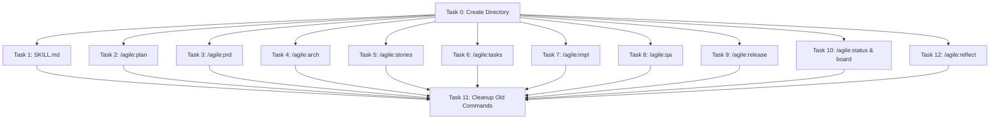
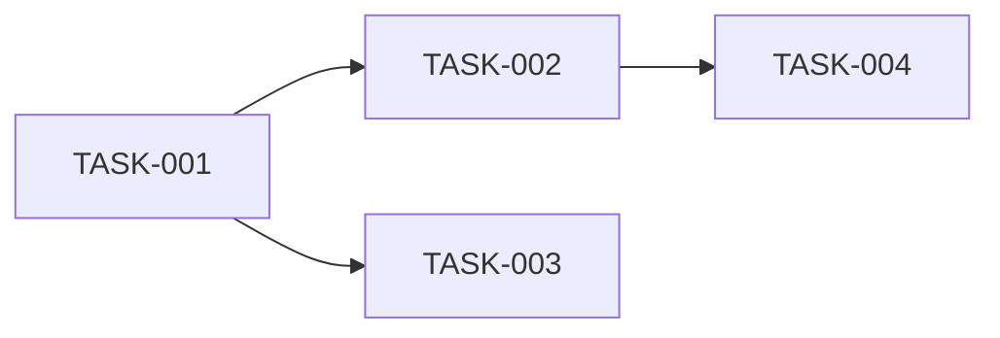

# Agile Workflow Enhancement Plan

> **For Claude:** REQUIRED SUB-SKILL: Use `superpowers:executing-plans` to implement this plan task-by-task.

**Goal:** Enhance the existing agile workflow commands to integrate with superpowers skills, feature-dev agents, parallel sub-agents, and position the user as lead Architect/PM/Developer throughout ALL phases.

**Architecture:**
- Directory-based namespacing: Commands move to `.claude/commands/agile/` (e.g., `/agile:plan`)
- Conditional brainstorming in ALL commands based on complexity
- Parallel sub-agent dispatching for independent work (not sequential TDD)
- User-as-lead with question-driven approach throughout

**Tech Stack:** Claude Code CLI, Markdown commands, Skills, Task tool for parallel agents

---

## Key Decisions (User-Provided)

| Decision | Choice | Rationale |
|----------|--------|-----------|
| Namespacing | Directory-based | `.claude/commands/agile/` creates `/agile:*` commands |
| Brainstorming | Conditional | Based on complexity, not mandatory |
| Parallel Agents | Where applicable | Avoid for sequential work (TDD) |
| Skill Location | Existing | `.claude/skills/agile-workflow/SKILL.md` |

---

## 🚀 Execution Strategy

### Task Dependency Graph



### Parallel Execution Map

| Batch | Tasks | Can Run in Parallel | Dependencies |
|-------|-------|---------------------|--------------|
| **Batch 0** | Task 0 | ❌ Single | None - must run first |
| **Batch 1** | Tasks 1-10, 12 | ✅ **ALL PARALLEL** | Task 0 complete |
| **Batch 2** | Task 11 | ❌ Single | All of Batch 1 complete |

### Sub-Agent Dispatch Strategy

**For Batch 1 (Parallel Execution):**

```
Dispatch 11 sub-agents in a SINGLE message with multiple Task tool calls:

Task tool call 1: "Execute Task 1 - Create SKILL.md"
Task tool call 2: "Execute Task 2 - Create /agile:plan"
Task tool call 3: "Execute Task 3 - Create /agile:prd"
Task tool call 4: "Execute Task 4 - Create /agile:arch"
Task tool call 5: "Execute Task 5 - Create /agile:stories"
Task tool call 6: "Execute Task 6 - Create /agile:tasks"
Task tool call 7: "Execute Task 7 - Create /agile:impl"
Task tool call 8: "Execute Task 8 - Create /agile:qa"
Task tool call 9: "Execute Task 9 - Create /agile:release"
Task tool call 10: "Execute Task 10 - Create /agile:status & board"
Task tool call 11: "Execute Task 12 - Create /agile:reflect"

Each sub-agent:
1. Reads the task from this plan
2. Creates the file with EXACT content from the plan
3. Commits with the specified message
4. Reports completion
```

### Execution Checklist

```
□ Batch 0: Task 0 (Directory Setup)
  └─ mkdir -p .claude/commands/agile && git commit

□ Batch 1: Parallel Sub-Agents (11 tasks)
  ├─ □ Task 1:  SKILL.md
  ├─ □ Task 2:  /agile:plan
  ├─ □ Task 3:  /agile:prd
  ├─ □ Task 4:  /agile:arch
  ├─ □ Task 5:  /agile:stories
  ├─ □ Task 6:  /agile:tasks
  ├─ □ Task 7:  /agile:impl
  ├─ □ Task 8:  /agile:qa
  ├─ □ Task 9:  /agile:release
  ├─ □ Task 10: /agile:status & board
  └─ □ Task 12: /agile:reflect

□ Batch 2: Task 11 (Cleanup)
  └─ rm old commands && git commit

□ Final: Verify all commands work
  └─ Test each /agile:* command loads correctly
```

### Time Estimate

| Phase | Sequential Time | Parallel Time | Savings |
|-------|-----------------|---------------|---------|
| Batch 0 | 2 min | 2 min | - |
| Batch 1 | 55 min (5 min × 11) | 5-8 min | **85%** |
| Batch 2 | 2 min | 2 min | - |
| **Total** | **~60 min** | **~12 min** | **80%** |

---

## Core Principles

**1. User-as-Lead:** The user leads EVERY phase. Claude NEVER makes decisions unilaterally.
- Ask before assuming
- Present options with trade-offs
- Wait for user validation before proceeding
- Document user's decisions with their rationale

**2. Parallel Sub-Agents:** Dispatch multiple agents via Task tool when work is independent.
- Use single message with multiple Task tool calls for parallel execution
- AVOID parallel for the TDD cycle itself (red-green-refactor is sequential)
- USE parallel for file exploration/context gathering BEFORE implementation

**3. Conditional Brainstorming:** Include brainstorming skill activation when:
- Multiple valid approaches exist
- Design decisions need exploration
- User requests deeper analysis

**4. Context Engineering:** NEVER read entire files. Use intelligent, sectional reading to prevent context rot.
- Use `Grep` tool with targeted patterns to find relevant sections
- Use `Read` with `offset` and `limit` for specific line ranges only
- Dispatch parallel agents to search different file sets simultaneously
- Summarize findings instead of dumping raw content
- Large file strategy: search → identify sections → read only relevant lines
- Present condensed context, not walls of code

**5. Context7 MCP for Libraries:** ALWAYS use Context7 MCP to fetch latest library documentation before implementation.
- Use `mcp__context7__resolve-library-id` to find the library ID
- Use `mcp__context7__get-library-docs` to fetch current documentation
- Required BEFORE writing any code that uses external libraries
- Ensures code follows latest API patterns and best practices
- Prevents outdated usage patterns from training data

**6. Advanced Context Engineering Techniques:**

### 6.1 Hierarchical Context Loading (RAG-inspired)
Load context progressively - start broad, zoom in only when needed:
```
Level 1: File/class names only (minimal tokens)
Level 2: Function signatures + docstrings
Level 3: Full implementation (only when needed)
```
- First: `Glob` to find relevant files
- Then: `Grep` for signatures/exports
- Finally: `Read` with offset/limit for specific implementations

### 6.2 AST-Based Extraction
Extract structural information without reading full implementations:
- Function signatures and parameters
- Class definitions and methods
- Import/export statements
- Type definitions and interfaces
- Skip: function bodies, comments (unless specifically needed)

Example queries:
```
Grep: pattern="^export (function|const|class)" → signatures only
Grep: pattern="^interface|^type" → type definitions
Grep: pattern="^import.*from" → dependencies
```

### 6.3 Context Budgeting
Explicit allocation prevents context bloat:
```
Total context budget: 100%
├── Current task context: 40%
├── Relevant code sections: 35%
├── Documentation/specs: 15%
└── Conversation history: 10%
```
- Monitor context usage throughout conversation
- Auto-summarize when approaching limits
- Prioritize: current task > recent changes > historical context

### 6.4 Diff-Based Updates
After initial read, track only changes:
```
📝 FILE CHANGE TRACKING

File: src/components/Button.tsx
Last read: [timestamp]
Changes since:
- Line 45: Added onClick handler
- Line 62: Modified prop types

Only loading changed sections...
```
- Dramatically reduces repeat reads
- Use `git diff` for modified files
- Track "last seen" state per file

### 6.5 Session Summaries
Generate structured summaries at phase boundaries:
```markdown
## Session Summary: [Feature] - [Phase]

**Completed:**
- [Action 1]
- [Action 2]

**Key Decisions:**
- [Decision]: [Rationale]

**Files Modified:**
- `path/to/file.ts` - [change description]

**Open Questions:**
- [Question needing resolution]

**Next Steps:**
- [Recommended next action]
```
Save to: `docs/agile/context/<feature>-<phase>-summary.md`

### 6.6 Decision Log
Track decisions with rationale for future sessions:
```markdown
## Decision Log: [Feature]

| ID | Decision | Rationale | Alternatives Considered | Files Affected |
|----|----------|-----------|------------------------|----------------|
| D1 | Use Zod for validation | Type safety + runtime checks | Yup, io-ts | schema.ts |
| D2 | Server Components for data | Reduce client bundle | Client fetch | page.tsx |
```
Save to: `docs/agile/context/<feature>-decisions.md`

New sessions can understand WHY without reading full history.

### 6.7 Progressive Context Handoff
Between commands, pass only essential context:
```typescript
interface ContextHandoff {
  task: string;                    // Current task ID
  phase: string;                   // Current workflow phase
  decisions_made: Decision[];      // Key decisions with rationale
  files_touched: string[];         // Recently modified files
  open_questions: string[];        // Unresolved questions
  next_action: string;             // Recommended next step
}
```
- NOT full conversation history
- NOT full file contents
- Just enough to continue intelligently

---

## Gap Analysis Summary

| Command | Current State | Enhancement | Parallel Agents |
|---------|---------------|-------------|-----------------|
| `/plan` | Basic Q&A | + `brainstorming` (conditional) + `code-explorer` | ✅ explorer + docs research |
| `/prd` | Template-based | + User-as-lead + PRD-TEMPLATE + `brainstorming` (conditional) | ✅ codebase + requirements analysis |
| `/arch` | Mermaid diagrams | + Conversation-based + `code-architect` + `solid-design-principles` | ✅ architect + explorer |
| `/stories` | Gherkin format | + `solid-design-principles` + `brainstorming` (conditional) | ✅ PRD analysis + architecture review |
| `/tasks` | Basic breakdown | + `writing-plans` format + `brainstorming` (conditional) | ✅ stories analysis + code exploration |
| `/impl` | TDD outline | + `test-driven-development` + `verification-before-completion` + context engineering | ✅ file exploration (TDD cycle stays sequential) |
| `/qa` | Checklist | + `code-reviewer` agents + `verification` | ✅ multiple reviewers |
| `/release` | Basic checklist | + `finishing-a-development-branch` | ❌ sequential |
| `/reflect` | **NEW** | End-of-phase analysis + recommendations + conversation insights | ❌ sequential (analysis) |

---

## Task 0: Create Directory Structure

**Files:**
- Create: `.claude/commands/agile/` directory
- Create: `.gitkeep` files for empty directories

**Step 1: Create agile commands directory**

```bash
mkdir -p .claude/commands/agile
```

**Step 2: Verify structure**

```bash
ls -la .claude/commands/agile/
```

**Step 3: Commit**

```bash
git add .claude/commands/agile/
git commit -m "chore(agile): create agile commands directory for namespacing"
```

---

## Task 1: Enhance SKILL.md with Skill Integration Map

**Files:**
- Modify: `.claude/skills/agile-workflow/SKILL.md`

**Step 1: Replace with enhanced content**

```markdown
---
name: agile-workflow
description: Spec-driven agile development workflow. Provides slash commands for feature planning, PRDs, architecture, user stories, tasks, TDD implementation, QA, and releases. Integrates with superpowers and feature-dev skills. User-led throughout.
---

# Agile Workflow

Spec-driven development lifecycle for building features from idea to release.

## Workflow

```
/agile:plan → /agile:prd → /agile:arch → /agile:stories → /agile:tasks → /agile:impl → /agile:qa → /agile:release
```

## Commands & Skill Integration

| Command | Model | Purpose | Skills | Parallel Agents |
|---------|-------|---------|--------|-----------------|
| `/agile:plan <feature>` | opus | Plan a new feature | `brainstorming` (conditional), `code-explorer` | ✅ explorer + docs research |
| `/agile:prd` | opus | Generate PRD | `brainstorming` (conditional), `code-explorer` | ✅ codebase + requirements |
| `/agile:arch` | opus | Design architecture | `code-architect`, `solid-design-principles`, `brainstorming` (conditional) | ✅ architect + explorer |
| `/agile:stories` | sonnet | Create user stories | `solid-design-principles`, `brainstorming` (conditional) | ✅ PRD + architecture analysis |
| `/agile:tasks` | sonnet | Break into tasks | `writing-plans`, `brainstorming` (conditional) | ✅ stories + code exploration |
| `/agile:impl <task-id>` | sonnet | Implement with TDD | `test-driven-development`, `verification-before-completion`, `testing-anti-patterns` | ✅ context gathering (TDD sequential) |
| `/agile:qa` | sonnet | Quality assurance | `requesting-code-review`, `verification-before-completion` | ✅ multiple reviewers |
| `/agile:release <version>` | haiku | Prepare release | `finishing-a-development-branch` | ❌ sequential |
| `/agile:status` | haiku | Show progress | - | ❌ |
| `/agile:board` | haiku | Display task board | - | ❌ |
| `/agile:reflect` | opus | End-of-phase analysis | - | ❌ sequential (analysis) |

## Mandatory Skill Activation

**EVERY command MUST start with:**

```
## Step 1 - SKILL EVALUATION

For each skill listed in the command's "Required Skills", evaluate:
[skill-name] - YES/NO/CONDITIONAL - [reason]

## Step 2 - SKILL ACTIVATION

IF any skills are YES → Use Skill(skill-name) tool for EACH skill NOW
IF CONDITIONAL → Evaluate if complexity warrants activation

## Step 3 - PARALLEL AGENT DISPATCH (if applicable)

IF command supports parallel agents → Dispatch via Task tool in single message

## Step 4 - PROCEED

Only after Steps 2-3, proceed with the command workflow.
```

## User-as-Lead Principle

**The user is the Architect, PM, and Developer. Claude is the assistant.**

- Present options, don't make decisions
- Ask questions before assuming
- Validate each section before proceeding
- Document the user's decisions with rationale
- Use `🎯 [ROLE] DECISION NEEDED:` prompts throughout

## Conditional Brainstorming

Activate `superpowers:brainstorming` when:
- Multiple valid approaches exist
- Design decisions need exploration
- User explicitly requests deeper analysis
- Complexity is non-trivial

Skip when:
- Single obvious approach
- User has already decided
- Simple/mechanical task

## Parallel Sub-Agent Dispatch

Use Task tool with multiple agents in single message when:
- Work is independent (no dependencies between agents)
- Different aspects can be explored simultaneously
- Code review can happen on separate file sets

NEVER use parallel for:
- TDD (red-green-refactor is sequential)
- Sequential approval workflows
- Dependent tasks

## Artifacts

All outputs go to `docs/agile/`:

```
docs/agile/
├── plans/
├── prds/
├── architecture/
├── stories/
├── tasks/
├── qa/
├── releases/
├── boards/
├── reflections/
└── context/           # Session summaries, decision logs, handoff data
    ├── <feature>-<phase>-summary.md
    ├── <feature>-decisions.md
    └── <feature>-handoff.json
```

## Principles

1. **User-led** — User makes all key decisions
2. **Spec-first** — Define before building
3. **Test-driven** — Tests before code
4. **Incremental** — Validate each phase
5. **Traceable** — Tasks → Stories → PRD → Plan
6. **Skill-activated** — Use relevant skills for each phase
7. **Parallel-aware** — Dispatch sub-agents for independent work
8. **Context-engineered** — Never read full files; use Grep and sectional reads
9. **Context7-first** — Fetch library docs via MCP before implementation
10. **Token-efficient** — Hierarchical loading, AST extraction, context budgeting
11. **Persistence-aware** — Session summaries, decision logs, progressive handoff

## Context Engineering Techniques

### Token Efficiency
- **Hierarchical Loading:** Level 1 (names) → Level 2 (signatures) → Level 3 (implementation)
- **AST Extraction:** Grep for signatures/types, skip implementation bodies
- **Context Budgeting:** 40% task + 35% code + 15% docs + 10% history
- **Diff-Based Updates:** After first read, track only changes via `git diff`

### Context Persistence
- **Session Summaries:** Save to `docs/agile/context/<feature>-<phase>-summary.md`
- **Decision Logs:** Save to `docs/agile/context/<feature>-decisions.md`
- **Progressive Handoff:** Pass `{task, decisions, files_touched, open_questions}`

## Context7 MCP Requirement

**BEFORE writing code that uses external libraries:**

1. Resolve library ID:
   ```
   mcp__context7__resolve-library-id: libraryName="next.js"
   ```

2. Fetch documentation:
   ```
   mcp__context7__get-library-docs: context7CompatibleLibraryID="/vercel/next.js" topic="app-router"
   ```

This ensures code follows the LATEST API patterns, not outdated training data.
```

**Step 2: Commit**

```bash
git add .claude/skills/agile-workflow/SKILL.md
git commit -m "feat(agile): add skill integration map with parallel agents and conditional brainstorming"
```

---

## Task 2: Create /agile:plan Command

**Files:**
- Create: `.claude/commands/agile/plan.md`

**Step 1: Create the command file**

```markdown
---
name: agile:plan
description: Start planning a new feature using spec-driven agile workflow with brainstorming
arguments:
  - name: feature
    description: Name of the feature to plan
    required: true
model: opus
---

# Feature Planning: $ARGUMENTS.feature

## Mandatory Skill Activation

### Step 1 - EVALUATE

- `superpowers:brainstorming` - CONDITIONAL - If multiple approaches or complex problem
- `feature-dev:code-explorer` - YES - Understanding existing codebase patterns

### Step 2 - ACTIVATE

Use `Skill(superpowers:brainstorming)` tool if complexity warrants it.

### Step 3 - PARALLEL AGENT DISPATCH

Dispatch in parallel (single message with multiple Task tool calls):
```
Task 1: feature-dev:code-explorer - "Analyze codebase for patterns related to [feature]"
Task 2: Explore agent - "Research existing implementations in docs/"
```

### Step 4 - PROCEED

Only after activating skills and dispatching agents, continue below.

---

## Your Role: Assistant (NOT Lead)

**The user is the lead Architect/PM/Developer.** You are helping them articulate their vision.

### What You DO:
- ✅ Ask ONE question at a time
- ✅ Present 2-3 options with trade-offs
- ✅ Research the codebase for patterns (via parallel agents)
- ✅ Challenge unclear requirements
- ✅ Suggest best practices

### What You DON'T DO:
- ❌ Make final decisions without user input
- ❌ Skip asking for validation
- ❌ Assume requirements

---

## Setup

Ensure the agile directory structure exists:
```
docs/agile/
├── plans/
├── prds/
├── architecture/
├── stories/
├── tasks/
├── qa/
├── releases/
└── boards/
```

Create any missing directories with .gitkeep files.

---

## Context Gathering (Parallel Agents)

Dispatch parallel agents to gather context:

```
🔍 DISPATCHING PARALLEL AGENTS

Agent 1: feature-dev:code-explorer
- Task: "Analyze project structure and patterns for [feature]"

Agent 2: Explore agent
- Task: "Find relevant documentation in docs/"

Waiting for results...
```

Present combined findings:
```
🔍 CODEBASE ANALYSIS (from parallel agents)

**Code Explorer findings:**
- [file:line] - [description]
- Existing patterns: [pattern description]

**Documentation findings:**
- [relevant docs]

⚡ ARCHITECT INPUT:
Does this context match your understanding? Anything to add?
```

---

## Planning Questions (One at a Time)

Following the brainstorming skill (if activated), ask these ONE AT A TIME:

### Question 1: Problem
```
🎯 ARCHITECT INPUT NEEDED

**What problem are we solving?**
- Who experiences this problem?
- Why does it matter now?
- What's the impact of NOT solving it?
```

### Question 2: User
```
🎯 ARCHITECT INPUT NEEDED

**Who is the primary user?**
- What's their current workflow?
- What pain points do they have?
```

### Question 3: Success
```
🎯 ARCHITECT INPUT NEEDED

**What does success look like?**
- How will we measure it?
- What's the minimum viable outcome?
```

### Question 4: Scope
```
🎯 ARCHITECT INPUT NEEDED

**What's explicitly OUT of scope?**
- What are we NOT building?
- What can wait for future iterations?
```

### Question 5: Constraints
```
🎯 ARCHITECT INPUT NEEDED

**Any constraints?**
- Technical constraints?
- Time constraints?
- Resource constraints?
```

### Question 6: Integration
```
🎯 ARCHITECT INPUT NEEDED

**How does this fit with existing functionality?**
- What existing code will be affected?
- Are there dependencies?
```

---

## Approach Options

After gathering context, propose 2-3 approaches:

```
🏗️ APPROACH OPTIONS

**Option A: [Name]**
- Approach: [description]
- Pros: [list]
- Cons: [list]
- Effort: [estimate]

**Option B: [Name]**
- Approach: [description]
- Pros: [list]
- Cons: [list]
- Effort: [estimate]

💡 **Recommendation:** Option [X] because [reasoning]

🎯 ARCHITECT DECISION:
Which approach aligns with your vision? Or should we explore a hybrid?
```

---

## Output

Save to: `docs/agile/plans/YYYY-MM-DD-$ARGUMENTS.feature-plan.md`

Include:
- Problem statement (user's words)
- User context
- Success criteria
- Chosen approach with user's rationale
- High-level scope
- Out of scope items
- Constraints and risks
- Next steps

---

## Next Phase

"✅ Plan complete. Run `/agile:prd` to generate the Product Requirements Document."
```

**Step 2: Commit**

```bash
git add .claude/commands/agile/plan.md
git commit -m "feat(agile): create /agile:plan with parallel agents and conditional brainstorming"
```

---

## Task 3: Create /agile:prd Command (Merged from /create-prd)

**Files:**
- Create: `.claude/commands/agile/prd.md`

**Note:** This command merges the best of `/create-prd` and `/agile:prd` into a comprehensive PRD creation workflow.

**Step 1: Create the command file**

```markdown
---
name: agile:prd
description: Collaboratively create a PRD with you as the lead Architect/PM/Developer. Claude assists with research, structure, and refinement while you make all key decisions.
arguments:
  - name: feature
    description: Feature name (auto-detects from most recent plan if omitted)
    required: false
model: opus
---

# Product Requirements Document

You are an **assistant** helping the user create a Product Requirements Document. The user is the **lead Architect, Product Manager, and Developer**. Your role is to:

- **Research** the codebase and gather context
- **Ask questions** to draw out the user's vision and decisions
- **Structure** information into the PRD template
- **Challenge** assumptions constructively
- **Never** make architectural or product decisions unilaterally

---

## 🔐 Mandatory Skill & Agent Activation

### Step 1 - EVALUATE

For each skill/agent, state: `[name] - YES/NO/CONDITIONAL - [reason]`

**Core PRD Skills:**
- `superpowers:brainstorming` - For refining ideas through collaborative questioning
- `feature-dev:code-architect` - For architecture design and pattern analysis
- `feature-dev:code-explorer` - For understanding existing codebase patterns
- `solid-design-principles` - For SOLID compliance in technical design

**Planning & Documentation:**
- `superpowers:writing-plans` - For creating implementation plans
- `technical-prd-agent` - For comprehensive PRD synthesis (Task tool)

**Domain-Specific (if applicable):**
- `nextjs-app-router` - If feature involves Next.js
- `frontend-design` - If feature involves UI components

### Step 2 - ACTIVATE

IF any skills are YES → Use `Skill(skill-name)` tool for EACH relevant skill NOW

### Step 3 - PARALLEL AGENT DISPATCH

Dispatch in parallel (single message with multiple Task tool calls):
```
Task 1: feature-dev:code-explorer - "Analyze codebase for existing patterns using Grep"
Task 2: Explore agent - "Research existing PRDs and docs in docs/ using Grep"
```

### Step 4 - CONTEXT7 MCP (If Libraries Involved)

If the feature uses external libraries:
```
mcp__context7__resolve-library-id: libraryName="[library]"
mcp__context7__get-library-docs: context7CompatibleLibraryID="[id]" topic="[topic]"
```

### Step 5 - PROCEED

Only after activation, begin the PRD workflow.

---

## 📥 Input Detection

Detect how the user is providing context:

### File-Based Input
If user provides a file path or references a document:
1. Read the file using Grep (sectional, NOT full file)
2. Summarize key points
3. Ask clarifying questions about gaps

### Plan-Based Input (Default)
1. Look for: `docs/agile/plans/*-$ARGUMENTS.feature-plan.md`
2. If no plan found, inform user to run `/agile:plan <feature>` first
3. Extract problem, scope, constraints from plan

### Conversation-Based Input
If no file or plan:
1. Ask the user to describe the feature/problem
2. Use brainstorming skill to refine the idea
3. Document responses in real-time

---

## 🎯 Your Role: Assistant (NOT Lead)

### What You DO:
- ✅ Ask probing questions (ONE at a time)
- ✅ Present options with trade-offs
- ✅ Research the codebase for patterns (via parallel agents)
- ✅ Challenge unclear requirements
- ✅ Structure decisions into PRD format
- ✅ Flag risks and dependencies

### What You DON'T DO:
- ❌ Make final architecture decisions
- ❌ Choose technologies without user input
- ❌ Define scope boundaries unilaterally
- ❌ Skip asking for user validation
- ❌ Read entire files (use Grep/sectional reads)

---

## 📚 Reference Documents

Always consult (using Grep, NOT full reads):
1. **PRD Template:** `docs/template/PRD-TEMPLATE.md`
2. **Design System:** `docs/design/Klard Design System.md`
3. **Package Guidelines:** `klard-web/AGENTS.md` and `klard-mobile/AGENTS.md`

---

## 🔄 PRD Creation Workflow

### Phase 1: Discovery (User Leads)

**1.1 Problem Understanding**
```
🎯 ARCHITECT DECISION NEEDED

1. What problem are we solving?
   - Who experiences this problem?
   - What's the impact of NOT solving it?

2. What does success look like?
   - How will we measure it?
   - What's the minimum viable outcome?
```

**1.2 Scope Definition**
```
📐 SCOPE DECISION NEEDED

1. What MUST be included? (non-negotiable)
2. What SHOULD be included? (high value)
3. What COULD be included? (nice to have)
4. What is explicitly OUT of scope?
```

**1.3 Technical Context (from Parallel Agents)**

Present findings from dispatched agents:
```
🔍 CODEBASE ANALYSIS (from parallel agents)

**Relevant code found:**
- [file:line] - [description]

**Existing patterns:**
- [pattern description]

⚡ DEVELOPER DECISION:
Should we follow these patterns or diverge?
```

---

### Phase 2: Architecture (User Decides)

**2.1 Architecture Options**
```
🏗️ ARCHITECTURE OPTIONS

Option A: [Name]
- Approach: [description]
- Pros: [list]
- Cons: [list]

Option B: [Name]
- Approach: [description]
- Pros: [list]
- Cons: [list]

🎯 ARCHITECT DECISION:
Which approach? Or explore a hybrid?
```

**2.2 Data Model** (if needed)
```
💾 DATA MODEL DECISION

Proposed entities:
- [Entity]: [fields]

Relationships:
- [Entity A] → [Entity B]: [type]

🎯 ARCHITECT DECISION:
Does this capture all needed data?
```

**2.3 API Design** (if needed)
```
🔌 API DESIGN DECISION

Proposed endpoints:
- `POST /api/v1/[resource]` - [purpose]
- `GET /api/v1/[resource]` - [purpose]

🎯 ARCHITECT DECISION:
Does this API contract meet your needs?
```

---

### Phase 2.5: Architecture Diagrams (Conversation-Based)

**CRITICAL:** Do NOT generate diagrams without consulting the user.

#### 2.5.1 System Context Diagram (Flowchart)
```
📊 SYSTEM CONTEXT DIAGRAM

🎯 ARCHITECT INPUT NEEDED:

1. **System Boundaries**
   - What is the main system/feature? (central box)
   - What external systems does it interact with?

2. **Actors/Users**
   - Human actors? (End User, Admin, Support)
   - System actors? (Cron Jobs, External APIs)

3. **Data Flows**
   - What flows INTO the system?
   - What flows OUT of the system?

💡 SUGGESTIONS:
- [ ] API Gateway as entry point
- [ ] Separate read/write paths (CQRS)
- [ ] Message queue for async
- [ ] Cache layer for frequent data

Please describe components and I'll draft the Mermaid diagram.
```

After input, draft and iterate:
```
📐 DRAFT: SYSTEM CONTEXT DIAGRAM

[Show Mermaid flowchart]

🎯 ARCHITECT REVIEW:
1. All components correct?
2. Connections accurate?
3. Add/remove/rename any?
```

#### 2.5.2 Sequence Diagram
```
🔄 SEQUENCE DIAGRAM

🎯 ARCHITECT INPUT NEEDED:

1. **Participants** - List all actors and systems
2. **Primary Flow** - Walk through step-by-step
3. **Error Flows** - What happens on failure?

Please describe the flow and I'll draft the sequence.
```

#### 2.5.3 Entity Relationship Diagram
```
💾 ER DIAGRAM

🎯 ARCHITECT INPUT NEEDED:

1. **Entities** - Main tables/collections with key fields
2. **Relationships** - One-to-one? One-to-many? Many-to-many?

💡 SUGGESTIONS:
- UUID for primary keys
- Include created_at/updated_at
- Consider soft deletes

Please describe entities and I'll draft the ER diagram.
```

#### 2.5.4 Diagram Iteration Loop
```
🔁 DIAGRAM REFINEMENT

Options:
1. ✅ Approve this diagram
2. 🔄 Request changes
3. 🗑️ Start over
4. ➕ Add another diagram type

🎯 ARCHITECT DECISION:
What would you like to do?
```

---

### Phase 3: Risk & Dependencies

```
⚠️ RISK ASSESSMENT

| Risk | Likelihood | Impact | Mitigation |
|------|------------|--------|------------|

🎯 PM DECISION:
1. Risks I'm missing?
2. Mitigations acceptable?
```

```
🔗 DEPENDENCIES

External: [dependency]: [why needed]
Internal: [PRD/Feature]: [relationship]
Blockers: [blocker]: [impact]

🎯 PM DECISION:
Proceed with these or find alternatives?
```

---

### Phase 4: User Stories

```
📝 PROPOSED USER STORIES

### US-001: [Title]
**As a** [persona], **I want** [need] **so that** [purpose]
**Acceptance Criteria:**
- [ ] [criterion]

🎯 PM DECISION:
1. Stories capture full scope?
2. Acceptance criteria specific enough?
```

---

### Phase 5: Testing Strategy

```
🧪 TESTING STRATEGY

**Unit Tests:**
| Component | What to Test |
|-----------|--------------|

**Integration Tests:**
| Integration Point | What to Test |
|-------------------|--------------|

🎯 DEVELOPER DECISION:
1. Critical paths missing?
2. Edge cases to prioritize?
```

---

### Phase 6: PRD Assembly

Use template from: `docs/template/PRD-TEMPLATE.md`

```
📋 PRD REVIEW CHECKPOINT

Please review:
1. Summary accurate?
2. Success Metrics measurable?
3. Architecture diagram correct?
4. Any sections incomplete?

📍 Save to: `docs/agile/prds/YYYY-MM-DD-<feature>-prd.md`

Ready to finalize?
```

---

### Phase 7: Implementation Planning Prompt

```
✅ PRD FINALIZED

Saved to: `docs/agile/prds/YYYY-MM-DD-<feature>-prd.md`

---

🚀 NEXT STEPS

**Option A: Continue agile workflow**
- Run `/agile:arch` for detailed architecture

**Option B: Use superpowers:writing-plans**
- Create task-by-task implementation plan

**Option C: Use feature-dev:code-architect agent**
- Design comprehensive architecture blueprint

🎯 ARCHITECT DECISION:
Which approach?
```

---

## 💬 Question Framework

### Architecture Questions
- "What are the performance requirements?"
- "How does this integrate with [existing system]?"
- "What's the failure mode if [dependency] unavailable?"

### Product Questions
- "What's the MVP vs full vision?"
- "Who are the primary users?"
- "What's more important: [A] or [B]?"

### Developer Questions
- "Should we use [library A] or [library B]?"
- "How should we handle [edge case]?"

---

## ✔️ Completion Checklist

Before finalizing:
- [ ] Problem statement validated by user
- [ ] Success metrics measurable
- [ ] Scope boundaries explicitly defined
- [ ] All technical decisions made BY THE USER
- [ ] Architecture diagrams approved
- [ ] User stories have acceptance criteria
- [ ] Testing strategy covers unit + integration
- [ ] Risks identified and mitigations accepted
- [ ] PRD saved to `docs/agile/prds/`
- [ ] Session summary saved to `docs/agile/context/`
- [ ] Decision log updated
- [ ] User prompted for next phase
```

**Step 2: Commit**

```bash
git add .claude/commands/agile/prd.md
git commit -m "feat(agile): create /agile:prd merged from /create-prd with full workflow"
```

---

## Task 4: Create /agile:arch Command

**Files:**
- Create: `.claude/commands/agile/arch.md`

**Step 1: Create the command file**

```markdown
---
name: agile:arch
description: Design technical architecture based on the PRD
arguments:
  - name: feature
    description: Feature name (auto-detects from most recent PRD if omitted)
    required: false
model: opus
---

# Architecture Design

## Mandatory Skill Activation

### Step 1 - EVALUATE

- `feature-dev:code-architect` - YES - Architecture design and pattern analysis
- `solid-design-principles` - YES - SOLID compliance in design
- `superpowers:brainstorming` - CONDITIONAL - If exploring architectural options

### Step 2 - ACTIVATE

Use `Skill(solid-design-principles)` tool NOW.
Use `Skill(superpowers:brainstorming)` tool if exploring multiple approaches.

### Step 3 - PARALLEL AGENT DISPATCH

Dispatch in parallel (single message with multiple Task tool calls):
```
Task 1: feature-dev:code-architect - "Design architecture for [feature] based on PRD"
Task 2: feature-dev:code-explorer - "Analyze existing architecture patterns in codebase"
```

### Step 4 - PROCEED

Only after activating skills and dispatching agents, continue below.

---

## Your Role: Assistant (NOT Lead)

**The user is the lead Architect.** Present options, analyze trade-offs, but let them decide.

---

## Find the PRD

1. If feature name provided, look for: `docs/agile/prds/*-$ARGUMENTS.feature-prd.md`
2. Otherwise, find the most recently modified PRD in `docs/agile/prds/`
3. If no PRD found, inform user to run `/agile:prd` first

---

## Analyze Existing Architecture (Parallel Agents)

Dispatch parallel agents:
```
🔍 DISPATCHING PARALLEL AGENTS

Agent 1: feature-dev:code-architect
- Task: "Design architecture for [feature]"

Agent 2: feature-dev:code-explorer
- Task: "Analyze existing architecture patterns"

Waiting for results...
```

Present combined findings:
```
🔍 EXISTING ARCHITECTURE ANALYSIS (from parallel agents)

**Code Architect recommendations:**
- [architectural approach]

**Existing Patterns (from explorer):**
- [pattern]: [where used]

**Technology Stack:**
- [tech]: [version]

**Relevant Files:**
- [file:line] - [description]

🎯 ARCHITECT INPUT:
Should we follow these patterns or is there a reason to diverge?
```

---

## Conversation-Based Diagram Creation

### System Context Diagram

**Do NOT generate diagrams without consulting the user.**

```
📊 SYSTEM CONTEXT DIAGRAM

Let's map out the system architecture together.

🎯 ARCHITECT INPUT NEEDED:

1. **System Boundaries**
   - What is the main system/feature we're building?
   - What are the external systems it interacts with?

2. **Actors/Users**
   - Who are the human actors? (e.g., End User, Admin)
   - Who are the system actors? (e.g., Cron Jobs, External APIs)

3. **Data Flows**
   - What data flows INTO the system?
   - What data flows OUT of the system?

💡 BEST PRACTICE SUGGESTIONS:
- [ ] API Gateway as entry point
- [ ] Separate read/write paths (CQRS)
- [ ] Message queue for async operations
- [ ] Cache layer for frequently accessed data

Please describe your components and I'll draft the Mermaid diagram.
```

After input, draft and iterate:
```
📐 DRAFT: SYSTEM CONTEXT DIAGRAM

[Show Mermaid flowchart based on user input]

🎯 ARCHITECT REVIEW:
1. Are all components represented correctly?
2. Are the connections accurate?
3. Should I add/remove/rename any components?
```

### Sequence Diagram

```
🔄 SEQUENCE DIAGRAM

Let's map the interaction flow step-by-step.

🎯 ARCHITECT INPUT NEEDED:

1. **Participants** (columns in the diagram)
   - List all actors and systems involved

2. **Primary Flow** (happy path)
   - What's step 1? Who initiates?
   - Walk me through until completion

3. **Error Flows**
   - What happens on error?

Please describe the flow and I'll draft the sequence.
```

### Entity Relationship Diagram

```
💾 ENTITY RELATIONSHIP DIAGRAM

Let's design the data model together.

🎯 ARCHITECT INPUT NEEDED:

1. **Entities** (tables/collections)
   - What are the main entities?
   - For each, what are the key fields?

2. **Relationships**
   - How do entities relate?
   - One-to-many? Many-to-many?

💡 BEST PRACTICE SUGGESTIONS:
- Use UUID for primary keys
- Include created_at/updated_at
- Consider soft deletes

Please describe your entities and I'll draft the ER diagram.
```

---

## SOLID Compliance Check

After architecture is drafted, validate against SOLID:

```
✅ SOLID COMPLIANCE CHECK

| Principle | Status | Notes |
|-----------|--------|-------|
| Single Responsibility | ✅/⚠️/❌ | [notes] |
| Open/Closed | ✅/⚠️/❌ | [notes] |
| Liskov Substitution | ✅/⚠️/❌ | [notes] |
| Interface Segregation | ✅/⚠️/❌ | [notes] |
| Dependency Inversion | ✅/⚠️/❌ | [notes] |

🎯 ARCHITECT REVIEW:
Any concerns with SOLID compliance?
```

---

## Technology Decisions (ADRs)

For each significant decision:
```
📝 ARCHITECTURE DECISION RECORD

**ADR-NNN: [Title]**

🎯 ARCHITECT INPUT NEEDED:

**Context:** [Why this decision is needed]

**Options:**
- Option A: [description] - [pros/cons]
- Option B: [description] - [pros/cons]

💡 **Recommendation:** [Your suggestion with reasoning]

Which option do you prefer and why?
```

---

## Output

Save to: `docs/agile/architecture/YYYY-MM-DD-<feature>-arch.md`

Include:
- All Mermaid diagrams (approved by user)
- ADRs with user's decisions
- SOLID compliance table
- Security considerations
- Performance notes

---

## Next Phase

"✅ Architecture complete. Run `/agile:stories` to create user stories."
```

**Step 2: Commit**

```bash
git add .claude/commands/agile/arch.md
git commit -m "feat(agile): create /agile:arch with parallel agents and conversation-based diagrams"
```

---

## Task 5: Create /agile:stories Command

**Files:**
- Create: `.claude/commands/agile/stories.md`

**Step 1: Create the command file**

```markdown
---
name: agile:stories
description: Create user stories with acceptance criteria from PRD
arguments:
  - name: feature
    description: Feature name (auto-detects if omitted)
    required: false
model: sonnet
---

# User Stories Creation

## Mandatory Skill Activation

### Step 1 - EVALUATE

- `solid-design-principles` - YES - Ensure stories promote good design
- `superpowers:brainstorming` - CONDITIONAL - If need to refine story scope

### Step 2 - ACTIVATE

Use `Skill(solid-design-principles)` tool NOW.
Use `Skill(superpowers:brainstorming)` tool if story scope needs exploration.

### Step 3 - PARALLEL AGENT DISPATCH

Dispatch in parallel (single message with multiple Task tool calls):
```
Task 1: Explore agent - "Analyze PRD for user personas and requirements"
Task 2: Explore agent - "Review architecture for technical constraints on stories"
```

### Step 4 - PROCEED

Only after activating skills and dispatching agents, continue below.

---

## Your Role: Assistant (NOT Lead)

**The user is the lead PM.** Generate stories based on PRD, validate each with user.

---

## Find Context Documents

1. PRD from `docs/agile/prds/`
2. Architecture from `docs/agile/architecture/`

---

## Story Mapping

First, propose a high-level story map:
```
📊 STORY MAP

🎯 PM VALIDATION NEEDED:

Proposed epic structure:
```
Epic: [Feature Name]
├── Theme 1: [Theme]
│   ├── Story 1.1
│   └── Story 1.2
└── Theme 2: [Theme]
    └── Story 2.1
```

Does this structure make sense? Any themes missing?
```

---

## Generate User Stories (Validate Each)

For each story, present for validation:
```
📝 STORY PROPOSAL

### STORY-NNN: [Story Title]

**Priority:** P0 | P1 | P2
**Size:** S (1-2h) | M (3-4h) | L (1d) | XL (2-3d)

**As a** [persona from PRD]
**I want** [capability]
**So that** [benefit/value]

**Acceptance Criteria (Gherkin):**
```gherkin
Scenario: [Happy path]
  Given [initial context]
  When [action taken]
  Then [expected result]

Scenario: [Edge case]
  Given [edge case context]
  When [action taken]
  Then [expected handling]

Scenario: [Error case]
  Given [error condition]
  When [action taken]
  Then [error handled gracefully]
```

**Technical Notes:**
- Files likely affected: [list]
- Dependencies: [other stories]

🎯 PM DECISION:
1. Is this story correctly scoped?
2. Are the acceptance criteria complete?
3. Is the size estimate reasonable?
```

---

## SOLID Story Check

After generating stories, verify they promote good design:
```
✅ SOLID STORY CHECK

| Story | SRP Impact | Notes |
|-------|------------|-------|
| STORY-001 | ✅ Single concern | [notes] |
| STORY-002 | ⚠️ Multiple concerns | Consider splitting |

🎯 PM DECISION:
Should any stories be split for better design?
```

---

## Prioritization Matrix

```
📊 PRIORITIZATION MATRIX

| Story | Value | Effort | Priority | Dependencies |
|-------|-------|--------|----------|--------------|
| STORY-001 | High | Low | P0 | - |
| STORY-002 | High | Med | P0 | STORY-001 |

🎯 PM DECISION:
Does this prioritization align with your goals?
```

---

## Output

Save to: `docs/agile/stories/YYYY-MM-DD-<feature>-stories.md`

Include:
- Story map
- All stories with full details
- SOLID compliance notes
- Prioritization matrix
- Dependency notes

---

## Next Phase

"✅ Stories complete. Run `/agile:tasks` to break down into implementable tasks."
```

**Step 2: Commit**

```bash
git add .claude/commands/agile/stories.md
git commit -m "feat(agile): create /agile:stories with SOLID validation and conditional brainstorming"
```

---

## Task 6: Create /agile:tasks Command

**Files:**
- Create: `.claude/commands/agile/tasks.md`

**Step 1: Create the command file**

```markdown
---
name: agile:tasks
description: Break down user stories into implementable tasks
arguments:
  - name: feature
    description: Feature name (auto-detects if omitted)
    required: false
model: sonnet
---

# Task Breakdown

## Mandatory Skill Activation

### Step 1 - EVALUATE

- `superpowers:writing-plans` - YES - Creating bite-sized implementation tasks
- `solid-design-principles` - YES - Ensure tasks promote good design
- `superpowers:brainstorming` - CONDITIONAL - If task breakdown needs exploration

### Step 2 - ACTIVATE

Use `Skill(superpowers:writing-plans)` tool NOW.
Use `Skill(solid-design-principles)` tool NOW.
Use `Skill(superpowers:brainstorming)` tool if task breakdown is complex.

### Step 3 - PARALLEL AGENT DISPATCH

Dispatch in parallel (single message with multiple Task tool calls):
```
Task 1: Explore agent - "Analyze stories for task dependencies and scope"
Task 2: feature-dev:code-explorer - "Explore codebase for existing implementations to reference"
```

### Step 4 - PROCEED

Only after activating skills and dispatching agents, continue below.

---

## Your Role: Assistant (NOT Lead)

**The user is the lead Developer.** Create task breakdown, validate estimates with them.

---

## Find Stories

Load from `docs/agile/stories/*-<feature>-stories.md`

---

## Task Generation (Writing-Plans Format)

For each story, generate tasks following the `superpowers:writing-plans` bite-sized format:

### Task Format
```markdown
### Task: <FEATURE>-<STORY#>-<TASK#>: [Verb] [What]

**Story:** STORY-XXX
**Type:** Feature | Bug | Chore | Spike
**Estimate:** Xh

**Files:**
- Create: `exact/path/to/NewFile.ts`
- Modify: `exact/path/to/existing.ts` - [what change]
- Test: `exact/path/to/test.ts`

**Step 1: Write the failing test**
```typescript
// Complete test code here
```

**Step 2: Run test to verify it fails**
Run: `pnpm test path/to/test.ts --run`
Expected: FAIL with "[reason]"

**Step 3: Write minimal implementation**
```typescript
// Complete implementation code here
```

**Step 4: Run test to verify it passes**
Run: `pnpm test path/to/test.ts --run`
Expected: PASS

**Step 5: Commit**
```bash
git add [files]
git commit -m "feat(scope): description"
```

**Dependencies:**
- Requires: TASK-XXX (must be done first)
- Blocks: TASK-YYY (do this before that)
```

---

## Validate Each Task

```
📋 TASK PROPOSAL

### AUTH-001-01: Create user registration endpoint

[Full task details]

🎯 DEVELOPER DECISION:
1. Is the estimate reasonable? (includes test + code + review)
2. Are the file paths correct?
3. Should this be split further? (max 4h per task)
```

---

## Dependency Graph



🎯 DEVELOPER REVIEW:
Is the dependency graph correct?

---

## Output

Save task breakdown to: `docs/agile/tasks/YYYY-MM-DD-<feature>-tasks.md`
Save board to: `docs/agile/boards/<feature>-board.md`

---

## Execution Options

```
✅ TASKS CREATED

**Option A: Subagent-Driven (this session)**
- Fresh subagent per task
- Code review between tasks
- Fast iteration

**Option B: Parallel Session (separate)**
- Open new session with executing-plans skill
- Batch execution with checkpoints

🎯 DEVELOPER DECISION:
Which execution approach?
```

---

## Next Phase

"✅ Tasks created. Run `/agile:impl <task-id>` to start implementing with TDD."
```

**Step 2: Commit**

```bash
git add .claude/commands/agile/tasks.md
git commit -m "feat(agile): create /agile:tasks with writing-plans format and conditional brainstorming"
```

---

## Task 7: Create /agile:impl Command

**Files:**
- Create: `.claude/commands/agile/impl.md`

**Step 1: Create the command file**

```markdown
---
name: agile:impl
description: Implement a task using Test-Driven Development (red-green-refactor)
arguments:
  - name: task_id
    description: Task ID to implement (e.g., AUTH-001-01)
    required: true
model: sonnet
---

# Implement Task: $ARGUMENTS.task_id

## Mandatory Skill Activation

### Step 1 - EVALUATE

- `superpowers:test-driven-development` - YES - TDD workflow
- `superpowers:verification-before-completion` - YES - Verify before claiming done
- `superpowers:testing-anti-patterns` - YES - Avoid testing mistakes
- `solid-design-principles` - YES - Write SOLID code
- `superpowers:brainstorming` - CONDITIONAL - If implementation approach unclear

### Step 2 - ACTIVATE

Use `Skill(superpowers:test-driven-development)` tool NOW.
Use `Skill(superpowers:testing-anti-patterns)` tool NOW.
Use `Skill(solid-design-principles)` tool NOW.
Use `Skill(superpowers:brainstorming)` tool if approach needs exploration.

### Step 3 - PARALLEL AGENT DISPATCH (Context Gathering Only)

**TDD cycle is sequential** (red → green → refactor), BUT context gathering happens in parallel BEFORE:

Dispatch in parallel (single message with multiple Task tool calls):
```
Task 1: Explore agent - "Search task files for $ARGUMENTS.task_id details using Grep"
Task 2: feature-dev:code-explorer - "Analyze files that will be modified/created using Grep patterns"
Task 3: Explore agent - "Find related tests and patterns using Grep"
```

### Step 4 - PROCEED

Only after activating skills and receiving context from parallel agents, continue below.

---

## Your Role: Assistant (NOT Lead)

**The user is the lead Developer.** You assist with TDD, but they:
- Confirm readiness before each phase
- Validate test approaches
- Decide when implementation is "good enough"
- Approve refactoring changes

---

## Context Engineering Rules

**NEVER read entire files.** Use intelligent, sectional reading:

1. **Use Grep to find relevant sections:**
   ```
   Grep: pattern="class.*ComponentName" path="src/"
   Grep: pattern="function.*methodName" path="src/"
   Grep: pattern="import.*from" path="src/file.ts"
   ```

2. **Use Read with offset/limit for specific lines:**
   ```
   Read: file_path="src/file.ts" offset=45 limit=30
   ```

3. **Summarize, don't dump:**
   - Present key signatures and interfaces
   - Show only relevant code blocks
   - Provide condensed context

---

## Find Task Context (via Parallel Agents)

Using context from dispatched agents:
1. Task details from `docs/agile/tasks/`
2. Load task description, files, subtasks
3. Find related story from `docs/agile/stories/`
4. Check architecture notes from `docs/agile/architecture/`

---

## Fetch Library Documentation (MANDATORY)

**BEFORE writing any code that uses external libraries, you MUST:**

1. **Resolve library ID:**
   ```
   mcp__context7__resolve-library-id: libraryName="[library-name]"
   ```

2. **Fetch current documentation:**
   ```
   mcp__context7__get-library-docs:
     context7CompatibleLibraryID="[resolved-id]"
     topic="[relevant-topic]"
     mode="code"
   ```

3. **Present key patterns to user:**
   ```
   📚 LIBRARY DOCUMENTATION (Context7)

   **[Library Name] - Latest Patterns:**
   - [Key API pattern 1]
   - [Key API pattern 2]

   🎯 DEVELOPER CONFIRMATION:
   Ready to proceed with these patterns?
   ```

**DO NOT skip this step.** Training data may have outdated patterns.

---

## Pre-Implementation Checklist

```
✅ PRE-IMPLEMENTATION CHECK

- [ ] Task dependencies are complete
- [ ] Understand acceptance criteria
- [ ] Know which files to modify/create
- [ ] **Library docs fetched via Context7 MCP** (MANDATORY if using libraries)
- [ ] Test framework identified

🎯 DEVELOPER CONFIRMATION:
Ready to proceed?
```

---

## TDD Cycle: Red → Green → Refactor

### 1. RED: Write Failing Tests

**Following superpowers:test-driven-development skill:**

Write tests FIRST that describe expected behavior.

```
🔴 RED PHASE

Writing failing test for: [behavior]

[Show complete test code]

Running: `pnpm test path/to/test.ts --run`
Expected: FAIL with "[specific error]"

🎯 Actual result: [show output]
```

### 2. GREEN: Write Minimum Code

```
🟢 GREEN PHASE

Implementing minimal code to pass:

[Show implementation]

Running: `pnpm test path/to/test.ts --run`
Expected: PASS

🎯 Actual result: [show output]
```

### 3. REFACTOR: Clean Up

```
🔵 REFACTOR PHASE

Improvements:
- [what was improved]

Running tests: STILL PASSING ✅
Running lint: PASSING ✅
```

---

## Verification Before Completion

**Following superpowers:verification-before-completion skill:**

```
✅ VERIFICATION CHECKLIST

Run these commands and confirm output:

- [ ] `pnpm test path/to/test.ts --run` → PASS
- [ ] `pnpm lint` → No errors
- [ ] `pnpm exec tsc --noEmit` → No errors

🎯 VERIFICATION RESULTS:
[Show actual output from each command]

Only mark complete AFTER showing evidence.
```

---

## Update Task Board

After verification:
1. Open `docs/agile/boards/<feature>-board.md`
2. Move task to "Done"
3. Add completion marker: `✓`

---

## Commit Changes

```bash
git add [files]
git commit -m "<type>(<scope>): <description>

Refs: $ARGUMENTS.task_id"
```

---

## Next Steps

```
✅ Task $ARGUMENTS.task_id complete.

Next task: Run `/agile:board` to see remaining tasks.
All tasks done? Run `/agile:qa` to start quality assurance.
```
```

**Step 2: Commit**

```bash
git add .claude/commands/agile/impl.md
git commit -m "feat(agile): create /agile:impl with TDD skills, context engineering, and parallel context gathering"
```

---

## Task 8: Create /agile:qa Command

**Files:**
- Create: `.claude/commands/agile/qa.md`

**Step 1: Create the command file**

```markdown
---
name: agile:qa
description: Run quality assurance process and generate QA report
arguments:
  - name: feature
    description: Feature name (auto-detects if omitted)
    required: false
model: sonnet
---

# Quality Assurance

## Mandatory Skill Activation

### Step 1 - EVALUATE

- `superpowers:requesting-code-review` - YES - Dispatch code review agent
- `superpowers:verification-before-completion` - YES - Verify all claims
- `superpowers:brainstorming` - CONDITIONAL - If QA approach needs discussion

### Step 2 - ACTIVATE

Use `Skill(superpowers:requesting-code-review)` tool NOW.
Use `Skill(superpowers:verification-before-completion)` tool NOW.

### Step 3 - PARALLEL AGENT DISPATCH

Dispatch multiple code reviewers in parallel (single message with multiple Task tool calls):
```
Task 1: superpowers:code-reviewer - "Review frontend components for [feature]"
Task 2: superpowers:code-reviewer - "Review backend/API code for [feature]"
Task 3: superpowers:code-reviewer - "Review test coverage for [feature]"
```

### Step 4 - PROCEED

Only after activating skills and dispatching agents, continue below.

---

## Your Role: Assistant (NOT Lead)

**The user is the lead QA/PM.** You gather evidence and present findings, but they:
- Make the final PASS/FAIL decision
- Decide which issues are blockers vs nice-to-fix
- Approve the QA report before saving
- Determine if re-testing is needed

---

## Load Context

Gather all artifacts:
1. PRD from `docs/agile/prds/`
2. Stories from `docs/agile/stories/`
3. Architecture from `docs/agile/architecture/`
4. Task board from `docs/agile/boards/`

---

## Dispatch Parallel Code Review Agents

```
🔍 DISPATCHING PARALLEL CODE REVIEWERS

Agent 1: Review frontend code
- Scope: [frontend files]

Agent 2: Review backend code
- Scope: [backend files]

Agent 3: Review test coverage
- Scope: [test files]

Waiting for results...
```

Present combined review results for user decision.

---

## Automated Testing

```
🧪 AUTOMATED TESTS

Running test suite...

Run: `pnpm test -- --coverage`

🎯 RESULTS:
[Show actual output]

| Suite | Passed | Failed | Coverage |
|-------|--------|--------|----------|
| Unit | X | X | X% |
| Integration | X | X | X% |

Coverage threshold: 80%
Status: ✅/❌
```

---

## Acceptance Criteria Verification

```
📋 ACCEPTANCE CRITERIA CHECK

For each story, verify each criterion:

| Story | AC# | Criteria | Status | Evidence |
|-------|-----|----------|--------|----------|
| STORY-001 | 1 | [criteria] | ✅/❌ | [proof] |

🎯 PM DECISION:
Do all criteria pass? Any concerns?
```

---

## Code Review Results (from Parallel Agents)

Present combined code review findings:
```
🔍 CODE REVIEW SUMMARY (from parallel agents)

**Frontend Review:**
- [severity] [issue] in [file:line]

**Backend Review:**
- [severity] [issue] in [file:line]

**Test Coverage Review:**
- [severity] [issue] in [file:line]

Recommendations:
- [suggestion]

🎯 DEVELOPER DECISION:
Which issues must be fixed before release?
```

---

## SOLID Compliance Verification

```
✅ SOLID COMPLIANCE

| Principle | Status | Notes |
|-----------|--------|-------|
| SRP | ✅/⚠️/❌ | [notes] |
| OCP | ✅/⚠️/❌ | [notes] |
| LSP | ✅/⚠️/❌ | [notes] |
| ISP | ✅/⚠️/❌ | [notes] |
| DIP | ✅/⚠️/❌ | [notes] |
```

---

## QA Summary

```
📊 QA SUMMARY

| Category | Status |
|----------|--------|
| Automated Tests | ✅/❌ |
| Acceptance Criteria | ✅/❌ |
| Code Review | ✅/❌ |
| SOLID Compliance | ✅/❌ |

🎯 PM/ARCHITECT DECISION:
Overall status: PASS or FAIL?

If FAIL, what must be fixed?
```

---

## Output

Save to: `docs/agile/qa/YYYY-MM-DD-<feature>-qa-report.md`

---

## Next Phase

If user says PASS:
"✅ QA complete. Run `/agile:release <version>` to prepare release."

If user says FAIL:
"❌ QA found issues. Fix the following, then run `/agile:qa` again:
- [Issue list]"
```

**Step 2: Commit**

```bash
git add .claude/commands/agile/qa.md
git commit -m "feat(agile): create /agile:qa with parallel code reviewers"
```

---

## Task 9: Create /agile:release Command

**Files:**
- Create: `.claude/commands/agile/release.md`

**Step 1: Create the command file**

```markdown
---
name: agile:release
description: Prepare release documentation and checklist
arguments:
  - name: version
    description: Version number (e.g., 1.2.0)
    required: true
model: haiku
---

# Release Preparation: v$ARGUMENTS.version

## Mandatory Skill Activation

### Step 1 - EVALUATE

- `superpowers:finishing-a-development-branch` - YES - Structured completion options
- `superpowers:verification-before-completion` - YES - Verify before claiming done
- `superpowers:brainstorming` - CONDITIONAL - If release strategy needs discussion

### Step 2 - ACTIVATE

Use `Skill(superpowers:finishing-a-development-branch)` tool NOW.

### Step 3 - NO PARALLEL AGENTS

Release is sequential verification. Do NOT dispatch parallel agents.

### Step 4 - PROCEED

Only after activating skills, continue below.

---

## Your Role: Assistant (NOT Lead)

**The user is the lead Developer/PM.** You prepare release artifacts, but they:
- Approve release notes content
- Make the merge/PR/tag decision
- Verify deployment checklist items

---

## Pre-Release Verification

```
✅ PRE-RELEASE CHECK

Verifying prerequisites:

- [ ] QA report exists and shows PASS
- [ ] All tasks marked done in board
- [ ] No open blockers
- [ ] All tests passing: `pnpm test --run`
- [ ] Lint passing: `pnpm lint`
- [ ] TypeScript passing: `pnpm exec tsc --noEmit`

🎯 VERIFICATION RESULTS:
[Show actual command outputs]

All checks pass?
```

---

## Generate Release Notes

Load from stories and tasks to generate:

```markdown
# v$ARGUMENTS.version - YYYY-MM-DD

## 🚀 New Features
- **[Feature]**: [User-facing description]

## 🐛 Bug Fixes
- Fixed [issue description]

## 💅 Improvements
- Improved [enhancement description]

## ⚠️ Breaking Changes
- [Breaking change with migration path]
```

---

## Branch Completion Options

Following `superpowers:finishing-a-development-branch`:

```
🏁 RELEASE OPTIONS

**Option 1: Merge to main**
- Squash merge feature branch
- Delete feature branch after merge

**Option 2: Create Pull Request**
- Open PR for team review
- Wait for approval before merge

**Option 3: Tag only**
- Tag current state
- Keep branch for continued work

🎯 DEVELOPER DECISION:
Which approach for this release?
```

---

## Deployment Checklist

```
📋 DEPLOYMENT CHECKLIST

### Pre-Deployment
- [ ] All tests passing on CI
- [ ] Code reviewed and approved
- [ ] QA sign-off received
- [ ] CHANGELOG updated
- [ ] Version bumped

### Deployment
- [ ] Deploy to staging first
- [ ] Verify staging
- [ ] Deploy to production
- [ ] Verify production

🎯 DEVELOPER:
Ready for each step? (y/n)
```

---

## Output

Save to: `docs/agile/releases/YYYY-MM-DD-v$ARGUMENTS.version-release.md`

---

## Next Steps

"✅ Release v$ARGUMENTS.version prepared.

Execute deployment and tag the release:
```bash
git tag -a v$ARGUMENTS.version -m \"Release v$ARGUMENTS.version\"
git push origin v$ARGUMENTS.version
```
"
```

**Step 2: Commit**

```bash
git add .claude/commands/agile/release.md
git commit -m "feat(agile): create /agile:release with finishing-branch skill"
```

---

## Task 10: Create /agile:status and /agile:board Commands

**Files:**
- Create: `.claude/commands/agile/status.md`
- Create: `.claude/commands/agile/board.md`

**Step 1: Create status.md**

```markdown
---
name: agile:status
description: Show current agile workflow status and progress
model: haiku
---

# Workflow Status

## Skill-Aware Status

When showing recommended actions, include the skills that will be activated:

| Current State | Recommended Action | Skills Activated | Parallel Agents |
|---------------|-------------------|------------------|-----------------|
| No artifacts | `/agile:plan <feature>` | brainstorming (conditional), code-explorer | ✅ explorer + docs |
| Plan exists | `/agile:prd` | brainstorming (conditional), code-explorer | ✅ codebase + requirements |
| PRD exists | `/agile:arch` | code-architect, solid-design-principles, brainstorming (conditional) | ✅ architect + explorer |
| Architecture exists | `/agile:stories` | solid-design-principles, brainstorming (conditional) | ✅ PRD + architecture |
| Stories exist | `/agile:tasks` | writing-plans, brainstorming (conditional) | ✅ stories + code |
| Tasks exist | `/agile:impl <task-id>` | test-driven-development, verification | ✅ context (TDD sequential) |
| All tasks done | `/agile:qa` | code-review, verification | ✅ multiple reviewers |
| QA passed | `/agile:release <version>` | finishing-branch | ❌ sequential |
| Any phase done | `/agile:reflect` | conversation analysis | ❌ sequential |

## Check Artifacts

Scan `docs/agile/` for existing artifacts and determine current state.

## Phase Detection

| Phase | Artifact Location | Status |
|-------|-------------------|--------|
| 1. Plan | `docs/agile/plans/` | ✅/⏳/❌ |
| 2. PRD | `docs/agile/prds/` | ✅/⏳/❌ |
| 3. Architecture | `docs/agile/architecture/` | ✅/⏳/❌ |
| 4. Stories | `docs/agile/stories/` | ✅/⏳/❌ |
| 5. Tasks | `docs/agile/tasks/` | ✅/⏳/❌ |
| 6. Implementation | `docs/agile/boards/` | ✅/⏳/❌ |
| 7. QA | `docs/agile/qa/` | ✅/⏳/❌ |
| 8. Release | `docs/agile/releases/` | ✅/⏳/❌ |

Legend:
- ✅ Complete
- ⏳ In Progress
- ❌ Not Started

## Current Phase

Based on artifacts found, determine:
- **Current Phase**: [Phase name]
- **Active Feature**: [Feature name from most recent artifacts]

## Task Board Summary

If in implementation phase, show board status:

```
┌─────────────┬─────────────┬─────────────┬─────────────┐
│   Backlog   │ In Progress │   Review    │    Done     │
├─────────────┼─────────────┼─────────────┼─────────────┤
│     X       │      Y      │      Z      │      W      │
└─────────────┴─────────────┴─────────────┴─────────────┘
```

Progress: [W/(X+Y+Z+W)] tasks complete ([%]%)

## Blockers

Check for:
- Tasks stuck in "In Progress" for >2 days
- Dependencies not resolved
- QA failures not addressed

## Recent Activity

Show last 5 modified files in `docs/agile/`:
1. [file] - [timestamp]
2. [file] - [timestamp]
...
```

**Step 2: Create board.md**

```markdown
---
name: agile:board
description: Display task board for current feature
arguments:
  - name: feature
    description: Feature name (auto-detects most recent if omitted)
    required: false
model: haiku
---

# Task Board

## Find Board

1. If feature provided: `docs/agile/boards/<feature>-board.md`
2. Otherwise: Most recent board in `docs/agile/boards/`

## Display Board

```
┌─────────────────────────────────────────────────────────────────┐
│                        [Feature Name]                            │
├─────────────┬─────────────┬─────────────┬─────────────┬─────────┤
│   Backlog   │ In Progress │   Review    │    Done     │ Blocked │
├─────────────┼─────────────┼─────────────┼─────────────┼─────────┤
│ TASK-001    │ TASK-003    │ TASK-002    │ TASK-004    │         │
│ TASK-005    │             │             │ TASK-006    │         │
└─────────────┴─────────────┴─────────────┴─────────────┴─────────┘
```

## Progress

- Total tasks: X
- Completed: Y (Z%)
- Remaining estimate: Xh

## Dependencies

Show blocked tasks and their blockers.

## Quick Actions

```
/agile:impl <task-id>  - Work on task
/agile:status          - Full workflow status
/agile:qa              - Run QA (when all done)
```
```

**Step 3: Commit**

```bash
git add .claude/commands/agile/status.md .claude/commands/agile/board.md
git commit -m "feat(agile): create /agile:status and /agile:board with skill awareness"
```

---

## Task 11: Clean Up Old Commands

**Files:**
- Delete: `.claude/commands/plan.md`
- Delete: `.claude/commands/prd.md`
- Delete: `.claude/commands/arch.md`
- Delete: `.claude/commands/stories.md`
- Delete: `.claude/commands/tasks.md`
- Delete: `.claude/commands/impl.md`
- Delete: `.claude/commands/qa.md`
- Delete: `.claude/commands/release.md`
- Delete: `.claude/commands/status.md`
- Delete: `.claude/commands/board.md`

**Step 1: Remove old commands**

```bash
rm .claude/commands/plan.md
rm .claude/commands/prd.md
rm .claude/commands/arch.md
rm .claude/commands/stories.md
rm .claude/commands/tasks.md
rm .claude/commands/impl.md
rm .claude/commands/qa.md
rm .claude/commands/release.md
rm .claude/commands/status.md
rm .claude/commands/board.md
```

**Step 2: Commit**

```bash
git add -A
git commit -m "chore(agile): remove old non-namespaced commands (replaced by /agile:*)"
```

---

## Task 12: Create /agile:reflect Command

**Files:**
- Create: `.claude/commands/agile/reflect.md`

**Step 1: Create the command file**

```markdown
---
name: agile:reflect
description: Analyze the current phase conversation and provide recommendations for improvement
model: opus
---

# Phase Reflection & Analysis

## Purpose

Run this command at the END of any agile workflow phase to:
1. Analyze what went well in the conversation
2. Identify patterns that worked effectively
3. Surface recommendations for future phases
4. Capture insights to improve the workflow

---

## Your Role: Analyst (NOT Participant)

**Step back and analyze the conversation objectively.** You are reviewing your own performance and the collaborative process.

---

## Analysis Framework

### 1. Conversation Quality Analysis

```
📊 CONVERSATION QUALITY

**Communication Patterns:**
- How many clarification questions were needed?
- Were user decisions captured accurately?
- Did any misunderstandings occur? Why?

**Efficiency Metrics:**
- Tool usage: [appropriate | over-used | under-used]
- Context management: [efficient | context rot detected]
- Parallel agent usage: [effective | missed opportunities]

**User Engagement:**
- User-as-lead principle followed? [yes | partially | no]
- Decisions validated before proceeding? [yes | partially | no]
```

### 2. What Worked Well

```
✅ EFFECTIVE PATTERNS

Identify 3-5 specific moments that worked well:
1. [Specific example from conversation]
   - Why it worked: [reason]
   - Replicable pattern: [how to repeat]

2. [Specific example from conversation]
   - Why it worked: [reason]
   - Replicable pattern: [how to repeat]
```

### 3. What Could Improve

```
⚠️ IMPROVEMENT OPPORTUNITIES

Identify 2-3 areas for improvement:
1. [Specific area]
   - What happened: [description]
   - Better approach: [recommendation]
   - Applies to phase: [which phases]

2. [Specific area]
   - What happened: [description]
   - Better approach: [recommendation]
   - Applies to phase: [which phases]
```

### 4. Context Engineering Assessment

```
📁 CONTEXT ENGINEERING REVIEW

**File Reading Patterns:**
- Full file reads (avoid): [count] occurrences
- Grep-based searches (good): [count] occurrences
- Sectional reads (good): [count] occurrences

**Context Efficiency:**
- Did context rot occur? [yes | no]
- Were summaries used effectively? [yes | no]
- Parallel agent context gathering? [yes | no]

**Recommendations:**
- [Specific recommendation for better context management]
```

### 5. Skill & Agent Usage Review

```
🔧 SKILL & AGENT USAGE

**Skills Activated:**
| Skill | Activated | Effective | Notes |
|-------|-----------|-----------|-------|
| brainstorming | ✅/❌ | ✅/⚠️/❌ | [notes] |
| solid-design-principles | ✅/❌ | ✅/⚠️/❌ | [notes] |

**Parallel Agents Dispatched:**
| Phase | Agents Used | Effective | Notes |
|-------|-------------|-----------|-------|
| [phase] | [agents] | ✅/⚠️/❌ | [notes] |

**Missed Opportunities:**
- [skill/agent that could have been used but wasn't]
```

### 6. User-as-Lead Assessment

```
👤 USER-AS-LEAD COMPLIANCE

**Decision Points:**
| Decision | User Asked | User Decided | Notes |
|----------|------------|--------------|-------|
| [decision] | ✅/❌ | ✅/❌ | [notes] |

**Autonomy Balance:**
- Did Claude make any unilateral decisions? [yes | no]
- Were options presented with trade-offs? [yes | no]
- Was validation requested appropriately? [yes | no]

**Recommendations:**
- [Specific recommendation for better user-as-lead compliance]
```

---

## Output Summary

```
📋 PHASE REFLECTION SUMMARY

**Phase Completed:** [phase name]
**Overall Rating:** ⭐⭐⭐⭐⭐ (1-5)

**Top 3 Insights:**
1. [Most important insight]
2. [Second insight]
3. [Third insight]

**Action Items for Next Phase:**
- [ ] [Specific action to improve]
- [ ] [Specific action to improve]

**Pattern to Replicate:**
> [Quote or describe the most effective pattern from this phase]
```

---

## Save Reflection

Save to: `docs/agile/reflections/YYYY-MM-DD-<phase>-reflection.md`

Include:
- Full analysis
- Recommendations
- Action items for improvement

---

## Command Update Proposal

Based on the reflection analysis, propose improvements to the agile commands:

```
🔧 COMMAND UPDATE PROPOSAL

Based on this reflection, I identified potential improvements to the agile workflow commands:

**Proposed Updates:**
1. [Command]: [Specific improvement]
   - Why: [Reasoning from reflection]
   - Change: [What to modify]

2. [Command]: [Specific improvement]
   - Why: [Reasoning from reflection]
   - Change: [What to modify]

🎯 ARCHITECT DECISION:
Should I update the commands based on these recommendations?

Options:
- **Yes, update now** - I'll modify the command files immediately
- **Yes, but review first** - I'll show you the exact changes before applying
- **No, just document** - Save recommendations for future consideration
- **Skip** - Continue without updating commands
```

If user approves updates:
1. Read the relevant command file using Grep (sectional)
2. Apply the recommended changes
3. Commit with message: `feat(agile): enhance [command] based on reflection insights`

---

## Prompt for Next Phase

"✅ Reflection complete.

Key insight: [most important takeaway]

Ready for next phase? Run the appropriate command:
- `/agile:plan` → `/agile:prd` → `/agile:arch` → `/agile:stories` → `/agile:tasks` → `/agile:impl` → `/agile:qa` → `/agile:release`"
```

**Step 2: Commit**

```bash
git add .claude/commands/agile/reflect.md
git commit -m "feat(agile): create /agile:reflect for end-of-phase analysis and recommendations"
```

---

## Summary Checklist

After implementing all tasks:

- [ ] `.claude/commands/agile/` directory created
- [ ] SKILL.md has skill integration map with parallel agents
- [ ] `/agile:plan` uses brainstorming (conditional) and parallel code-explorer
- [ ] `/agile:prd` uses user-as-lead and PRD-TEMPLATE
- [ ] `/agile:arch` uses parallel code-architect + conversation-based diagrams
- [ ] `/agile:stories` uses SOLID validation + brainstorming (conditional)
- [ ] `/agile:tasks` uses writing-plans format + brainstorming (conditional)
- [ ] `/agile:impl` uses TDD skills + parallel context gathering + context engineering
- [ ] `/agile:qa` uses parallel code reviewers
- [ ] `/agile:release` uses finishing-branch skill
- [ ] `/agile:status` and `/agile:board` show skill awareness
- [ ] `/agile:reflect` provides end-of-phase analysis, recommendations, and command update proposals
- [ ] Context7 MCP integrated into SKILL.md and /agile:impl
- [ ] Advanced context engineering: hierarchical loading, AST extraction, context budgeting, diff-based updates
- [ ] Context persistence: session summaries, decision logs, progressive handoff
- [ ] `docs/agile/context/` directory for persistence artifacts
- [ ] Old non-namespaced commands removed

---

## Execution Handoff

**Plan complete and saved to: `docs/plans/2025-12-15-agile-workflow-enhancement.md`**

**Total Tasks: 13 (Task 0-12) | Estimated Time: ~12 min (parallel) vs ~60 min (sequential)**

---

### 🎯 Recommended: Parallel Sub-Agent Execution

**Step-by-Step Execution:**

```
STEP 1: Execute Batch 0 (2 min)
─────────────────────────────
□ Run: mkdir -p .claude/commands/agile
□ Run: git add .claude/commands/agile/
□ Run: git commit -m "chore(agile): create agile commands directory"
□ Verify: ls .claude/commands/agile/ shows empty directory

STEP 2: Dispatch Batch 1 Sub-Agents (5-8 min)
─────────────────────────────────────────────
□ Send SINGLE message with 11 Task tool calls
□ Each sub-agent creates ONE command file
□ Each sub-agent commits independently
□ Wait for all 11 to complete
□ Verify: All files exist in .claude/commands/agile/

STEP 3: Execute Batch 2 (2 min)
─────────────────────────────
□ Run: rm .claude/commands/plan.md (and other old commands)
□ Run: git add -A
□ Run: git commit -m "chore(agile): remove old non-namespaced commands"

STEP 4: Verify (2 min)
─────────────────────
□ Test: /agile:status loads correctly
□ Test: /agile:plan --help shows usage
□ Commit any fixes if needed
```

---

### Execution Options

| Option | Method | Time | Best For |
|--------|--------|------|----------|
| **A. Parallel (Recommended)** | 11 sub-agents in single message | ~12 min | Fast execution |
| **B. Sequential** | One task at a time | ~60 min | Careful review |
| **C. Batched Sequential** | 3 tasks, review, repeat | ~30 min | Balance |

---

### Copy-Paste Execution Prompt

**For a new session, use this prompt:**

```
Execute the implementation plan at docs/plans/2025-12-15-agile-workflow-enhancement.md

Use superpowers:executing-plans skill.

EXECUTION STRATEGY:
1. Run Task 0 first (create directory)
2. Dispatch Tasks 1-10 and 12 as PARALLEL sub-agents (11 agents in ONE message)
3. Wait for all to complete
4. Run Task 11 (cleanup old commands)
5. Verify all /agile:* commands work

The plan has a dependency graph - Tasks 1-10,12 can ALL run in parallel after Task 0.
```

---

### Sub-Agent Prompt Template

**Each parallel sub-agent receives:**

```
You are executing Task [N] from the agile workflow enhancement plan.

TASK: Create [command file]
FILE: .claude/commands/agile/[name].md

STEPS:
1. Read the task content from docs/plans/2025-12-15-agile-workflow-enhancement.md
2. Find Task [N] using Grep
3. Create the file with EXACT content from the plan
4. Commit: git add [file] && git commit -m "[commit message from plan]"
5. Report: "Task [N] complete - [file] created and committed"

DO NOT modify the content. Copy EXACTLY as written in the plan.
```

---

**Which execution approach would you like to use?**