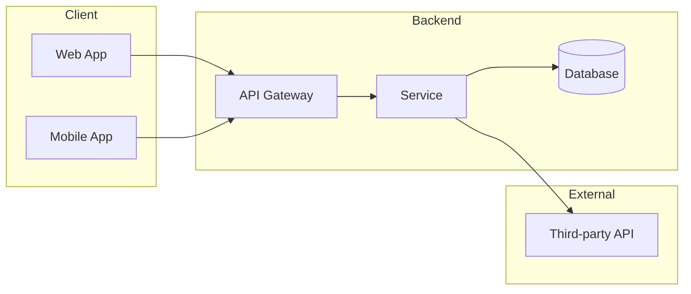
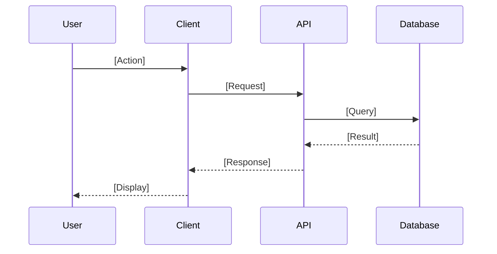
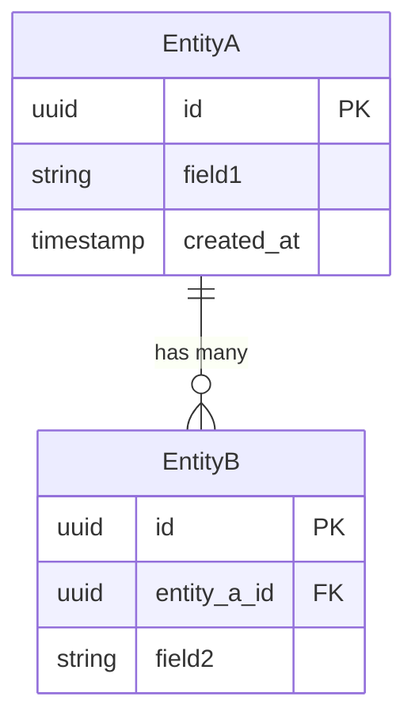

---
# PRD Metadata (Machine-Readable)
prd:
  id: "PRD-XXX"
  title: "[Feature Name]"
  version: "1.0.0"
  created: "YYYY-MM-DD"
  updated: "YYYY-MM-DD"

  # Status: draft | review | approved | in-progress | completed | deferred | cancelled
  status: "draft"

  # Target delivery date (ISO 8601)
  target_delivery: "YYYY-MM-DD"

  # Priority: critical | high | medium | low
  priority: "medium"

  # Stakeholders
  product_owner: ""
  tech_lead: ""
  team:
    - name: ""
      role: ""

  # Tracking
  tracking:
    epic: ""
    milestone: ""

  # Dependencies (optional)
  dependencies:
    - id: ""
      title: ""
      type: "blocks"  # blocks | blocked-by | relates-to

  # Tags for categorization
  tags: []
---

# [Feature Name]

## Summary

> **One-liner:** [Brief description of what this feature does]

| Field | Value |
|-------|-------|
| **Status** | `draft` |
| **Target Delivery** | YYYY-MM-DD |
| **Product Owner** | @name |
| **Tech Lead** | @name |
| **Team** | @name1, @name2 |
| **Epic** | [PROJ-XXX](link) |

---

## Problem Definition

### Objective/Outcomes

**What problem are we solving?**

[Describe the problem from the user's perspective. What pain point or need does this feature address?]

**What is our approach?**

[High-level description of how we plan to solve this problem]

### Success Metrics

This feature will be successful if:

- [ ] [Measurable outcome 1]
- [ ] [Measurable outcome 2]
- [ ] [Measurable outcome 3]

### Scope & Constraints

#### In Scope

**Frontend Changes:**
- [ ] [Feature/change 1]
- [ ] [Feature/change 2]

**Backend Changes:**
- [ ] [Feature/change 1]
- [ ] [Feature/change 2]

**Data Model Changes:**
- [ ] [Change 1]
- [ ] [Change 2]

#### Out of Scope

- [Item 1 - brief reason why]
- [Item 2 - brief reason why]

#### Constraints

- [Technical constraint 1]
- [Business constraint 1]
- [Dependency: Dependent on completion of [PRD/Feature name]]

---

## Solution Definition

### Architecture

**System Context Diagram:**



**Sequence Diagram:**



### Technical Specification

#### API Contracts

**Endpoint:** `POST /api/v1/resource`

Request:
```json
{
  "field1": "string",
  "field2": "number"
}
```

Response (Success):
```json
{
  "id": "string",
  "status": "success"
}
```

Response (Error):
```json
{
  "error": "error_code",
  "message": "Human-readable message"
}
```

#### Error Handling

| Status Code | Error Code | Description | User Action |
|-------------|------------|-------------|-------------|
| 400 | `validation_error` | Invalid input data | Display field-level errors |
| 401 | `unauthorized` | Missing/invalid auth | Redirect to login |
| 500 | `internal_error` | Server error | Show generic error, retry |

#### Data Model Changes

```sql
-- New tables/columns
CREATE TABLE table_name (
  id UUID PRIMARY KEY,
  field1 VARCHAR(255),
  created_at TIMESTAMP DEFAULT NOW()
);
```

**Entity Relationship:**



---

## Decision Log

| # | Question | Decision | Decider | Date |
|---|----------|----------|---------|------|
| 1 | [Question that needed resolution] | [Decision made and rationale] | @name | YYYY-MM-DD |
| 2 | [Question that needed resolution] | [Decision made and rationale] | @name | YYYY-MM-DD |

---

## User Stories

> **Format:** As a [persona], I want [need] so that [purpose]

### Epic: [Epic Name]

#### US-001: [User Story Title]

**Story:** As a [persona], I want [need] so that [purpose].

**Acceptance Criteria:**
- [ ] [Criterion 1 - specific, testable]
- [ ] [Criterion 2 - specific, testable]
- [ ] [Criterion 3 - specific, testable]

**Ticket:** [PROJ-XXX](link) | **Status:** `todo`

---

#### US-002: [User Story Title]

**Story:** As a [persona], I want [need] so that [purpose].

**Acceptance Criteria:**
- [ ] [Criterion 1]
- [ ] [Criterion 2]

**Ticket:** [PROJ-XXX](link) | **Status:** `todo`

---

## Testing Strategy

### Unit Tests

Unit tests verify individual functions/components in isolation.

| Component | Test File | What to Test |
|-----------|-----------|--------------|
| `[ComponentName]` | `[component-name].test.ts` | [Key behaviors to verify] |
| `[ServiceName]` | `[service-name].test.ts` | [Key behaviors to verify] |
| `[HookName]` | `[hook-name].test.ts` | [Key behaviors to verify] |

**Unit Test Checklist:**
- [ ] All public functions have test coverage
- [ ] Edge cases handled (null, empty, boundary values)
- [ ] Error states tested
- [ ] Mocks used for external dependencies

### Integration Tests

Integration tests verify components work together correctly.

| Integration Point | Test File | What to Test |
|-------------------|-----------|--------------|
| `[API Route]` | `[route].integration.test.ts` | Request/response flow, auth, validation |
| `[Service + DB]` | `[service].integration.test.ts` | Data persistence, transactions |
| `[Component + API]` | `[feature].integration.test.ts` | UI renders correct data from API |

**Integration Test Checklist:**
- [ ] API endpoints return correct status codes
- [ ] Database operations commit/rollback correctly
- [ ] Authentication/authorization enforced
- [ ] Error responses match API contract
- [ ] Component renders loading, success, and error states

### Test Commands

```bash
# Run all tests
pnpm test

# Run unit tests only
pnpm test:unit

# Run integration tests only
pnpm test:integration

# Run tests with coverage
pnpm test:coverage

# Run tests in watch mode
pnpm test:watch
```

---

## Launch Readiness

### Pre-Launch Checklist

- [ ] **Code Complete** - All user stories implemented
- [ ] **Code Review** - All PRs reviewed and merged
- [ ] **Unit Tests** - All unit tests passing, coverage meets threshold
- [ ] **Integration Tests** - All integration tests passing
- [ ] **Documentation** - API docs updated
- [ ] **Monitoring** - Alerts configured
- [ ] **Stakeholder Sign-off** - Product owner approved

### Release Strategy

| Phase | Description | Target Date | Success Criteria |
|-------|-------------|-------------|------------------|
| Alpha | Internal testing | YYYY-MM-DD | [criteria] |
| Beta | Limited rollout (X%) | YYYY-MM-DD | [criteria] |
| GA | Full release | YYYY-MM-DD | [criteria] |

---

## Risk Assessment

| Risk | Likelihood | Impact | Mitigation |
|------|------------|--------|------------|
| [Risk 1] | Low/Med/High | Low/Med/High | [Mitigation strategy] |
| [Risk 2] | Low/Med/High | Low/Med/High | [Mitigation strategy] |

**Systems Affected:**
- [System/component 1]
- [System/component 2]